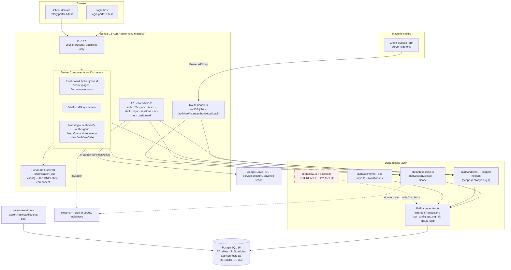
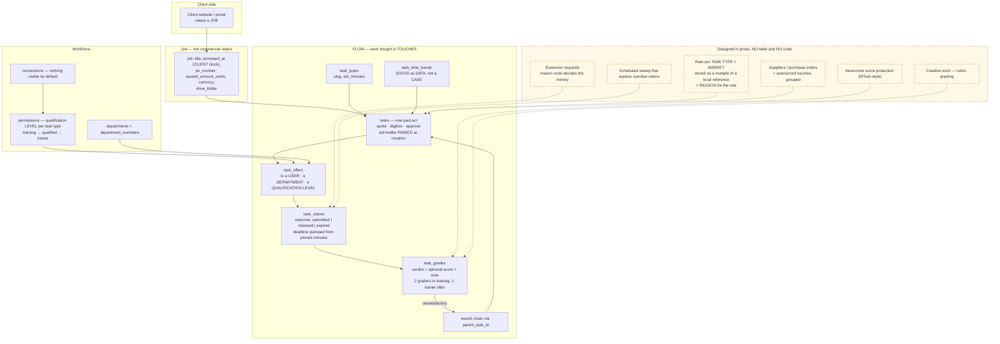
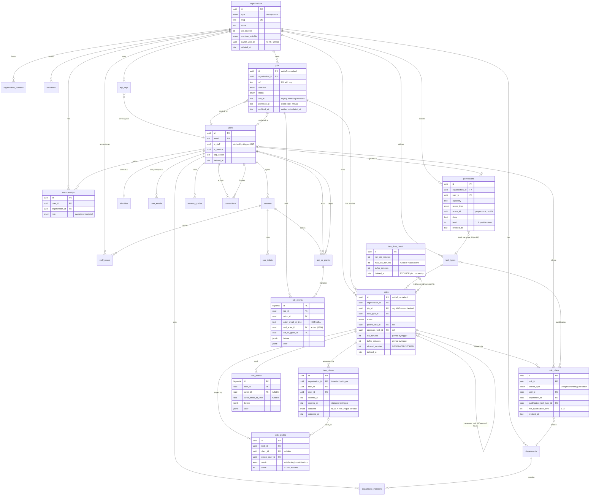

# Flow — Existing-System Handoff

**Audit date/time:** 2026-09-22, ~03:00–04:00 America/Toronto (times in this
document are Toronto unless marked UTC).
**Repository path:** `/home/user/login` — GitHub `10xid-com/login`.
**Branch / commit at audit:** `main` @ `2f07c3d` ("Staff is a role, not a
company"), working tree clean.
**Auditor:** Claude (Opus 5) in Claude Code, orchestrating six parallel
read-only sub-audits. Every load-bearing claim below was re-verified by the
orchestrator directly against the source; where a sub-audit and the
orchestrator disagreed, the disagreement is recorded rather than smoothed.

**Access actually available during this audit**

| System | Available? | Notes |
|---|---|---|
| Local repository | **Yes** | Full read, typecheck, lint, build, partial test run |
| Railway | **Yes, read-only** | Inspection calls only; variable values came back redacted by the platform |
| Production PostgreSQL | **No** | No TCP proxy exists; private network only. Every production figure here is inference from deploy logs |
| Google Drive / Google Cloud | **Not used** | No Drive tool was called. The integration was audited as source code only |
| Supabase | **N/A — does not exist** | See §10 |
| DNS / registrar | **No** | Only what Railway reports about the two domains |
| Resend (email) | **No** | Only the env-var name and the SDK in the repo |

---

## READ THIS FIRST — three corrections to the brief

This audit was commissioned with a prompt that describes a system slightly
different from the one that exists. Three mismatches change what the document
can honestly say, and all three are recorded here rather than papered over.

**1. There is no separate Flow repository.** The brief says "opened at the root
of the existing Flow repository". Flow is not a repository, a service or an
app. It is a set of database tables (migrations `0014`–`0015`), one library
file (`lib/db/flow.ts`), and a design document (`docs/flow/README.md`), all
living inside `10xid-com/login` alongside the portal. There is nothing else to
open. *(Verified.)*

**2. There is no Supabase.** The brief devotes a whole required section to it.
A grep for `supabase` across every `.ts`, `.tsx`, `.json`, `.md` and `.sql`
outside `node_modules` returns **zero matches** — not a dependency, not a
config file, not a comment. The database is PostgreSQL on Railway, reached
through Drizzle, with Row-Level Security written by hand in the migrations.
§10 is retained under its mandated heading and answers every question the brief
asked of Supabase — RLS coverage, policy summaries, `SECURITY DEFINER` risk,
service-role keys in browser code — against the system that actually exists.
*(Verified.)*

**3. "Flow" and "the portal" are not the same product, and only one of them
runs.** This is the central finding of the audit and it governs every section
below. See §1.

---

## 1. Executive Summary

**Maturity: the portal is a late alpha. Flow is a schema with no product on
top of it.**

The running application is a **jobs portal**: multi-tenant, passwordless,
second-factor-protected, with staff who move between client companies under a
30-minute reasoned grant, an API-key intake endpoint that machines POST jobs
to, and a Google Drive folder per job. It is deployed at `login.10xid.com`,
it holds real data (9 users, 10 organizations as of 2026-09-22 00:44), and its
tenant isolation is the strongest-engineered part of the codebase — four
independent mechanisms, enforced at the database, verified by a boot-time
assertion that refuses to serve traffic if the app's database role is too
powerful.

**Flow is something else, and it is not yet a product.** Migration `0015` is
~600 lines and builds a genuinely sophisticated task spine: offers, claims with
per-attempt deadlines pinned at creation and frozen against edits, three
distinguishable outcomes (completed / released / expired), rework as a new row
rather than a mutated one, binary grading, and separation of duty enforced by a
database trigger that walks the rework chain through a recursive CTE. It is
well built and it is test-verified.

It is also **unreachable**. `grep -rn "db/flow"` over the whole repository
returns exactly one importer, and it is `test/flow-spine.test.ts`. No route, no
page, no server action, no API handler in `app/` touches any of it. Six of the
seven Flow tables are read by one library file that nothing in the application
imports. `expireOverdueClaims()` — the sweep that makes the deadline mean
anything — has no scheduler, so even wired up, claims would never expire.
*(Verified by the orchestrator, independently of the sub-audit that reported
it.)*

**The most advanced complete journey demonstrable today** is: staff sign in →
enrol an authenticator → save recovery codes → choose a client with a typed
reason → mint an API key → a machine POSTs a job to `/api/v1/jobs` → the job
appears as a dashboard card → a Drive folder is created and a summary filed →
open the job → change its status → and separately, a client user lands on their
own domain through the three-hop SSO handoff and cannot reach another client's
job even with its exact id. It stops there. Nothing can be assigned, worked,
quoted, approved, priced, extended or notified.

**The five biggest blockers to a usable internal pilot**

1. **No rate limit on the second factor.** Unlimited TOTP and recovery-code
   guesses against exactly the accounts that reach every client's data. (§15,
   B1 — Critical.)
2. **Act-as escapes its time box through the SSO handoff**, minting a durable
   first-party session as the impersonated person, with no banner, no grant and
   a falsified audit trail. (§15, B2 — Critical.)
3. **Flow has no user interface at all.** There is nothing for a pilot user to
   open. (§2, §9.)
4. **It is unconfirmed whether the last deploy's migrations applied**, and if
   they did not, `/team` is throwing for staff in production right now. (§12,
   §19.)
5. **The tenancy test suite cannot be run by anyone receiving this handoff** —
   the database bootstrap script is not in version control, and there is no CI.
   (§16.)

**What a new architect should understand before touching anything:** the parts
of this system that look conservative are load-bearing and were reasoned about
carefully — the fail-closed RLS, the two-role database model, the refusal to
guess which company is the house, the deliberate absence of money from `0015`.
The parts that look finished are often not wired to anything. Read the comments;
this codebase carries its open questions in rationale comments and commit
bodies rather than in `TODO` markers, of which there are exactly zero.

---

## 2. What Works Today

*All Verified unless marked.*

**Authentication and account security**
- Passwordless sign-in: emailed six-digit code. **There is no password column
  and no password path anywhere in the system.**
- TOTP authenticator enrolment, and thereafter TOTP **replaces** the emailed
  code rather than stacking on it — once `totp_confirmed_at` is set, the email
  code stops working for that account.
- Ten single-use recovery codes, shown once through an httpOnly one-hop flash
  cookie.
- Session listing and revocation at `/account/sessions`, including "revoke every
  other session".
- Invitations: create, accept, revoke.

**Multi-tenancy**
- Staff choose a client from `/staff` with a typed reason, producing a
  30-minute `staff_grants` row.
- Row-Level Security on 13 tables, fail-closed, scoped transaction-locally.
- `assertRestrictedRole()` refuses to boot the app if its database role is
  superuser, can bypass RLS, or owns the tables.
- Cross-domain SSO: a three-hop ticket handoff lands a user on their own
  client domain with their own branding.

**Jobs (the running product)**
- `POST /api/v1/jobs` with an API key — the machine intake path, rate-limited
  to 60 jobs per key per hour, counted in the database.
- Jobs list at `/jobs` (flat, hard `LIMIT 200`, no filter/sort/search/pagination).
- Job detail at `/jobs/[id]`, invisible outside its organization — not-found and
  not-allowed are byte-for-byte identical.
- Status change on a job (8 statuses, **no transition rules** — `completed` →
  `draft` is permitted).
- Dashboard cards with a per-job Google Drive folder button.
- `/team` — who is employed at the company on screen.
- `/pages` — the page inventory desk, with a per-audience view.
- API key minting and revocation at `/staff/keys`.

**Act-as-user**
- Grant creation with a typed reason and a 60-minute expiry, a loud full-width
  banner naming the person, and a stop button.
- *Unexercised:* nobody has clicked "Become" in a real browser. The server-action
  POST wiring is untested outside the test suite. *(Verified — noted in the
  prior session and unchanged.)*

**Quality gates that currently pass**
- `tsc --noEmit`: **PASS**, zero errors.
- `eslint`: **PASS**, zero findings, including the custom tenancy
  `no-restricted-imports` rule that makes opening a database pool outside
  `lib/db/` a build error.
- `next build`: **PASS**, 21 routes, needs no database and no network.

---

## 3. What Is Mocked or Incomplete

**Built as schema and library code, with no user interface whatsoever**
- The entire Flow task spine: `task_types`, `tasks`, `task_offers`,
  `task_claims`, `task_grades`, `task_events`, `task_time_bands`; six triggers;
  the separation-of-duty rule; `lib/db/flow.ts` (13 functions). Imported only by
  a test.
- `departments` and `department_members` — created in `0011`, referenced by
  **zero** files in `lib/` or `app/`.
- `permissions` and the qualification ladder — reached only by one capability
  check in the act-as path.

**Columns defined that nothing reads or writes**
- `jobs.assigned_to` — a single nullable uuid. No screen writes it. Also means
  one participant per job, maximum, by construction.
- `jobs.promised_at` — given a long rationale in the schema as "the only clock
  they ever see". No screen shows it, no code writes it.
- `organizations.owner_user_id` — described as "the reason a brand can be handed
  over". Nothing reads it.

**Partially wired**
- **Google Drive**: real Google calls, real service-account JWT auth, narrowest
  possible scope (`drive.file`). But all three `GOOGLE_*` variables are **unset
  on both Railway services**, so it is inert in production. Implemented: create
  one folder per job, upload one plain-text summary, link out. Absent: upload,
  download, preview, permissions, listing, delete, shortcuts, subfolders, retry,
  token caching, and all file-version metadata.
- **The header knows nothing about whose screen it is.** `PortalShell` accepts
  an `organization` prop — name and logo — and **all nine call sites omit it**
  (`dashboard`, `jobs`, `jobs/[id]`, `team`, `staff`, `staff/keys`,
  `account/sessions`, `pages`, `act-as`). The fallback therefore fires every
  time and the Mark reads "10XiD Portal" for everybody, including clients
  looking at their own data. When acting on a client the *name* switches, but
  the logo is read from the prop that was never passed, so the artwork never
  renders at all. *(Verified directly at all nine call sites.)* The file's own
  comment says the Mark exists because "the thing a person most needs to be sure
  of is whose data they are looking at" — which is the one thing it cannot
  currently do. This is a wiring gap, not a header defect.

**Cosmetic only**
- The brand swatch, the status-distribution bar (a `title=` attribute, not
  clickable), and the "choose a client" explanatory sentences.

**Described in prose rather than built** — from `docs/flow/README.md`: the wage
rule (both halves), rates and markets, extensions and reason codes, quote
tolerance, dual-worker training, three-grader redundancy, newcomer score floors,
and all money. `0015` excludes money deliberately and says so.

**Claims the code makes that the code does not honour** *(Verified)*
- `PortalShell` calls its session read "already-cached". Nothing caches it;
  `getSessionContext()` runs at least twice per render, each with a
  `touchSession` write.
- `lib/pages.ts` says `/team` "should list who you can SEE". It lists who is
  employed; the `canSee` helper is unused.
- `app/globals.css` says Phase 2 wires `brand_primary_hex`. It is not wired.

---

## 4. Product Model and Terminology

The single most consequential fact about this system's vocabulary: **the unit
the product is designed around has no interface, and the unit that has an
interface is not the designed unit.** `docs/flow/README.md` states "the unit is
not the job. It is the TOUCH." A touch is a `task`. `tasks` has no route, no
API, no page and no human-readable reference. `jobs` has all four. *(Verified —
recorded as contradiction D1.4.)*

### A3. Terminology table — where each word actually lives

| Term | Where it lives | What it means here | Conflicts with |
|---|---|---|---|
| **organization** | DB table `organizations`; every `organization_id` column; app code | A company: a client brand or the house | UI, which says "Clients"; `0016`, which says "brand" |
| **client** | `organization_type` enum value; UI nav + `<h1>` "Clients"; route `/staff`; page iD `clients`; prose everywhere | A customer company whose work the house does | The route it lives at is `/staff`; the schema word is `organizations` |
| **internal / the house** | `organization_type` enum value; prose "the house" (0016, 0017, policy.ts) | TBOX Studio: the operator | "the house" appears in no identifier, only prose |
| **brand** | Prose (0016, schema comment on `owner_user_id`); CSS tokens `--brand-*`; columns `brand_primary_hex`, `brand_logo_url` | Two senses: a client identity that can be sold; and a colour theme | Itself — party vs theme |
| **job** | DB table `jobs`; route `/jobs`, `/jobs/[id]`; API `POST /api/v1/jobs`; UI "Jobs" | A piece of client work: ref, direction, title, status, dates, Drive folder, commercial fields | `docs/flow/README.md` says the unit "is not the job"; MTurk map calls a HIT a "job" |
| **order** | **Prose only — and barely.** Zero occurrences as a product noun. All 25 `order` hits in `.ts`/`.tsx` are `order by`, `time-ordered`, `tab order`, `orders@club.org` | No meaning in this codebase | The brief's assumed hierarchy; nothing implements it |
| **item** | **Prose only**, once: the MTurk map, "a *touch* when it is one unit of work on one **item**" (`docs/reference/mturk/README.md`). All 33 `.tsx` hits are Tailwind `items-center` | No entity | The assumed hierarchy |
| **component** | **Does not exist as a product noun.** Both hits mean React server components | No entity | The assumed hierarchy |
| **task** | DB table `tasks` + `task_types`, `task_offers`, `task_claims`, `task_grades`, `task_events`, `task_time_bands`; enums `task_status`, `task_offeree`; `lib/db/flow.ts` | **One touch — one paid act by one person.** Not a subtask of an item | `docs/flow/README.md` calls the same thing a "touch"; no table is named `touches` |
| **touch** | **Prose only** — `docs/flow/README.md`, `0015`'s header, `schema.ts:1067` ("ONE TOUCH"), `lib/db/flow.ts:18` | The unit of value and payment | The table is `tasks`. Two words, one row |
| **offer** | DB table `task_offers`; enum `task_offeree` (`user`/`department`/`qualification`); `offerTask()` | Who a task is available to; three shapes, one table | None found |
| **claim** | DB table `task_claims`; enum `claim_outcome` (`submitted`/`released`/`expired`) | One attempt by one person, with its own deadline | `docs/flow/README.md` does not use the word "claim" as a noun; MTurk map maps Assignment→claim |
| **assignment** | **Nowhere.** Zero occurrences in `.ts`/`.tsx`/`.sql` | — | `jobs.assigned_to` exists as a column; MTurk map uses "Assignment" for their record |
| **card** | **UI projection only.** `RequestCard` type (`lib/db/index.ts:426`), `app/dashboard/requests.tsx`. No table | A dashboard tile rendering one `jobs` row plus the JSON details from its first `job_events` row | Heritage conflict: in the deleted first project (`c5326c1`) "card" meant a *digital business card* — the actual product being sold |
| **board** | **UI projection only** — "the requests board", a `<section>` with `aria-labelledby` | The Requests area of the dashboard | None |
| **workspace** | **Nowhere.** Zero occurrences | — | — |
| **desk** | Prose + one page. `lib/pages.ts` ("`/dashboard` may well become `/desk` — it is called a desk in conversation already"); `app/pages/page.tsx` is `PagesDesk`, "the pages desk" | Two different things: the future name of `/dashboard`, and the `/pages` inventory screen | Itself |
| **request** | UI projection: `recentRequests()`, `RequestCard`, "Requests" heading | Work arriving from the client side — an `estimate` enquiry or a job raised in the portal | It is a `jobs` row; there is no `requests` table |
| **contractor / worker** | Prose only (`docs/flow/README.md`, MTurk map). No `contractors` table, no role value | The person doing a touch | `membership_role` has no such value; workers are `users` with `permissions` rows |
| **iD** | DB table `identities`, column `id_code`; `lib/pages.ts` iDs for pages | A public, stable, reissue-never handle. Deliberately not a foreign-key target anywhere | Lower-case `id` columns everywhere mean uuid primary keys |
| **Mark / Pin** | CSS classes + assets (`.portal-pin`, `/10xid-mark.png`, `/10xid-pin.png`); prose in `app/globals.css`, `app/portal-shell.tsx` | Mark = the client's full-colour logo (left). Pin = the 10XiD grayscale badge (right) | "brand" again |

### A4. Intended hierarchy Organization → Order → Item → Component → Task vs what the code has

**Verified — the code has:**

```
organizations
  └── jobs            (ref ROT-0042, direction, status, promised_at, due_at, drive folder)
        └── tasks     (= a "touch": one paid act; std_minutes + buffer_minutes, pinned)
              ├── task_offers   (user | department | qualification)
              ├── task_claims   (one row per attempt; submitted | released | expired)
              ├── task_grades   (satisfactory | unsatisfactory + optional score)
              └── task_events   (append-only)
        └── job_events (append-only)
```

Plus two **non-containment** links on `tasks`: `parent_task_id` (the rework chain — a
retry is a *new sibling row*, not a child in a work breakdown) and `approves_task_id`
(an approval touch names what it reviews). Both exist so the separation-of-duty
trigger can walk them (`lib/db/schema.ts:1062-1066`, `drizzle/0015:621-627`).

**Verified — Order, Item and Component do not exist**, in any table, column, enum,
route, type, or doc. The hierarchy in the brief is **two levels deep in reality
(job → task)**, not five. There is no evidence anywhere in the repo that a five-level
hierarchy was ever designed; `docs/flow/README.md` argues the opposite case — that
the unit is the touch and a job is just what a client bought.

**Inferred:** the three missing levels are either a newer conversation not yet
written down, or an assumption carried in from elsewhere. The repo cannot tell which.


### The concepts from `docs/flow/README.md` — in the schema, or only on paper?

**In the schema and enforced** *(Verified)*: touches as `tasks`; separation of
duty (Postgres triggers walking the rework chain via recursive CTE, on both
`task_claims` and `task_grades` inserts); time bands as rows in
`task_time_bands`; allowed time pinned at task creation and frozen against later
edits by two triggers; release-versus-expire as distinguishable outcomes; binary
grading with an optional score; qualification levels 1/2/3 in `permissions`.

**Documented only, no schema, no code** *(Verified)*: the wage rule in both
halves (pay the quoted rate; and if our quote was wrong, pay what the rate would
have been had it been quoted correctly); rates and markets; extensions and their
reason codes; quote tolerance; dual-worker training; three-grader redundancy;
newcomer score floors. `0015` excludes money deliberately and says so in its
header.

### "Still open" in `docs/flow/README.md` — all three still open

1. **Does the next worker see the abandoned partial work?** "Clear about the
   money, silent about the file. If they can use it, the first person worked for
   free rather than merely losing their claim — a different bargain, and one they
   should be told about up front." *(Unresolved: `task_claims` has a `note`
   column and no artifact reference at all.)*
2. **Who grades the approver**, once past training with no second grader?
   "Contest, spot-check and client complaint are the candidates." *(Unresolved:
   none of those three entities exists.)*
3. **The employment question.** "Setting rates, defining tasks, timing work,
   qualifying and de-qualifying people, and paying differently by country is a
   lot of control. Whether that carries exposure in Ontario is a question for a
   lawyer, not a guess made here." *(Outside the repository entirely. Still a
   question for a lawyer.)*

---

## 5. Repository and Git State

*All Verified.*

- **Remote:** `https://github.com/10xid-com/login`. **Default and current
  branch:** `main`. **HEAD:** `2f07c3d`. **47 commits.**
- **Working tree: completely clean.** No uncommitted or untracked files.
- The `AGENTS.md` trap resolves clean: the block `next dev` regenerates is
  already committed (`f0c445f`), so regenerating it is a no-op and produces no
  dirt.
- Ignored-but-present, all expected: `.env.local`, `.next/`, `next-env.d.ts`,
  `node_modules/`, `tsconfig.tsbuildinfo`.
- **No tags, no stashes, one worktree.** Two stale `claude/*` branches — one
  identical to `main`, one fully merged; `main` is 26 ahead.
- **Single app, not a monorepo.** Next.js 16 App Router at the root.
  ~18,343 LOC: `app/` 36 files, `lib/` 20, `scripts/` 5, `test/` 24,
  `drizzle/` 30.
- **CI/CD: none found.** No `.github/`, no Dockerfile, no `railway.json`, no
  `vercel.json`, no Procfile, no nixpacks config, no git hooks. `main` deploys
  straight to production with nothing mechanically preventing a broken commit
  from reaching it.
- **Two things that may not belong to Flow:** `docs/reference/mturk/` is 37–39
  files / 236 KB of Amazon's own documentation, kept verbatim and self-declared
  "not our content" — a licensing decision is owed. And five unreferenced
  `create-next-app` scaffold SVGs remain in `public/`.
- **Two structural risks:** `drizzle/meta/_journal.json` lists 18 migrations but
  only 11 snapshots exist (missing `0010`, `0012`–`0017`, with hand-typed
  timestamps on the last two), so `db:generate` would diff against a stale
  schema and try to re-create six migrations' worth of objects. *Applying*
  migrations is unaffected. Separately, **the database bootstrap is not in
  version control** — the `initdb`/`psql`/`db:migrate`/`db:seed` sequence exists
  only as a scratch script from a prior session and will not survive this
  handoff.

## 6. Technology Inventory

*All Verified.*

- **Node 22.22.2** (`engines: >=22`, **no `.nvmrc`**). **TypeScript 5.9.3**,
  strict, ES2022. **Next.js 16.3.5** App Router — note this version uses
  `proxy.ts`, not `middleware.ts`. **React 19**. **Tailwind 4**.
  **Drizzle ORM 0.45.2** / **drizzle-kit 0.31.10**. **PostgreSQL 16**.
  **Resend 6.28.1**.
- **Every one of the 21 packages is exact-pinned**, a documented house policy.
  **All are actively used; nothing is unused or duplicated** (verified by
  grepping imports, not assumed). `react-dom` has no direct import but is Next's
  required renderer. `resend` is dynamically imported and inert without
  `RESEND_API_KEY`. Six sharp-WASM packages report `extraneous`.
- **14 npm scripts**; 3 verified working here, the rest need a database.
- **No deployment config file exists in the repository.** Railway's build and
  deploy configuration lives only in the Railway dashboard and is **not
  recoverable from this repo** — a real handoff gap.
- **Migrations are hand-written idempotent SQL**, `0000`–`0017`. The house
  stopped generating Drizzle snapshots after `0011`.

## 7. Current Architecture

**Layers.** Browser → `proxy.ts` (cookie *presence* only, optimistic, explicitly
refuses to be a gate) → Server Components → a data-access layer where every
helper takes `scope` as its first argument → `inTenantTransaction()`, the only
module that opens a pool → PostgreSQL with RLS. External: Resend for mail,
Google Drive REST for folders.

**Server/client boundary.** Exactly **one** `"use client"` file exists in the
entire application: `app/portal-nav.tsx`. Everything else is a Server Component.
Every mutation is a `<form action={serverAction}>` POST-and-redirect. There is
no client state library, no optimistic UI, and feedback is carried in `?done=`
and `?error=` query strings. *(Verified.)*

**Surface.** 4 route handlers (`POST /api/v1/jobs` plus the three SSO hops) and
**17 server actions** across 8 files. **No webhooks, no cron, no queues, no
workers, no scheduler** — which is why `expireOverdueClaims()` can never run.

**Observability is effectively absent.** No Sentry, no OpenTelemetry, no
analytics. No `error.tsx`, `not-found.tsx` or `loading.tsx` anywhere. Four
`console.error` calls, each deliberately logging the *shape* of a failure and
never the payload. `instrumentation.ts` holds only the database-role assertion.

### A7. Mermaid — the CURRENT architecture



### The apparent INTENDED architecture, where it differs

Source of intent: `docs/flow/README.md` (Paolo's design note, September 2026) plus the
Flow tables already in `lib/db/schema.ts` (lines 932–1339) and the RLS/trigger migration
`drizzle/0015_flow_task_spine.sql`. It differs substantially from what is built.




**Architectural dead ends and duplicated truth** *(Verified)*
- `lib/db/flow.ts` and `lib/db/access.ts` — built, tested, unreachable.
- Two hand-maintained lists of tenant-scoped tables that disagree:
  `TENANT_SCOPED_TABLES` (10 entries, `schema.ts`) vs `MUST_BE_PROTECTED` (13
  entries, `scripts/check-rls.ts`). Only the second is checked.
- `users.is_staff` is simultaneously derived by trigger and directly settable —
  documented as deliberate, and a test depends on the drift being possible.
- `assertRestrictedRole()` still names only the four tables that existed when it
  was written.

---

## 8. UI, Routes and User Journeys

`lib/pages.ts` is the repository's own route inventory, and it was **verified
correct against the filesystem** — exactly 20 routes, 13 human screens, 1:1
match. `test/pages-desk.test.ts` walks `app/` and fails if the inventory and the
filesystem disagree, so it stays correct.

### There is no board, queue or job workspace

*(Verified.)* `/jobs` is a flat list: no filter, no sort, no search, no
pagination, hard `LIMIT 200`. Eight statuses with **zero transition rules** —
`completed` → `draft` is permitted, and nothing objects. No priorities. No
comments, no files, no notifications anywhere in the product.

### B4. Control-by-control status

Method: for each control I traced the handler to the function that performs the write, and
then to the DB helper. **WORKS** = the handler exists, validates, writes, and the result is
visible. **PARTIALLY WIRED** = it writes something but the feature it implies is incomplete,
or it depends on configuration that is absent by default. **COSMETIC** = no handler.

#### `/` — front door
| Control | Status | Evidence |
|---|---|---|
| (none — `redirect("/dashboard")`) | **WORKS** | `app/page.tsx` |

#### `/auth/login` — Sign in
| Control | Status | Evidence |
|---|---|---|
| Email field + "Continue" | **WORKS** | `requestCodeAction` → `requestSignInCode` → mailer → redirect `/auth/verify` |
| "Set up your account" link | **WORKS** | `<Link>` to `/auth/signup?next=…` |
| Error banner (`?error=email|rate`) | **WORKS** | local `ERRORS` map |

#### `/auth/signup` — Accept an invitation
| Control | Status | Evidence |
|---|---|---|
| Email field + "Email me a code" | **WORKS** | posts to the *same* `requestCodeAction` deliberately, so the two forms are indistinguishable to a prober |
| "Already set up? Sign in" link | **WORKS** | `<Link>` |
| Three-step explainer list | **COSMETIC** (prose) | static `<ol>` |

#### `/auth/verify` — Six-digit code
| Control | Status | Evidence |
|---|---|---|
| Code field (accepts 6 digits **or** an 8-char recovery code) + "Sign in" | **WORKS** | `verifyCodeAction` → `verifySignInCode` → `startSession` → `writeSessionCookie` → redirect `next` |
| "Use a different email, or request a new code" | **WORKS** | `<Link>` back to `/auth/login` carrying `next` + `email` |

#### `/auth/2fa` — Authenticator (staff only)
| Control | Status | Evidence |
|---|---|---|
| "Start setup" | **WORKS** | `beginEnrolmentAction` → `setTotpSecret(encryptSecret(generateSecret()))` |
| Setup key (select-all) + `otpauth://` details disclosure | **WORKS** | rendered from the decrypted secret |
| Code field + "Confirm and continue" / "Continue" | **WORKS** | `verifySecondFactorAction` → `verifyCode` → `confirmTotp` + `markSecondFactorPassed` → first time, issues recovery codes and redirects to `/auth/recovery-codes` |
| "Second step unavailable" screen when `TOTP_ENC_KEY` is unset | **WORKS** (refuses rather than storing unprotected) | `secondFactorConfigured()` |
| **There is no QR code** — only the key and the URI, as text | **PARTIALLY WIRED** | no QR library in `package.json`; the screen says "Add this to an authenticator app" and offers a string to type |

#### `/auth/recovery-codes`
| Control | Status | Evidence |
|---|---|---|
| The 10 codes (select-all) | **WORKS** — shown once, read from a 5-minute httpOnly flash cookie | `RECOVERY_FLASH_COOKIE` |
| "I have saved these — continue" | **WORKS** | `acknowledgeRecoveryCodesAction` clears the cookie, redirects to `next` |
| "Generate a new set" (on a reload/bookmark arrival) | **WORKS** | `regenerateRecoveryCodesAction`; the empty-state also reports how many remain |

#### `/auth/sso/failed`
| Control | Status |
|---|---|
| "Try again" → `/` | **WORKS** (`<Link>`) |

#### `/dashboard`
| Control | Status | Evidence |
|---|---|---|
| Notice banner (6 `?done=`/`?error=` outcomes) | **WORKS** | `NOTICES` map, `app/dashboard/page.tsx:81–97` |
| "⚠ N jobs awaiting a response … Review →" | **WORKS** | computed from `jobStats().awaitingUs`; the link goes to `/jobs` **unfiltered** — there is no filter to link to |
| 5 stat tiles (Open pipeline, Sent this month, Received this month, Completion rate, Total jobs) | **WORKS** — all five are real aggregates from one grouped query | `jobStats()` in `lib/db/index.ts:309` |
| "Jobs by status" distribution bar | **PARTIALLY WIRED** — renders and is accurate, but `title=` is its only label and it is not clickable/filterable | `app/dashboard/page.tsx:241–250` |
| Status breakdown list (all 8 statuses, zeros included) | **WORKS** — read-only, not clickable | lines 252–280 |
| "Recent jobs" list rows | **WORKS** | each row `<Link>`s to `/jobs/{id}` |
| "View all →" | **WORKS** | `<Link>` to `/jobs` |
| **Requests cards** — title link | **WORKS** | `<Link>` to `/jobs/{id}` |
| Requests card — "Create Drive folder" | **PARTIALLY WIRED** | real handler (`createDriveFolderAction`), real Google API call; but it renders **only** when `driveIsConfigured()` *and* the session is scoped to one org. With no service account configured (the default) it is replaced by the static text "Drive not connected". |
| Requests card — "Open Drive folder ↗" | **WORKS** once a folder exists | `request.driveFolderUrl`, `target="_blank" rel="noreferrer"` |
| Requests card — "Choose a client to file" text | **COSMETIC** (a sentence, not a link) | `app/dashboard/requests.tsx` |
| "+ N more fields on the job" | **COSMETIC** | a count; the fields are on the job page |

#### `/jobs`
| Control | Status | Evidence |
|---|---|---|
| Job rows (ref, title, direction arrow, status pill, due date) | **WORKS** | `<Link>` to `/jobs/{id}` |
| "N jobs" counter | **WORKS** | `jobs.length` |
| **"Send a new job"** — title, direction `<select>`, due `<input type="date">`, "Send" | **WORKS** | `createJobAction`; org taken from the session, never the form; `ScopeError` → `?error=noclient` |
| "Choose a client" link when unscoped | **WORKS** | `<Link>` to `/staff` |
| **Sorting** | **absent** — fixed `ORDER BY created_at DESC LIMIT 200` | `listJobs()` in `lib/db/index.ts:106` |
| **Filtering / search** | **absent** — no control of any kind | whole file |
| **Pagination** | **absent** — hard `LIMIT 200`, silently truncating | `lib/db/index.ts:113` |

#### `/jobs/[id]`
| Control | Status | Evidence |
|---|---|---|
| "← All jobs" | **WORKS** | `<Link>` |
| Detail list: Status, Direction, Due, Raised | **WORKS** (read-only text) | |
| **"Change status" `<select>` + "Update"** | **WORKS** | `setJobStatusAction`; the select offers 7 of the 8 statuses (`draft` deliberately omitted) with **no transition rules at all** — any status can go to any other |
| "Submitted details" block | **WORKS** | read from the `created` job event's `after.details`, rendered as text, never as markup |
| "History" list (append-only events) | **WORKS** | `listJobEvents`, newest first, limit 100 |
| **Assign to a person** | **absent from the UI entirely** — `jobs.assigned_to` exists, `createJob` accepts `assignedTo`, the Team page *counts* assignments, but nothing writes it | grep for `assignedTo` |
| **Comments / messages / files / attachments** | **absent** — no table, no column, no screen | grep |
| **Drive folder link on the job page** | **absent** — the folder link appears only on the dashboard request card, not on the job itself | `app/jobs/[id]/page.tsx` |

#### `/team`
| Control | Status | Evidence |
|---|---|---|
| Invite form: email, "Can invite others" (member/owner) `<select>`, "Send invitation" | **WORKS** | `inviteAction`; rendered only when `mayInvite` (staff, or an owner of the scoped org) |
| "Withdraw" on a pending invitation | **WORKS** | `revokeInvitationAction`; shown only for the org the session is scoped to |
| Member rows: name, "you" badge, "integration" badge, email, role, Sent / Received / Assigned / Last activity | **WORKS** (all four figures are real aggregates) | `jobsPerPerson`, `assignedPerPerson` |
| **Change someone's role, remove someone, edit a member** | **absent** — no control exists | whole file |
| "Choose a client to see their people" | **COSMETIC** (a sentence) | |

#### `/pages` — the desk
| Control | Status | Evidence |
|---|---|---|
| Path links | **WORKS** for `kind: "page"` rows | `PathCell` deliberately renders machinery and `[id]` paths as inert `<code>`, because following them would be a broken link that looks deliberate |
| iD / name / audience badge / method badge | **WORKS** (read-only) | |
| "N pages — M more are staff only and not listed here" | **WORKS** | `pagesFor()` / `hiddenFrom()` |

#### `/account/sessions`
| Control | Status | Evidence |
|---|---|---|
| Session rows: host, role at creation, "last used" relative time, lifetime sentence, "this device" badge | **WORKS** | `activeSessionsForUser` |
| "Sign out" / "Sign out here" per row | **WORKS** | `revokeSessionAction`; scoped to your own user id inside the same statement, so submitting a stranger's id revokes nothing |
| "Sign out N other devices" | **WORKS** | `revokeOthersAction` |
| Reached **only** from the Pin menu — no nav pill | by design (`lib/pages.ts:204`) | |

#### `/staff` — Clients (staff only)
| Control | Status | Evidence |
|---|---|---|
| Per-client reason field (min 8 chars) + "Open" | **WORKS** | `chooseClientAction` → 30-min `staff_grants` row + `sessions.active_organization_id` → `revalidatePath("/", "layout")` → `/jobs` |
| Brand colour swatch | **COSMETIC** — the only use of `brand_primary_hex` in the whole UI | `app/staff/page.tsx` |
| "Exit" in the acting-on banner | **WORKS** | `exitClientAction` |

#### `/staff/keys` (staff only)
| Control | Status | Evidence |
|---|---|---|
| "New key for X" label + "Mint key" | **WORKS** | `mintKeyAction`; requires a live grant, else a "choose a client" panel is shown instead |
| Minted-key panel (shown once, in the URL) | **WORKS** — and honest about the browser-history consequence | |
| "Revoke" per live key | **WORKS** — offered only for the org currently granted | `revokeKeyAction` |
| Revoked keys `<details>` fold-away | **WORKS** (native disclosure) | |
| Jobs filed / last used columns | **WORKS** | `listKeys` |

#### `/act-as`
| Control | Status | Evidence |
|---|---|---|
| Per-person reason field + "Become" / "Renew" | **WORKS** | `startActingAsAction` → `lib/auth/act-as.ts` `startActingAs` with 7 named refusals (`not_staff`, `second_factor`, `chaining`, `unknown_target`, `service_account`, `self`, `needs_capability`) |
| "Stop and be yourself" (and the same in the red banner) | **WORKS** | `stopActingAsAction` |
| "What you have done" history | **WORKS** | `actAsHistoryForActor`, last 20, showing running / stopped / lapsed |
| Staff-target refusal notice | **WORKS** | `mayActAsStaff` → `canInAny(ACT_AS_STAFF_CAPABILITY)` |
| **Candidate list is global** — every non-service, non-deleted user across all companies | **WORKS as written, but note:** it is not filtered by anything; the comment says this is acceptable because only a staff session can reach the page |

#### `/api/v1/jobs`
| Control | Status |
|---|---|
| `POST` with Bearer key | **WORKS** — Zod body, DB-backed rate limit, org from the key row, 201 with `{id, ref, status}` |
| `GET` | **WORKS** — explicit 405 with `Allow: POST` and an explanatory body |
| Idempotency | **absent, and documented as absent** in the route's own header comment |


### B7. The four specific questions

**Q: Can work be assigned to more than one person concurrently, in the UI?**
**No — Verified, twice over.** (a) There is no assignment control in the UI at all. (b) At the
data level, `jobs.assigned_to` is a single nullable uuid, so even the schema permits only one.
(c) The Flow layer *does* model concurrent holders — several `task_claims` per task over time,
several `task_grades` per claim (the training design has two workers do the same job
independently) — but `task_claims_one_live_idx` is a partial unique index enforcing **one live
claim per task**, and none of it is reachable from a screen.

**Q: Can responsibility be handed from one person to another, in the UI?**
**No — Verified.** There is no reassign, no transfer, no delegate, no "pass to" control.
The nearest things in the product are: **act-as** (`/act-as`), which is *becoming* someone
rather than handing work to them, and is explicitly time-boxed and blocked from anything that
outlives the grant; and **staff grants** (`/staff`), which hand a *staff member* access to a
client for 30 minutes. In the Flow layer, `releaseClaim()` returns a task to the pool
(`released` vs `expired` being a deliberate distinction) — but again, no UI.

**Q: Can a card link to / open a persistent job folder (Google Drive)?**
**Yes, partially — Verified.** `jobs.drive_folder_id` and `drive_folder_url` persist the
reference; the request card shows **"Create Drive folder"** (which calls Google for real) and,
once created, **"Open Drive folder ↗"**. Important qualifications:
- The control appears **only on dashboard request cards**, never on `/jobs` and never on the
  job detail page.
- It requires the session to be scoped to one org *and* `driveIsConfigured()`; with no service
  account configured — which is the default, `.env.example` ships the keys blank — the control
  is replaced by the static text "Drive not connected". `test/e2e/requests.spec.ts` has a test
  named "without a configured service account the button is not offered".
- One folder per job, created once, never renamed, never re-linked, never unlinked. The only
  thing put in it is a generated `<REF> — request.txt` summary. There is **no file upload, no
  file listing, no folder browsing** in the portal.
- Scope is `drive.file`, so the portal can only ever touch files it created itself.

**Q: Can external links (e.g. ChatGPT conversation URLs) be stored and displayed?**
**No — Verified.** I grepped the whole repository (schema, migrations, lib, app, docs) for
`chatgpt`, `conversation`, external-link, attachment and comment concepts. Nothing exists.
There is no links table, no URL column beyond `drive_folder_url`, and no UI to add one.
The **only** partial workaround available today: a machine posting to `/api/v1/jobs` can put a
URL into `details` (values are capped at 2000 chars), and it will then be **displayed as plain
text** on the job page's "Submitted details" block and on the request card — deliberately not
rendered as a link, because the page treats every detail value as untrusted text typed by an
anonymous member of the public.


### C. The most advanced COMPLETE user journey demonstrable end to end

**Verified** by reading every step's implementation; **Inferred** that it runs, since I did not
execute the app (it requires two Postgres roles, two hosts and a seeded database).

There are two candidate journeys. The deepest one that ends in something a person can *look at
and act on* is the **machine-filed request → staff triage → Drive folder → status change**
journey. It is also the one the e2e suite most nearly covers end to end
(`test/e2e/intake.spec.ts` + `requests.spec.ts` + `tenancy.spec.ts`).

**Setup:** `npm run db:migrate` (as owner), `npm run db:seed` — creates Branding Centres
(internal), Rotary and Northstar Roofing (clients), and one person in each plus a staff account.

1. **Staff signs in** at the login host. `/auth/login` → six-digit code (written to
   `/tmp/portal-signin-codes.log` in dev) → `/auth/verify`. **Works.**
2. **Staff is stopped at the second step.** `requireSession()` sees `needsSecondFactor` and
   redirects to `/auth/2fa`. Enrol → setup key → confirm → **10 recovery codes shown once** →
   acknowledge. **Works.** (A half-authenticated staff session is scoped to nothing, so even a
   route that forgot to redirect would read no rows.)
3. **Staff lands on `/dashboard` as the cross-client survey.** All clients' figures, all
   clients' request cards. "Choose a client to file" on every card. **Works.**
4. **Staff opens a client.** `/staff` → type a reason ≥8 chars → "Open" → a 30-minute
   `staff_grants` row is written with that reason, the layout revalidates, the amber banner
   appears on every page naming the client and the reason, and the header title becomes the
   client's name. **Works.**
5. **Staff mints an API key** for that client at `/staff/keys`. The key is shown once, in the
   URL, with an explicit warning about browser history. **Works.**
6. **The client's website files a request** with that key:
   `POST /api/v1/jobs`, `Authorization: Bearer …`, body `{title, details:{name,email,phone,message,…}}`.
   The org comes from the key row. A `ROT-0007`-style per-client reference is allocated by a
   single incrementing statement. 201 returns `{id, ref, status}`. **Works.**
7. **It appears as a card on the dashboard**, carrying exactly what the sender wrote, read back
   off the append-only creation event rather than off mutable columns. **Works.**
8. **Staff gives it a Drive folder.** "Create Drive folder" → service-account JWT → token →
   folder created under the configured parent → `drive_folder_id`/`url` written → a
   `drive_folder_created` audit event appended → a `<REF> — request.txt` summary uploaded →
   redirect `?done=filed` → the card now shows "Open Drive folder ↗".
   **Works only with `GOOGLE_SERVICE_ACCOUNT_KEY` + `GOOGLE_DRIVE_PARENT_FOLDER_ID` set** —
   otherwise the button is not rendered at all.
9. **Staff opens the job** at `/jobs/{uuid}` — the UUID is in the URL, never the guessable
   `ROT-0007` reference. Four facts, the submitted details verbatim, the event history.
   **Works.**
10. **Staff moves the status** `open → in_progress` via the `<select>` + Update. A
    `status_changed` event is appended with the actor's email at that time. **Works.**
11. **The client signs in on their own domain** — a cold visit to `rotary.portal-b.test`
    carries no cookie, `proxy.ts` sends them to `/auth/sso/start`, the three-hop ticket
    handoff runs, and they land signed in with no second prompt. They see the job, its
    submitted details and its history — **and cannot reach Northstar's job by its exact id**
    (404, byte-identical to an imaginary id). **Works**; `npm run prove` prints the transcript.
12. **Staff invites a colleague** into that client at `/team`; the invitation lands, the
    invitee sets up at `/auth/signup`, and the invitation is spent once. **Works.**
13. **Anyone signs out**, and the session ends on **every** domain in one request, because the
    session row is revoked server-side and no short-lived token outlives it. **Works**
    (measured numbers in the README; **Claimed**, not re-measured here).

#### Where it stops — precisely

The journey stops at **step 10**. Once a job has a status and a Drive folder, there is nothing
further the product can do:

- **Nobody can be made responsible for it.** No assignment control exists.
- **Nobody can do the work in it.** No file upload, no message, no comment, no note, no
  deliverable, no proof, no external link.
- **Nobody can approve or reject it.** `awaiting_approval`, `changes_requested` and `approved`
  are labels on a dropdown with no approval mechanism, no approver, no separation-of-duty
  check and no record of a decision beyond "somebody changed a dropdown".
- **No money is involved at any point.** `quoted_amount_cents`, `currency` and `po_number` are
  columns no screen touches.
- **The entire Flow model — the thing `docs/flow/README.md` describes as the business — is
  unreachable.** No screen creates a task type, raises a touch, offers it, claims it, releases
  it, submits it, grades it or reworks it.
- **Nobody is notified of anything, ever.** The only two emails the system sends are the
  sign-in code and the invitation.

So: the demonstrable product today is **a tenant-isolated, cross-domain, passwordless job
*ledger* with a Drive filing cabinet attached** — and the security and identity work behind it
is genuinely deep. The *work management* the design document is about has not started at the UI.

---


#### B3. Responsive and accessibility status

**Responsive (Verified):**

- Breakpoints used: `sm` (640px), `md`, `lg`, `xl`. Tiles go 1 → 2 → 5 columns; request cards
  1 → 2 → 3; the dashboard's lower region is a two-column `lg:grid-cols-[1fr_1.4fr]`.
- Team and Keys tables hide their header row below `sm` and switch each row to a 2-column
  grid with inline `sm:hidden` labels ("Sent", "Received", "Assigned"). That is a genuine
  mobile table treatment, not just wrapping.
- `app/globals.css:331–362` forces `font-size: 16px` on every `input`, `select` and `textarea`
  below 640px. The recorded reason is specific and real: WebKit zooms on focus below 16px and
  **the zoom survives the form submit and redirect**, so you land on the dashboard panned off
  to one side. This is an iOS-wide behaviour (all iOS browsers are WebKit) and cannot be
  reproduced on desktop Chrome.
- `min-h-dvh` (not `vh`) on both the shell and the auth card.
- **No `viewport` export in `app/layout.tsx`.** Next 16 emits a sane default
  (`width=device-width, initial-scale=1`); nothing here overrides or confirms it. **Inferred.**

**Accessibility — what is there (Verified):** `aria-labelledby` on the Requests section;
`role="alert"` on every error banner and `role="status"` on every success banner and on the
act-as banner (deliberately `status` and not `alert`, so a screen reader is not interrupted on
every navigation for an hour); `aria-label` on every unlabelled input (Job title, Direction,
Due date, per-client reason fields); explicit `<label htmlFor>` on the labelled ones;
`focus-visible:outline-2 outline-offset-2` on essentially every interactive element; a global
`prefers-reduced-motion` reset; `aria-hidden` on decorative dots, swatches and the ⚠ glyph;
`select-all` on the codes you are meant to copy; light and dark palettes with contrast ratios
recorded in the CSS comments.

**Accessibility — what is missing (Verified):**

- **No skip link** to main content. With up to 6 nav pills plus the Pin on every page, a
  keyboard user tabs the whole header on every navigation.
- **No `<h1>` on `/act-as`'s banner region**, and headings jump `h1 → h2` consistently but
  `app/pages/page.tsx` nests `h2` group headings under `h1` with no landmark regions beyond
  `<main>`.
- The account menu is `role="menu"` but its children are plain `<a>` and `<button>` elements,
  **not `role="menuitem"`**, and there is no arrow-key roving focus or focus trap. It is a
  disclosure wearing menu semantics.
- The status distribution bar (`app/dashboard/page.tsx:241–250`) conveys its data only through
  colour widths and `title=` attributes — `title` is not reliably announced and is unreachable
  on touch. The list below it carries the same numbers, so it is redundant rather than lost.
- `autoFocus` on the code inputs (`/auth/verify`, `/auth/2fa`) moves focus without warning.
- No `aria-live` on the nav strip position; that is defensible given both affordances are
  `aria-hidden` and focus-scrolling is the keyboard path.
- **No automated accessibility testing.** The Playwright suite asserts behaviour, never axe.


#### B8. Screens a human should capture (do not rely on code review for these)

I took no screenshots. These are the captures worth making, and why. `scripts/screenshots.ts`
(`npm run shots`) already drives most of the flow and writes to `/tmp/portal-shots`.

**Mobile, 390×844 (iPhone-class) — the highest-value set, because the header work is here:**

1. `/dashboard` at 390px, **at rest, freshly loaded** — to confirm the nav arrows and the drawn
   3px bar are both visible at rest, that the Mark is 48px and not clipped into a circle, and
   that the organization name is correctly absent below 640px.
2. `/dashboard` at 390px **mid-scroll downward** — to confirm the header has translated away.
3. `/dashboard` at 390px **scrolled back up** — to confirm it returns immediately, not at the top.
4. `/dashboard` at 390px with the **nav strip scrolled to its right end** — to confirm the right
   arrow dims, the left arrow enables, and the thumb's right edge lands flush with the track.
   The file claims 325.98px against a track ending at 326; only a real device confirms it.
5. `/dashboard` at 390px with the **Pin menu open** — to confirm the menu does not overflow the
   viewport (`w-60` anchored `right-0 top-12`) and the Pin reads as grey, not blue.
6. **`/auth/verify` on a real iPhone, immediately after submitting** — this is the one defect
   the codebase says cannot be reproduced on desktop (WebKit zoom surviving the redirect).
   Capture the landing page, not the form.
7. `/jobs` at 390px — the job row is a 5-element flex with `flex-wrap`; confirm the ref, title,
   direction, status and date do not wrap into an unreadable stack.
8. `/team` at 390px — the deliberate mobile table treatment, with the `sm:hidden` inline labels.
9. `/staff` at 390px — the client picker's reason field is `flex-[2]` beside a name and a
   button; confirm it is usable and not 40px wide.
10. `/jobs/[id]` at 390px with the status `<select>` open — confirm the 16px font rule holds.

**Desktop, 1180×820 (what `scripts/screenshots.ts` uses):**

11. `/dashboard` as **staff with no client chosen** — the cross-client survey, showing
    "Work in flight across every client" and "Choose a client to file" on the cards.
12. `/dashboard` as **staff holding a grant** — both the amber acting-on banner and the header
    title switching to the client's name (this is the *only* state in which the header is not
    "10XiD Portal", and it is worth seeing).
13. `/dashboard` as a **client user** — to document that their own company name and logo are
    *not* shown (the `organization` prop gap in A9).
14. **The red act-as banner** on any page — full width, the person's name at `text-lg`, the
    reason, the UTC expiry and the white exit button. This is the loudest thing in the product
    and it is worth having a picture of it.
15. `/staff/keys` **immediately after minting** — the once-only key panel. (Redact the key.)
16. `/auth/recovery-codes` with a live set. (Redact.)
17. `/auth/2fa` **enrolment** — to show that there is no QR code, only a setup key.
18. `/pages` — the desk, staff view (20 rows) and client view (18 rows + the hidden count).
19. `/jobs/[id]` with a **request filed through `/api/v1/jobs`** — the submitted-details block
    plus the history list. This is the end of the deepest journey (section C).
20. **Dark mode** at the system level: `/dashboard` and `/auth/login`. The palette is fully
    defined for dark but there is no theme toggle in the UI, so this is only ever seen by
    someone whose OS is dark, which means nobody has necessarily looked at it.
21. `/auth/sso/failed` — the one screen of the handoff a person is meant to see.

---

---

## 9. Database and Data Model

**27 tables, one schema (`public`), 18 migrations, no views or materialized
views.** 11 enums, 12 functions, 11 triggers. **Every foreign key in the entire
schema is `ON DELETE NO ACTION`** — there is no cascade anywhere and no defined
deletion story for an organization or a user. *(Verified.)*

### A.1 Tables in the order introduced

| # | Table | Introduced | Note |
|---|---|---|---|
| 1 | `organizations` | 0000 | tenant root |
| 2 | `organization_domains` | 0000 | hostname → org |
| 3 | `users` | 0000 | |
| 4 | `memberships` | 0000 | user ↔ org |
| 5 | `sessions` | 0000 | |
| 6 | `sign_in_codes` | 0000 | |
| 7 | `sso_tickets` | 0000 | |
| 8 | `staff_grants` | 0000 | staff → one client, time-boxed |
| 9 | `jobs` | 0000 | |
| 10 | `job_events` | 0000 | append-only audit |
| 11 | `api_keys` | 0005 | |
| 12 | `recovery_codes` | 0006 | |
| 13 | `invitations` | 0007 | |
| 14 | `identities` | 0009 | the "iD" code |
| 15 | `user_emails` | 0009 | multi-address identity |
| 16 | `connections` | 0011 | person ↔ person pair |
| 17 | `departments` | 0011 | |
| 18 | `department_members` | 0011 | |
| 19 | `permissions` | 0011 | capability grants (+ `level` added in 0015) |
| 20 | `act_as_grants` | 0014 | impersonation |
| 21 | `task_time_bands` | 0015 | house policy, not tenant data |
| 22 | `task_types` | 0015 | |
| 23 | `tasks` | 0015 | |
| 24 | `task_offers` | 0015 | |
| 25 | `task_claims` | 0015 | |
| 26 | `task_grades` | 0015 | |
| 27 | `task_events` | 0015 | append-only audit |

0012, 0013, 0016, 0017 add **no tables**. 0012/0016 write data; 0013 is a pure
read/report; 0017 adds functions, triggers and a one-off reconciliation.

All of the above **Verified** from the `CREATE TABLE` statements in the named files.


### A.2 Column detail, per table

Unless stated otherwise: `created_at` / `updated_at` are
`timestamp with time zone NOT NULL DEFAULT now()`; every FK is
**`ON DELETE NO ACTION ON UPDATE NO ACTION`**.

**Verified, and this is a finding in itself: not one foreign key in the entire
schema has a cascade, a `SET NULL`, or a `RESTRICT`.** Every FK in 0000, 0005, 0007,
0009, 0011, 0014 and 0015 is spelled `ON DELETE no action ON UPDATE no action`.
`grep -n "onDelete" lib/db/schema.ts` returns nothing. Deletion of a parent row is
therefore refused by the database, which is consistent with the soft-delete posture
below, but it means there is **no defined deletion story at all** for an
organization or a user.

---

#### `organizations` (0000; extended 0003, 0011)
| column | type | null | default |
|---|---|---|---|
| `id` | uuid PK | no | `gen_random_uuid()` |
| `type` | `organization_type` | no | — |
| `name` | text | no | — |
| `slug` | text | no | — (**UNIQUE** `organizations_slug_unique`) |
| `brand_primary_hex` | text | yes | |
| `brand_logo_url` | text | yes | |
| `created_at` / `updated_at` | timestamptz | no | `now()` |
| `deleted_at` | timestamptz | yes | soft delete |
| `job_counter` | integer | no | `0` (0003) |
| `member_visibility` | `member_visibility` | no | `'closed'` (0011) |
| `owner_user_id` | uuid | yes | (0011) — **no FK constraint**, and 0016 states plainly "No code path reads that column today" |

#### `organization_domains` (0000)
`id` uuid PK default random; `organization_id` uuid NOT NULL → `organizations.id`;
`hostname` text NOT NULL **UNIQUE**; `is_primary` boolean NOT NULL default false;
`verified_at` timestamptz null; `created_at`.
Index: `organization_domains_org_idx (organization_id)`.

#### `users` (0000; extended 0004, 0005)
`id` uuid PK default random; `email` text NOT NULL **UNIQUE**; `full_name` text null;
`email_verified_at` timestamptz null; `is_staff` boolean NOT NULL default false;
`created_at`/`updated_at`; `deleted_at` timestamptz null;
`totp_secret` text null (0004); `totp_confirmed_at` timestamptz null (0004);
`is_service` boolean NOT NULL default false (0005).

#### `user_emails` (0009)
`id` uuid PK default random; `user_id` uuid NOT NULL → `users.id`; `email` text NOT
NULL **UNIQUE**; `is_primary` boolean NOT NULL default false; `verified_at`
timestamptz null; `created_at`.
Indexes: `user_emails_user_idx (user_id)`; **partial unique**
`user_emails_one_primary_per_user ON user_emails (user_id) WHERE is_primary` — the
"exactly one primary" rule.

#### `identities` (0009)
`id` uuid PK; `user_id` uuid NOT NULL → `users.id`; `id_code` text NOT NULL
**UNIQUE**; `issued_at` default now(); `revoked_at` timestamptz null;
`created_at`/`updated_at`.
Indexes: `identities_user_idx`; **partial unique**
`identities_one_live_per_user ON identities (user_id) WHERE revoked_at IS NULL`.
Grant deliberately withholds DELETE (0009 comment).

#### `memberships` (0000)
`id` uuid PK default random; `user_id` uuid NOT NULL → `users.id`;
`organization_id` uuid NOT NULL → `organizations.id`; `role` `membership_role` NOT
NULL; `created_at`/`updated_at`.
Indexes: **unique** `memberships_user_org_idx (user_id, organization_id)`;
`memberships_org_idx (organization_id)`.

#### `departments` (0011)
`id` uuid PK default random; `organization_id` uuid NOT NULL → `organizations.id`;
`name` text NOT NULL; `slug` text NOT NULL; `created_at`/`updated_at`; `deleted_at`.
Indexes: **unique** `departments_org_slug_idx (organization_id, slug)`;
`departments_org_idx`.

#### `department_members` (0011)
`id` uuid PK; `department_id` → `departments.id`; `user_id` → `users.id`;
`organization_id` → `organizations.id` (all NOT NULL); `created_at`.
Indexes: **unique** `department_members_dept_user_idx (department_id, user_id)`;
`department_members_user_idx`.

#### `connections` (0011)
`id` uuid PK; `organization_id` uuid **nullable** → `organizations.id`;
`a_user_id`, `b_user_id` uuid NOT NULL → `users.id`; `source` `connection_source`
NOT NULL; `created_by` uuid null → `users.id`; `created_at`; `revoked_at`.
Constraints: `connections_pair_ordered CHECK (a_user_id < b_user_id)` — forces one
canonical row per pair.
Indexes: `connections_a_idx`, `connections_b_idx`, `connections_org_idx`;
**partial unique** `connections_live_pair_idx ON (COALESCE(organization_id,
'000…0'::uuid), a_user_id, b_user_id) WHERE revoked_at IS NULL`.

#### `permissions` (0011; `level` added 0015)
`id` uuid PK; `organization_id` NOT NULL → organizations; `user_id` NOT NULL →
users; `capability` text NOT NULL; `scope_type` `permission_scope` NOT NULL;
`scope_id` uuid **nullable**, **no FK** (polymorphic — it may point at a department,
a task_type, a task or a user); `deny` boolean NOT NULL default false;
`granted_by` uuid NOT NULL → users; `created_at`; `revoked_at`;
`level` integer nullable (0015) with `permissions_level_range CHECK (level IS NULL
OR level BETWEEN 1 AND 3)`.
Indexes: `permissions_user_idx (user_id, organization_id)`;
`permissions_org_capability_idx (organization_id, capability)`; **partial unique**
`permissions_live_grant_idx (organization_id, user_id, capability, scope_type,
COALESCE(scope_id,'000…0'), deny) WHERE revoked_at IS NULL`.
**Verified:** the live-grant unique index does **not** include `level`, which is why
`qualify()` in `lib/db/access.ts` revokes then re-inserts rather than updating.

#### `sessions` (0000; extended 0004)
`id` uuid PK; `user_id` NOT NULL → users; `token_hash` **bytea** NOT NULL UNIQUE;
`issued_for_host` text NOT NULL; `created_at`; `last_seen_at` default now();
`idle_seconds` integer null; `absolute_expires_at` timestamptz NOT NULL;
`role_at_creation` text NOT NULL (**text, not an enum** — the session role is
stamped, not derived per-request); `active_organization_id` uuid null →
organizations; `revoked_at` timestamptz null; `second_factor_at` timestamptz null
(0004). Index `sessions_user_idx`.

#### `sign_in_codes` (0000)
`id` uuid PK; `email` text NOT NULL; `code_hash` bytea NOT NULL; `expires_at` NOT
NULL; `attempts` integer NOT NULL default 0; `consumed_at`; `requested_ip` text null;
`created_at`. Index `sign_in_codes_email_idx`.

#### `recovery_codes` (0006)
`id` uuid PK; `user_id` NOT NULL → users; `code_hash` bytea NOT NULL; `used_at`;
`created_at`. Index `recovery_codes_user_idx`. No DELETE granted (spent codes are
marked, never removed).

#### `sso_tickets` (0000)
`id` uuid PK; `ticket_hash` bytea NOT NULL UNIQUE; `user_id` NOT NULL → users;
`audience_host` text NOT NULL; `return_path` text NOT NULL default `'/'`;
`source_session_id` NOT NULL → sessions; `expires_at` NOT NULL; `consumed_at`;
`created_at`. Index `sso_tickets_session_idx`.

#### `staff_grants` (0000)
`id` uuid PK; `staff_user_id` NOT NULL → users; `organization_id` NOT NULL →
organizations; `reason` text **NOT NULL**; `granted_at` default now(); `expires_at`
NOT NULL; `session_id` NOT NULL → sessions. Index `staff_grants_session_idx`.

#### `act_as_grants` (0014)
`id` uuid PK; `session_id` NOT NULL → sessions; `actor_user_id` NOT NULL → users;
`target_user_id` NOT NULL → users; `reason` text NOT NULL; `started_at` default
now(); `expires_at` NOT NULL; `ended_at` null.
Constraints: `act_as_grants_not_self CHECK (actor_user_id <> target_user_id)`;
`act_as_grants_reason_present CHECK (length(btrim(reason)) >= 8)`;
`act_as_grants_window_forwards CHECK (expires_at > started_at)`.
Indexes: `act_as_grants_session_idx`, `_actor_idx`, `_target_idx`.
**Claimed** (0014 header): the 60-minute window is policy in application code
(`lib/auth/act-as.ts`), not in the schema — the constraint only says time runs
forwards.

#### `api_keys` (0005)
`id` uuid PK; `organization_id` NOT NULL → organizations; `service_user_id` NOT NULL
→ users; `label` text NOT NULL; `key_hash` bytea NOT NULL UNIQUE; `prefix` text NOT
NULL; `created_by` NOT NULL → users; `created_at`; `last_used_at`; `revoked_at`.
Index `api_keys_org_idx`.

#### `invitations` (0007)
`id` uuid PK; `email` text NOT NULL; `organization_id` NOT NULL → organizations;
`role` `membership_role` NOT NULL; `invited_by` NOT NULL → users; `expires_at` NOT
NULL; `accepted_at`; `revoked_at`; `created_at`.
Indexes: `invitations_email_idx`, `invitations_org_idx`. **No unique constraint on
(email, organization_id)** — duplicate live invitations are possible. *(Inferred.)*

#### `jobs` (0000; extended 0008, 0015)
`id` uuid PK **with no default** (caller-supplied UUIDv7 — see `lib/ids.ts`);
`organization_id` NOT NULL → organizations; `ref` text NOT NULL; `direction`
`job_direction` NOT NULL; `title` text NOT NULL; `status` `job_status` NOT NULL
default `'open'`; `created_by` NOT NULL → users; `assigned_to` uuid null → users;
`due_at` timestamptz null; `po_number` text null; `quoted_amount_cents` integer null;
`currency` `char(3)` null; `created_at`/`updated_at`; `archived_at` timestamptz null;
`drive_folder_id` text null (0008); `drive_folder_url` text null (0008);
`promised_at` timestamptz null (0015).
Indexes: **unique** `jobs_org_ref_idx (organization_id, ref)`;
`jobs_org_created_idx (organization_id, created_at)`.
**Verified contradiction:** `jobs` uses `archived_at`, while every other soft-deleted
table uses `deleted_at`. 0015 additionally states that `jobs.due_at` "predates this
distinction and nothing here knows what it means" — so `jobs` now carries **two
date columns with overlapping meaning** (`due_at`, `promised_at`) and no rule
distinguishing them at the database level.

#### `job_events` (0000; extended 0014)
`id` **bigserial** PK; `job_id` NOT NULL → jobs; `organization_id` NOT NULL →
organizations; `actor_id` uuid null → users; `actor_email_at_time` text **NOT NULL**;
`action` text NOT NULL; `before` jsonb null; `after` jsonb null; `created_at`.
0014 adds: `real_actor_id` uuid null → users; `real_actor_email_at_time` text null;
`act_as_grant_id` uuid null → act_as_grants, plus
`job_events_real_actor_complete CHECK` — all three NULL together or all three
present together.
Index `job_events_job_idx`.
**Verified inconsistency:** `job_events.actor_email_at_time` is NOT NULL while
`task_events.actor_email_at_time` is nullable with a paired CHECK. The two audit
tables disagree about whether a system-generated row is expressible.

#### `task_time_bands` (0015)
`id` uuid PK default random; `min_std_minutes` integer NOT NULL;
`max_std_minutes` integer **nullable** (means "and above"); `buffer_minutes` integer
NOT NULL; `note` text; `created_at`/`updated_at`; `deleted_at`.
Constraints: `task_time_bands_sane CHECK (min >= 0 AND buffer >= 0 AND (max IS NULL
OR max > min))`; **exclusion constraint** `task_time_bands_no_overlap EXCLUDE USING
gist (int4range(min_std_minutes, max_std_minutes) WITH &&) WHERE (deleted_at IS
NULL)` — live bands may not overlap.
**No `organization_id`** — house policy, shared by every tenant. Granted `SELECT`
only to the app role.

#### `task_types` (0015)
`id` uuid PK default random; `organization_id` NOT NULL → organizations; `slug` text
NOT NULL; `name` text NOT NULL; `description` text null; `std_minutes` integer NOT
NULL; `created_at`/`updated_at`; `deleted_at`.
Constraint `task_types_std_minutes_positive CHECK (std_minutes > 0)`.
Indexes: **unique** `task_types_org_slug_idx (organization_id, slug)`;
`task_types_org_idx`.

#### `tasks` (0015)
| column | type | null | default |
|---|---|---|---|
| `id` | uuid PK | no | **no default** — caller supplies UUIDv7 |
| `organization_id` | uuid → organizations | no | |
| `job_id` | uuid → jobs | no | |
| `task_type_id` | uuid → task_types | no | |
| `status` | `task_status` | no | `'open'` |
| `title` | text | yes | |
| `parent_task_id` | uuid → tasks (self) | yes | the rework chain |
| `approves_task_id` | uuid → tasks (self) | yes | this row inspects that one |
| `std_minutes` | integer | no | **no default — filled by trigger** |
| `buffer_minutes` | integer | no | **no default — filled by trigger** |
| `allowed_minutes` | integer | no | `GENERATED ALWAYS AS (std_minutes + buffer_minutes) STORED` |
| `created_by` | uuid → users | no | |
| `created_at`/`updated_at` | timestamptz | no | `now()` |
| `deleted_at` | timestamptz | yes | |

Constraints: `tasks_minutes_sane CHECK (std_minutes > 0 AND buffer_minutes >= 0)`;
`tasks_not_own_parent CHECK (parent_task_id IS NULL OR parent_task_id <> id)`;
`tasks_not_own_approval CHECK (approves_task_id IS NULL OR approves_task_id <> id)`.
Indexes: `tasks_org_status_idx (organization_id, status)`, `tasks_job_idx`,
`tasks_parent_idx`, `tasks_approves_idx`.

**Inferred finding:** the two self-reference CHECKs prevent a *one-row* cycle only.
Nothing prevents a two-row cycle (`A.parent = B`, `B.parent = A`). The
separation-of-duty trigger walks that chain via the recursive CTE
`flow_task_chain()`; the CTE uses `UNION` (not `UNION ALL`), which de-duplicates and
so terminates — but 0015's own comment ("a one-row cycle would make the rework chain
walk forever") only accounts for the one-row case.

#### `task_offers` (0015)
`id` uuid PK default random; `organization_id` NOT NULL → organizations; `task_id`
NOT NULL → tasks; `offeree_type` `task_offeree` NOT NULL; `user_id` null → users;
`department_id` null → departments; `qualification_task_type_id` null → task_types;
`min_qualification_level` integer null; `created_by` NOT NULL → users; `created_at`;
`revoked_at` null.
Constraint `task_offers_exactly_one_target` — a three-branch CHECK forcing exactly
one of {user, department, qualification+level 1..3} and NULLing the rest.
Indexes: `task_offers_task_idx`, `_user_idx`, `_department_idx`,
`_qualification_idx`.

#### `task_claims` (0015)
`id` uuid PK default random; `organization_id` NOT NULL; `task_id` NOT NULL → tasks;
`user_id` NOT NULL → users; `claimed_at` default now(); `expires_at` timestamptz
**NOT NULL, filled by trigger**; `outcome` `claim_outcome` **nullable — NULL means
still running**; `outcome_at` timestamptz null; `note` text null; `created_at`.
Constraints: `task_claims_outcome_dated CHECK ((outcome IS NULL) = (outcome_at IS
NULL))`; `task_claims_window_forward CHECK (expires_at > claimed_at)`.
Indexes: `task_claims_task_idx`, `task_claims_user_idx`; **partial unique**
`task_claims_one_live_idx ON task_claims (task_id) WHERE outcome IS NULL` — at most
one live attempt per task.

#### `task_grades` (0015)
`id` uuid PK default random; `organization_id` NOT NULL; `task_id` NOT NULL → tasks;
`claim_id` uuid **nullable** → task_claims; `grader_user_id` NOT NULL → users;
`verdict` `grade_verdict` NOT NULL; `score` integer null; `note` text null;
`created_at`.
Constraint `task_grades_score_range CHECK (score IS NULL OR score BETWEEN 0 AND
100)`.
Indexes: `task_grades_task_idx`, `task_grades_grader_idx`.
No unique constraint — a task may be graded many times; 0015 says a verdict is
amended by filing another, never by editing.

#### `task_events` (0015)
`id` bigserial PK; `task_id` NOT NULL → tasks; `organization_id` NOT NULL →
organizations; `actor_id` uuid null → users; `actor_email_at_time` text **nullable**;
`action` text NOT NULL; `before`/`after` jsonb null; `created_at`.
Constraint `task_events_actor_named CHECK ((actor_id IS NULL) =
(actor_email_at_time IS NULL))`.
Index `task_events_task_idx`.
**Verified finding:** `task_events` has **no** `real_actor_id` /
`real_actor_email_at_time` / `act_as_grant_id`. The act-as impersonation trail that
0014 added to `job_events` was never extended to Flow. Work done while acting as
somebody else leaves no trace of who was really at the keyboard in `task_events`,
and `lib/db/flow.ts`'s `record()` writes only `scope.userId` / `scope.email`, never
`scope.actingAs`.


### A.3 Relationships and cardinality (Verified)

- `organizations` **1 —— N** `memberships` **N —— 1** `users` (unique on the pair;
  a user may belong to many orgs, an org holds many users).
- `organizations` 1 — N `organization_domains`, `departments`, `permissions`,
  `invitations`, `api_keys`, `jobs`, `task_types`, `tasks`, and every `task_*` child.
- `departments` 1 — N `department_members` N — 1 `users` (unique per pair).
- `users` 1 — N `user_emails` (at most one primary, partial unique).
- `users` 1 — 0..1 live `identities` (partial unique on `revoked_at IS NULL`).
- `users` N —— N `users` through `connections`, stored once with `a < b`; the
  "context" is `organization_id`, nullable for a personal iD-scan connection.
- `jobs` 1 — N `job_events`; `jobs` 1 — N `tasks`.
- `tasks` 1 — N `task_offers`, `task_claims`, `task_grades`, `task_events`.
- `tasks` 0..1 — N `tasks` twice over: `parent_task_id` (rework chain) and
  `approves_task_id` (approval touch → the task it inspects).
- `task_claims` 1 — 0..N `task_grades` via nullable `claim_id`.
- `sessions` 1 — N `staff_grants`, `act_as_grants`, `sso_tickets`.
- `act_as_grants` 1 — N `job_events` (via `act_as_grant_id`).

### A.4 Enums and every value they permit (Verified)

| enum | introduced | values |
|---|---|---|
| `job_direction` | 0000 | `from_client`, `to_client` |
| `job_status` | 0000 | `draft`, `open`, `in_progress`, `awaiting_approval`, `changes_requested`, `approved`, `completed`, `cancelled` |
| `membership_role` | 0000 | `owner`, `member`, `staff` |
| `organization_type` | 0000 | `client`, `internal` |
| `connection_source` | 0011 | `org_open`, `invitation`, `id_scan`, `shared_work`, `manual` |
| `member_visibility` | 0011 | `open`, `closed` |
| `permission_scope` | 0011 | `organization`, `department`, `task_type`, `task`, `user` |
| `task_status` | 0015 | `draft`, `open`, `claimed`, `submitted`, `approved`, `rejected`, `cancelled` |
| `task_offeree` | 0015 | `user`, `department`, `qualification` |
| `claim_outcome` | 0015 | `submitted`, `released`, `expired` |
| `grade_verdict` | 0015 | `satisfactory`, `unsatisfactory` |

`sessions.role_at_creation` is **plain text**, not an enum; 0017 matches it against
the literal `'staff'`.

**Verified finding:** nothing in the database constrains status transitions. Both
`job_status` and `task_status` are free to move from any value to any other; the
state machine lives entirely in `lib/db/index.ts` and `lib/db/flow.ts`.


### A.5 Views, materialized views, functions, triggers

**Verified: there are no views and no materialized views.** `grep -i "create (or
replace )?(materialized )?view"` over `drizzle/*.sql` and `lib/db/*.ts` returns
nothing.

#### Functions (9)

| function | migration | language | SECURITY | search_path | what it does |
|---|---|---|---|---|---|
| `users_primary_email()` | 0010 | plpgsql | INVOKER | not set | trigger body: inserts the primary `user_emails` row |
| `flow_buffer_minutes(int)` | 0015 | plpgsql STABLE | INVOKER | not set | band lookup; raises `check_violation` if no live band covers the figure |
| `flow_pin_allowed_time()` | 0015 | plpgsql | **DEFINER** | `public, pg_temp` | trigger body: fills `std_minutes` from the task type and `buffer_minutes` from the bands |
| `flow_freeze_allowed_time()` | 0015 | plpgsql | INVOKER | not set | trigger body: refuses any change to the two minute columns |
| `flow_stamp_claim_window()` | 0015 | plpgsql | **DEFINER** | `public, pg_temp` | trigger body: `expires_at := claimed_at + allowed_minutes` |
| `flow_inherit_task_org()` | 0015 | plpgsql | **DEFINER** | `public, pg_temp` | trigger body: fills or verifies a child row's `organization_id` against its task |
| `flow_task_chain(uuid)` | 0015 | sql STABLE | **DEFINER** | `public, pg_temp` | recursive CTE walking `parent_task_id` upward; returns task ids |
| `flow_same_company(uuid, uuid)` | 0015 | sql STABLE | **DEFINER** | `public, pg_temp` | boolean: do these two users share any membership org |
| `flow_enforce_separation_of_duty()` | 0015 | plpgsql | **DEFINER** | `public, pg_temp` | trigger body: the separation-of-duty rule, both directions |
| `identity_sync_is_staff(uuid[])` | 0017 | plpgsql | INVOKER | not set | recomputes `users.is_staff` for named users from the membership rule |
| `identity_is_staff_after_membership()` | 0017 | plpgsql | INVOKER | not set | trigger body on `memberships` |
| `identity_is_staff_after_organization()` | 0017 | plpgsql | INVOKER | not set | trigger body on `organizations` |

(12 rows; 6 are `SECURITY DEFINER`.)

#### Triggers (11), the rule each enforces, and whether it runs as DEFINER

| trigger | table | timing | function | SECURITY DEFINER | rule enforced |
|---|---|---|---|---|---|
| `users_primary_email_ins` | `users` | AFTER INSERT ROW | `users_primary_email()` | no | **Every account has a primary address.** Writes `user_emails(user_id, lower(email), is_primary=true, …)`. Deliberately **no `ON CONFLICT`** — a claimed address aborts the insert loudly rather than creating an account that can never sign in (0010). |
| `tasks_pin_allowed_time` | `tasks` | BEFORE INSERT ROW | `flow_pin_allowed_time()` | **yes** | **The allowed time is decided once, at creation.** Fills `std_minutes` from `task_types` and `buffer_minutes` from `task_time_bands`. |
| `tasks_freeze_allowed_time` | `tasks` | BEFORE UPDATE ROW | `flow_freeze_allowed_time()` | no | **A pin that can be edited is not a pin.** Raises `check_violation` on any change to `std_minutes` or `buffer_minutes`. |
| `task_claims_stamp_window` | `task_claims` | BEFORE INSERT ROW | `flow_stamp_claim_window()` | **yes** | **An attempt's deadline comes from the task's pinned figure**, and each attempt gets a full fresh window. |
| `task_offers_inherit_org` | `task_offers` | BEFORE INSERT ROW | `flow_inherit_task_org()` | **yes** | **A child row belongs to its task's client.** Fills `organization_id` when NULL, raises `check_violation` when it contradicts the task. |
| `task_claims_inherit_org` | `task_claims` | BEFORE INSERT ROW | same | **yes** | as above |
| `task_grades_inherit_org` | `task_grades` | BEFORE INSERT ROW | same | **yes** | as above |
| `task_events_inherit_org` | `task_events` | BEFORE INSERT ROW | same | **yes** | as above |
| `task_claims_separation_of_duty` | `task_claims` | BEFORE INSERT ROW | `flow_enforce_separation_of_duty()` | **yes** | see §C |
| `task_grades_separation_of_duty` | `task_grades` | BEFORE INSERT ROW | same | **yes** | see §C |
| `memberships_sync_is_staff` | `memberships` | AFTER INSERT OR UPDATE OR DELETE ROW | `identity_is_staff_after_membership()` | no | **`users.is_staff` follows the memberships.** Recomputes for OLD and NEW user ids. |
| `organizations_sync_is_staff` | `organizations` | AFTER UPDATE OF `type`, `deleted_at` ROW, `WHEN (OLD.type IS DISTINCT FROM NEW.type OR OLD.deleted_at IS DISTINCT FROM NEW.deleted_at)` | `identity_is_staff_after_organization()` | no | Retyping or soft-deleting an org recomputes `is_staff` for everybody in it. |

**Verified, stated by 0017 itself:** `users.is_staff` is *not* fully derived — a
direct `UPDATE users SET is_staff = …` is not intercepted. 0017 argues the residual
drift "can only ever make the system more careful, never less" because
`lib/auth/act-as.ts` ORs the flag with the membership derivation. **Unknown** whether
that OR-ing claim holds for every current reader of the flag; it was not re-verified
in this audit (cluster boundary — that is the auth auditor's ground).

### A.6 Soft deletion, archival, timestamps, audit history (Verified)

Four different conventions coexist:

1. **`deleted_at`** — `organizations`, `users`, `departments`, `task_time_bands`,
   `task_types`, `tasks`.
2. **`revoked_at`** — `identities`, `connections`, `permissions`, `invitations`,
   `api_keys`, `sessions`, `task_offers`.
3. **`archived_at`** — `jobs` **only**. An outlier.
4. **Consumed/spent/ended markers** — `sign_in_codes.consumed_at`,
   `sso_tickets.consumed_at`, `recovery_codes.used_at`, `act_as_grants.ended_at`,
   `task_claims.outcome_at`.

**No table has a hard-delete path granted plus a cascade.** `task_claims`,
`task_grades`, `task_events`, `job_events`, `recovery_codes`, `act_as_grants`,
`identities`, `api_keys`, `invitations`, `task_types`, `tasks`, `task_offers` are
all **not granted DELETE** to the application role (0001, 0005–0007, 0009, 0014,
0015). `organizations`, `organization_domains`, `users`, `memberships`, `sessions`,
`sign_in_codes`, `sso_tickets`, `staff_grants`, `jobs`, `user_emails`, `departments`,
`department_members`, `permissions`, `connections` **are** granted DELETE.

**Inferred finding:** the append-only posture is enforced by *grant*, not by rule.
It holds only for the `portal_app` role. The owner role (migrations, `scripts/`)
can delete anything, and `scripts/seed.ts` does exactly that (`TRUNCATE … CASCADE`).

**Audit history:** two append-only tables, `job_events` and `task_events`, both
`(before jsonb, after jsonb)` field-level diffs rather than whole-row dumps
(`lib/db/schema.ts` comment). Both carry `organization_id` directly and are
RLS-protected. `job_events` additionally carries the act-as triple; `task_events`
does not (see A.2).

`updated_at` is a plain `DEFAULT now()` column on every table that has one — **there
is no trigger maintaining it.** Callers set it by hand
(`lib/db/index.ts`: `.set({ status, updatedAt: new Date() })`). *Verified.*


### A.7 Seed / demo data strategy

Three distinct mechanisms, and they disagree with each other:

**1. `scripts/seed.ts` — development only, destructive (Verified).**
`TRUNCATE job_events, jobs, sso_tickets, staff_grants, sessions, sign_in_codes,
memberships, organization_domains, users, organizations RESTART IDENTITY CASCADE`,
then creates `branding-centres` (internal), `rotary` (client), `northstar` (client)
and one person in each, on `*.portal-b.test` hosts. Runs as the **owner**
connection, which bypasses RLS. Two clients on purpose, so
`test/isolation.test.ts` has something to fail to reach.
**Note the truncate list is stale:** it does not include `tasks`, `task_claims`,
`task_types`, `task_offers`, `task_grades`, `task_events`, `departments`,
`department_members`, `permissions`, `connections`, `identities`, `user_emails`,
`api_keys`, `invitations`, `recovery_codes`, `act_as_grants`. `CASCADE` will pull
most of them through FKs, but `task_time_bands` and `permissions` rows not tied to a
truncated row survive. *(Inferred.)*

**2. `scripts/migrate.mjs` bootstrap block (Verified by grep).**
Runs as the pre-deploy command. Creates/ensures the `portal_app` role
(`ALTER ROLE portal_app WITH LOGIN NOBYPASSRLS PASSWORD …`), then a `bootstrap()`
that inserts an organization, a staff user from `BOOTSTRAP_EMAIL`, memberships
(`'staff'` and `'owner'`), a first `jobs` row, a `job_events` row, and an
`organization_domains` row. 0012's header states this block created "Branding
Centres" on slug `branding-centres` plus "Rotary" on `rotary`.

**3. Migration 0012 — production data, written as a migration (Verified).**
This is the one the brief asks about. Characterisation:

- **It is data, not schema.** It creates no table, no type, no index.
- **What it inserts:** 8 organizations — `TBOX Studio` (`tbox-studio`, *internal*),
  and 7 clients: `vinyl-wrap-toronto`, `branding-centres`, `rotary-store`,
  `workwear-toronto`, `416print`, `print-three`, `10xid`. And 8 users with
  memberships: Paolo (tbox-studio, `staff`), Peter (tbox-studio, `member`), Joel /
  Imran / Rana (vinyl-wrap-toronto, `member`), Andrew (branding-centres, `member`),
  Reza (print-three, `member`), Ethan (10xid, `member`).
- **Never updates, never deletes.** Not one `UPDATE` or `DELETE` statement in the
  file. Every write is guarded by a lookup first: an org by `slug`, a person by
  address, a membership by the `(user, org)` pair.
- **Idempotent and self-reporting.** A second run writes nothing and emits a
  `RAISE NOTICE` line per decision. The notices reach the deploy log only because
  `scripts/migrate.mjs` attaches a `notice` listener to its pool — stated in the
  header as the whole mechanism.
- **Sends no email.** Accounts are created as rows precisely to avoid the
  invitation path putting eight messages in front of eight people.
- **`email_verified_at` left NULL** deliberately.
- **The collision it was written for:** it wanted `branding-centres` as a *client*
  and found it as an *internal* org from the bootstrap. It **refused to settle
  that** — printed the clash and skipped Andrew's membership, on the correct
  reasoning that joining an internal org is what confers staff over every client.
- **The trap it defends against:** 0010's `users_primary_email_ins` trigger has no
  `ON CONFLICT`, so inserting a `users` row for an address already claimed aborts
  the migration and the whole pre-deploy step. 0012 therefore checks **both**
  `users.email` and `user_emails.email`, and distinguishes "this address IS that
  account" (primary) from "somebody else lists it as a spare" (secondary) — an
  earlier version collapsed the two with a `COALESCE` and would have joined a
  stranger to an internal company.

**4. Migration 0016 — resolves the 0012 clash (Verified).** Retypes
`branding-centres` internal → client, changes Paolo's membership there `staff` →
`owner`, joins Andrew as `member`, and revokes the `user.act_as.staff` permission
row inside that org. Every step guarded; the retype is additionally guarded on "will
at least one live account still hold a `staff`-role membership of a live internal
org afterwards" and **skips rather than raising** if not, so a refusal does not take
the deploy down.

**5. Migration 0014 also inserts one row (Verified):** a `permissions` row granting
`user.act_as.staff` to `paolo@tboxstudio.com`, in **every** internal org he belongs
to (not a named slug), `scope_type = 'organization'`, `scope_id = NULL`,
`granted_by` = himself.

**6. Migration 0015 inserts three `task_time_bands` rows** — `(0,20,5)`,
`(20,41,10)`, `(41,NULL,15)` — but **only if the table is empty**, so a replay never
resurrects a retired band. *(Verified.)*

**7. Migration 0013 inserts nothing at all** — it is a pure report over
organizations, internal memberships, totals, and `is_staff` drift, with a 25-row
ceiling past which it degrades to ids rather than dumping addresses into a deploy
log. *(Verified.)*

**Flagged contradiction:** the repo contains two mutually incompatible notions of
"the house". `scripts/migrate.mjs`'s bootstrap makes an internal org from
`BOOTSTRAP_EMAIL`; 0012 makes `tbox-studio` internal; 0016 demotes
`branding-centres`. `scripts/seed.ts` **still** creates `branding-centres` as
internal. Running the seed against a database that has had 0016 applied re-creates
the very state 0016 exists to undo. *(Verified by reading both files.)*

---


### C. Flow's task spine (0015, with 0014 alongside)

#### What 0015 models

`docs/flow/README.md` is the WHY and 0015 says to read it first. The model:

**Work is bought in TOUCHES, not jobs (Verified, README §"Work is bought in
touches").** The unit is one paid act by one person — quote, digitize, approve. A
digitised cap logo is three touches, each with its own holder, clock and state. One
person may hold several roles; they simply hold several rows. `tasks` is that row.

**`task_types`** — the catalogue of kinds of touch, per organization, each with a
`std_minutes`. Unique on `(organization_id, slug)`.

**`tasks`** — one touch. Attached to a `job` and a `task_type`. Two self-links:
`parent_task_id` (this attempt replaces that one) and `approves_task_id` (this touch
exists to inspect that one). Carries **pinned** `std_minutes` + `buffer_minutes` and
a generated `allowed_minutes`.

**`task_offers`** — who a task is available to, in three shapes in one table
(`user` / `department` / `qualification`+level), with a CHECK forcing exactly one.
0015's reason for one table rather than three: "splitting them into three tables
would mean three code paths for 'what may I claim'."

**`task_claims`** — **one row per attempt**, not a status on the task. A task
claimed, released, then reclaimed leaves three distinguishable facts; a `claimed_by`
column on `tasks` would leave one, overwriting the evidence. That evidence is the
whole input to "is this person reliable", which is what the extension policy and the
qualification levels turn on (`lib/db/schema.ts` comment).

**`task_grades`** — the verdict. Binary (`satisfactory` / `unsatisfactory`) with an
optional 0–100 `score` "so creative work does not need a second grading system".
Amended by filing another, never by editing — the role holds INSERT and SELECT only.

**`task_events`** — append-only audit, `before`/`after` jsonb diffs.

**`task_time_bands`** — the buffer policy as rows rather than a `CASE` statement,
"because 5/10/15 is a first guess that will be revised once real people have been
watched working" and a guess compiled into code needs a deploy to revise.

**Deliberately absent (Verified, 0015 header):** *money*. No rate, pay, price book,
payout, currency, FX, supplier or purchase order. The README's wage rule — rate as a
multiple of a local market reference, per task type **and** per market, with a
recorded reason — is explicitly deferred to "the next slice", on the argument that
half of it now would be "a column somebody types a number into, which is exactly the
thing the README says drifts silently for two years."

#### The named mechanisms

**1. Two clocks.** `jobs.promised_at` (added by 0015) is the **client's** date,
deliberately generous. `tasks.std_minutes + buffer_minutes` is the **worker's**
window, in minutes. The slack between them is commercial safety. 0015 pointedly does
**not** reuse `jobs.due_at`: "it predates this distinction and nothing here knows
what it means; guessing that it was the promise and reusing it would have made
whichever answer is wrong permanent."

**2. Pinning (trigger `tasks_pin_allowed_time`, function `flow_pin_allowed_time`,
SECURITY DEFINER).** At insert, `std_minutes` is copied from the task type and
`buffer_minutes` is looked up from the bands via `flow_buffer_minutes()`. Retune a
task type next month, or retire a band, and nothing in flight moves.
`flow_buffer_minutes` **raises** rather than defaulting when no live band covers a
figure — an uncovered standard time is an error, not a zero buffer.

**3. Freezing (trigger `tasks_freeze_allowed_time`).** "A pin that can be edited is
not a pin." Any `UPDATE` touching either minute column raises `check_violation`,
with the message "raise a new task instead". This is why `lib/db/flow.ts` omits both
columns from its insert and casts the values object — the columns are NOT NULL with
no default, because the default *is* a trigger and Drizzle cannot express that.

**4. Claiming, and the race (Verified, `lib/db/flow.ts` `claimTask`).** One
conditional statement decides the winner:
```
UPDATE tasks SET status = 'claimed' WHERE id = $1 AND status = 'open'
```
Zero rows back means somebody else got there first, and that is the only thing it
means. Under `READ COMMITTED` the second transaction blocks on the row lock, then
re-evaluates its `WHERE` against the committed row, finds `claimed`, and updates
nothing. The read-then-write alternative has a window in which both callers see
`open` — "the window is small, which is worse than large: it will not show up in
testing and will show up on the first busy morning."

**There is no `FOR UPDATE SKIP LOCKED` anywhere in this repository.** *(Verified —
`grep -riE "skip locked|for update"` over `lib/`, `app/`, `scripts/`, `test/`
returns nothing.)* The brief asks about it; the answer is that this design took a
different and, for this shape of problem, better route. `SKIP LOCKED` is the right
tool when a worker *pulls the next available item* from a queue; here a specific
task is named by id, so a conditional `UPDATE` on the status column is both
sufficient and cheaper. If a "give me any claimable task" endpoint is ever added,
`SKIP LOCKED` becomes the right mechanism and is currently absent.

**5. The belt to that brace: `task_claims_one_live_idx`** — partial unique on
`(task_id) WHERE outcome IS NULL`. Even a caller that skipped the conditional UPDATE
entirely cannot write a second live claim. *(Verified.)*

**6. The claim window (trigger `task_claims_stamp_window`, SECURITY DEFINER).**
`expires_at := claimed_at + allowed_minutes * interval '1 minute'`, read from the
task's **pinned** figure. On the claim rather than on the task, "because a second
attempt gets its own full window rather than the remains of somebody else's."

**7. Three outcomes, and why the distinction is load-bearing.** `released` (handed
back on purpose), `expired` (the clock ran out), `submitted` (handed in). 0015 and
`lib/db/flow.ts`: if a clean release and a silent abandonment looked the same in the
record "there would be no reason to ever release — you may as well sit on it and
hope." Enforced by `task_claims_outcome_dated CHECK ((outcome IS NULL) = (outcome_at
IS NULL))` and by withholding DELETE from the role.

**8. Expiry as a sweep, not a timer.** `expireOverdueClaims()` updates every live
claim past `expires_at` to `expired`, puts each task back to `open` (conditionally,
`WHERE status = 'claimed'`), and writes an audit row with **`actorId` and
`actorEmailAtTime` both NULL** — "a claim timing out is the clock's doing, and
attributing it to whoever triggered the sweep would be a lie in the one table that
exists to be believed." The `task_events_actor_named` CHECK is what makes NULL an
assertion rather than an omission.
**Finding (Verified):** `expireOverdueClaims(scope)` calls `requireOrg(scope)`, so
it is per-tenant and must be driven once per organization. No caller exists anywhere
in `app/` or `lib/` — the only importer of `lib/db/flow.ts` is
`test/flow-spine.test.ts`. There is no cron, no route, no scheduled job. **Claims
never expire in the running system today.**

**9. Rework as a new row.** `openRework()` creates a **new** `tasks` row with
`parent_task_id` pointing at the rejected one — not a reset, not a status the row
recovers from. `task_status` deliberately has no state that a `rejected` row
recovers from. Two attempts are two facts, may be held by two different people, and
each gets its own full window. The link is what the separation-of-duty trigger
walks.

**10. SEPARATION OF DUTY — the load-bearing rule (function
`flow_enforce_separation_of_duty`, SECURITY DEFINER, on `BEFORE INSERT` of **both**
`task_claims` and `task_grades`).**

The rule, from the README: *"The person who DOES the work must be a different person
at a DIFFERENT COMPANY from the person who approves it."*

Why it is in the database and not in TypeScript (0015's argument, and it is the
right one): it is a rule *about other rows*, so a CHECK cannot express it; and "the
first repair script, the first backfill and the first admin screen written in a
hurry all go straight to the table."

It fires on **both paths into approval**, because there are two — taking on the
approval touch (a `task_claims` insert on a task whose `approves_task_id` is set),
and filing the verdict (a `task_grades` insert).

It enforces two directions:

- **Reviewing side.** If the actor is about to approve task *R*, walk
  `flow_task_chain(R)` — *R* and every earlier attempt — and refuse if the actor, or
  anybody at the actor's company (`flow_same_company`), holds any claim in that
  chain. Two distinct error messages distinguish "you did the work" from "your
  colleague did".
- **Doing side.** If the actor is about to *claim* a plain task *T*, walk
  `flow_task_chain(T)` and refuse if the actor (or their company) either **graded**
  anything in that chain, **or** holds a claim on an approval touch pointing into
  that chain — which is what "was SET TO approve" means: they took the review on,
  whether or not a verdict is filed yet.

The exploit it closes, for free (README + 0015): an approver is paid to reject. If
they could then claim the rework they would be paid twice for one judgement, and the
judgement is theirs to make. The second attempt is a new row with **no memory** of
who rejected the first — the only link is `parent_task_id`, and it has to be walked.
That is precisely why `flow_task_chain` exists and why it must be `SECURITY
DEFINER`: the claimant's own scope cannot see the grader's rows.

`flow_same_company(a, b)` is deliberately broad: any shared membership at all. "Two
people who both belong to Rotary are at the same company even if one is an owner and
the other a member."

**Gaps in the rule, as written (Inferred):**
- It fires on `BEFORE INSERT` only. **No `UPDATE` trigger.** `portal_app` holds
  UPDATE on `task_claims`, and `task_claims.user_id` is an ordinary updatable
  column. An `UPDATE task_claims SET user_id = <the approver>` after the fact is not
  checked by anything. Same for `tasks.approves_task_id`, which `tasks_freeze_…`
  does not guard (it guards only the two minute columns).
- The chain walk is *upward* only (`parent_task_id`). A grader who worked on a
  *later* attempt — a sibling reached by walking down — is not found. Whether that
  case is reachable depends on how reworks are created; `openRework()` always points
  the new row at the old, so upward is sufficient for that path. *(Inferred.)*
- `flow_same_company` counts **every** shared membership, including the internal
  house org. **Inferred consequence:** once two staff members both belong to
  `tbox-studio`, no member of the house may ever approve work done by another member
  of the house, in any client. Whether that is intended is **Unknown**; the README's
  "different company" phrasing suggests it is, but it interacts oddly with
  `membership_role = 'staff'`.

#### 0014 alongside

0014 is the impersonation half. Its relevance to the spine:

- `act_as_grants` is modelled deliberately in the **same shape** as `staff_grants` —
  "Staff already trade their identity for a bounded grant to one CLIENT; this is the
  same trade for one PERSON. Inventing a second kind of elevated access with its own
  rules is how one of them ends up with weaker ones." *(Verified.)*
- The `Scope` type in `lib/db/index.ts` carries `actingAs` as **part of the scope**
  rather than as a parameter, "so a new write cannot forget it; an extra parameter is
  a thing the next function to be written will not have."
- `job_events` gained `real_actor_id`, `real_actor_email_at_time`, `act_as_grant_id`
  with an all-or-nothing CHECK. NULL on those three is an assertion — "this was real
  work, by the person named" — not merely an absence.
- **The gap, restated because it matters here:** `task_events`, created one migration
  later, has none of those three columns, and `lib/db/flow.ts`'s `record()` never
  reads `scope.actingAs`. Flow's audit trail cannot distinguish Paolo's test data
  from a client's real history — which is the exact thing 0014's header says "cannot
  be reconstructed later."

---


### D. Mermaid ER diagram of the current schema

Grouped by area. Relationship labels give cardinality. All FKs are `ON DELETE NO
ACTION`.



Tables omitted from the diagram for readability, all leaf/auth tables with no
outgoing business edges: `sign_in_codes`, `sso_tickets`, `recovery_codes`,
`identities`, `user_emails`, `connections`, `organization_domains` (each appears in
the relationship block above or is a standalone leaf).

---

### E. GAP TABLE — current schema vs the intended Flow hierarchy

Intended: **Organization → Order → Item → Component → Task**, plus memberships,
participants, assignments, comments, artifacts/files, file versions, approvals,
links, notifications, status transitions, audit/activity events.

| Intended concept | Exists? | Called here | State | Evidence |
|---|---|---|---|---|
| **Organization** | **Yes** | `organizations` | Complete. Carries `type` (`client`/`internal`), branding, `job_counter`, `member_visibility`, soft delete. | 0000; 0003; 0011 |
| **Order** | **Partial** | `jobs` | The nearest analogue, and a good one: `ref` unique per org, `direction`, `status`, `promised_at`, `po_number`, `quoted_amount_cents`, `currency`, Drive folder. But it is named "job", not "order", and it is the **only** level between organization and task. | 0000; 0008; 0015 (`promised_at`) |
| **Item** | **MISSING** | — | No table. Nothing between `jobs` and `tasks`. A job with three garments each needing its own digitise has nowhere to record the garments. | no `CREATE TABLE` in 0000–0017 |
| **Component** | **MISSING** | — | No table. Same gap, one level deeper. | as above |
| **Task** | **Yes** | `tasks` | Complete and the most carefully built table in the schema. **But it hangs directly off `jobs`** (`tasks.job_id`), collapsing three intended levels into one. | 0015 |
| **Memberships** | **Yes** | `memberships`, plus `departments` + `department_members` | Complete. Unique per `(user, org)`; role enum `owner|member|staff`; departments give an intra-org grouping. `department_members` redundantly carries `organization_id` so the tenant policy applies without a join. | 0000; 0011 |
| **Participants** | **Partial** | `task_offers`, `jobs.assigned_to`, `task_claims.user_id`, `task_grades.grader_user_id` | Participation is expressed per-task, three different ways, with no table answering "who is involved in this order". `jobs.assigned_to` is a single nullable uuid — one participant per job, maximum. | 0000; 0015 |
| **Assignments** | **Partial** | `task_offers` (the offer) + `task_claims` (the acceptance) | The two-step offer/claim model is richer than a plain assignment and is genuinely well built (three offeree shapes, one-live-claim partial unique, trigger-stamped deadline). What is missing is a *direct* assignment — "this is yours, no claiming" — and any assignment above task level. | 0015 |
| **Comments** | **MISSING** | — | No table. The only free text on work is `task_claims.note`, `task_grades.note` and `task_time_bands.note` — none of which is a thread, none of which has an author separate from the row's owner, none of which is readable as a conversation. | grep over `lib/db/schema.ts` finds no comment table |
| **Artifacts / files** | **Partial, and external** | `jobs.drive_folder_id`, `jobs.drive_folder_url` | Two text columns pointing at a Google Drive folder, per job. Deliberate — "a reference, not a copy… Drive stays the place the files are, so nobody has to wonder which of two systems has the current version." But: no file rows, no per-task artifacts, and no way for a task to point at the specific file it produced. The README's §"the file either works or it does not" depends on a file existing that the system can name; it cannot name one. | 0008; `lib/db/schema.ts` |
| **File versions** | **MISSING** | — | No table, and the Drive-folder approach forecloses it — versioning lives in Drive, invisible to this schema. | as above |
| **Approvals** | **Partial** | `tasks.approves_task_id` + `task_grades` | Approval is modelled as *a task that inspects another task*, which is elegant and is what makes separation of duty enforceable. `task_grades` records the verdict. What is missing: multi-approver / quorum (README §"Redundant approval" discusses it), any approval above task level, and any approval on a `job` — `job_status` has `awaiting_approval` / `approved` / `changes_requested` with **nothing writing or guarding them**. | 0000 (`job_status`); 0015 |
| **Links** | **Partial** | `tasks.parent_task_id`, `tasks.approves_task_id` | Two purpose-built link columns and no generic link table. Adequate for the rework chain and the approval relation; nothing can express "this task blocks that one", "this order supersedes that one", or any cross-entity relation. | 0015 |
| **Notifications** | **MISSING** | — | No table, no outbox, no delivery record. 0012's header states mail leaves the system from exactly two places, `sendSignInCode()` and `sendInvitation()`, neither of which persists anything. An offer made to a worker is a row nobody is told about. | 0012 header; grep finds no table |
| **Status transitions** | **Partial** | `job_events` / `task_events` rows with `action` + `before`/`after` jsonb | Transitions are *recorded* but not *constrained*. Both `job_status` and `task_status` permit any value to any value; the state machine exists only in `lib/db/index.ts` (`setJobStatus`) and `lib/db/flow.ts`. No transition table, no CHECK, no trigger. A task can go `approved` → `open` with nothing objecting. | 0000; 0015; `lib/db/flow.ts` |
| **Audit / activity events** | **Yes, twice** | `job_events`, `task_events` | Both append-only *by grant* (INSERT + SELECT only for `portal_app`), both with `organization_id` denormalised and RLS-protected, both storing field-level `before`/`after` diffs rather than row dumps. **Two defects:** (a) `task_events` lacks the act-as triple that `job_events` gained in 0014, so impersonated Flow work is indistinguishable from real work; (b) the two tables disagree on whether `actor_email_at_time` may be NULL, so a system-authored row is expressible in one and not the other. | 0000; 0014; 0015 |

**Summary of E:** of the five intended hierarchy levels, **two exist** (Organization,
Task), **one exists under another name and does double duty** (Order → `jobs`), and
**two are entirely absent** (Item, Component). Of the eleven supporting concepts,
**three are complete** (memberships, audit events, and — arguably — assignments via
offer+claim), **five are partial**, and **three are missing outright** (comments,
file versions, notifications).

The absence of Item and Component is the single largest structural gap. It is not a
missing column; it means `tasks.job_id` will have to change, and `tasks` is the table
with six triggers, a generated column, a partial unique index and the
separation-of-duty rule hanging off it.

---

### F. Tables that appear unused or orphaned

Method (Verified): for each of the 27 table symbols exported from
`lib/db/schema.ts`, `grep -rl` over `lib/` and `app/` excluding `schema.ts` itself.

| table | files referencing it in `lib/`+`app/` | verdict |
|---|---|---|
| `departments` | **0** | **ORPHANED.** Created in 0011 with a unique index and a tenant policy. Referenced nowhere in `lib/` or `app/` — only as the FK target of `task_offers.department_id` in `schema.ts`. No screen creates, lists, renames or deletes a department. |
| `task_time_bands` | **0 outside `schema.ts` comments** | **Read only by the database.** `flow_buffer_minutes()` (0015) reads it; no TypeScript does. Hits are `lib/db/schema.ts` (its own definition + comments), `lib/db/flow.ts` (a comment), and `test/flow-spine.test.ts` (raw SQL). This is *correct by design* — the app is meant never to read it — but it means the bands can only be revised by hand-written SQL against production. There is no screen. |
| `task_types`, `tasks`, `task_offers`, `task_claims`, `task_grades`, `task_events` | 1 each — **`lib/db/flow.ts` only** | **UNREACHABLE FROM THE APPLICATION.** `grep -rn "db/flow"` over `lib/`, `app/`, `test/`, `scripts/` returns exactly one importer: `test/flow-spine.test.ts`. **No route, page, server action or API handler in `app/` imports `lib/db/flow.ts`.** The entire 862-line task spine, its six triggers, its separation-of-duty rule and its 13 indexes are exercised only by one test file. |
| `department_members` | 1 — `lib/db/flow.ts` | Reachable only through `isOfferedTo()`, which is itself only reachable from tests. Effectively orphaned. |
| `connections` | 1 — `lib/db/identity.ts` | In use. |
| `permissions` | 3 | In use (`lib/db/access.ts`, and the act-as capability check). |
| `identities` | 3 | In use. |
| `user_emails` | 1 — `lib/db/identity.ts` | In use (sign-in resolves through it). |
| `recovery_codes` | 1 | In use (`lib/auth/recovery.ts` path). |
| `sso_tickets` | 1 | In use. |
| `staff_grants` | 1 | In use. |
| `act_as_grants` | 1 | In use (`lib/auth/act-as.ts`). |
| `api_keys` | 1 — `lib/db/api-keys.ts` | In use; `app/staff/keys/` is its screen. |
| `organization_domains` | 1 | In use (hostname → brand). |
| `sign_in_codes` | 1 | In use. |
| `job_events` | 1 — `lib/db/index.ts` | In use. |
| `jobs` | **24** | The live core of the running application. |
| `organizations`, `users`, `memberships`, `sessions`, `invitations` | 4–9 each | In use. |

**The headline finding of §F, and probably of this whole audit:** the application
that is actually running is the **jobs portal** (`app/jobs`, `app/dashboard`,
`app/staff`, `app/team`, `app/account`, `app/auth`, `app/api/v1/jobs`). **Flow —
the task spine, migrations 0014–0015, `lib/db/flow.ts`, `docs/flow/README.md` — is
schema and library code with no user interface and no caller.** It is a very
carefully built foundation that nothing yet stands on.

Two consequences worth naming:
1. The separation-of-duty rule, the claim race guard, the pinning triggers and the
   expiry sweep have never run against real traffic. Their correctness is
   test-verified, not production-verified.
2. `expireOverdueClaims()` has no scheduler, so even if the spine were wired up
   today, claims would never expire.

---

---

## 10. Supabase

**Supabase is not used by this project. There is no Supabase project, no
dependency, no configuration file and no reference of any kind.** *(Verified —
a case-insensitive grep for `supabase` across every `.ts`, `.tsx`, `.json`,
`.md` and `.sql` outside `node_modules` returns zero matches.)* The repository
records it as a deliberate exclusion, alongside Clerk.

The database is **PostgreSQL 16 on Railway**, reached through Drizzle ORM, with
Row-Level Security written by hand in the migrations and a two-role connection
model. Every question the brief asked under this heading is answered below
against that system, because the questions are the right ones regardless of
vendor.

### B. Row-Level Security

This is the tenant-safety heart of the system and it is, in the main, carefully
built. The findings below are about its edges.

#### B.1 Tables WITH row-level security (13)

| table | enabled in | policies |
|---|---|---|
| `jobs` | 0001 | `jobs_tenant_isolation` (ALL), `jobs_staff_read` (SELECT, 0002) |
| `job_events` | 0001 | `job_events_tenant_isolation` (ALL), `job_events_staff_read` (SELECT, 0002) |
| `api_keys` | 0005 | `api_keys_tenant_isolation` (ALL), `api_keys_staff_read` (SELECT), `api_keys_authenticate` (SELECT) |
| `invitations` | 0007 | `invitations_tenant_isolation` (ALL), `invitations_staff_read` (SELECT), `invitations_accept_lookup` (SELECT) |
| `departments` | 0011 | `departments_tenant_isolation` (ALL) |
| `department_members` | 0011 | `department_members_tenant_isolation` (ALL) |
| `permissions` | 0011 | `permissions_tenant_isolation` (ALL) |
| `task_types` | 0015 | `task_types_tenant_isolation` (ALL) |
| `tasks` | 0015 | `tasks_tenant_isolation` (ALL) |
| `task_offers` | 0015 | `task_offers_tenant_isolation` (ALL) |
| `task_claims` | 0015 | `task_claims_tenant_isolation` (ALL) |
| `task_grades` | 0015 | `task_grades_tenant_isolation` (ALL) |
| `task_events` | 0015 | `task_events_tenant_isolation` (ALL) |

All **Verified** from the `ALTER TABLE … ENABLE ROW LEVEL SECURITY` and
`CREATE POLICY` statements.

#### B.2 Tables WITHOUT row-level security (14)

| table | carries `organization_id`? | app-role grant | status |
|---|---|---|---|
| `organizations` | (it *is* the org) | SELECT/INSERT/UPDATE/**DELETE** | **no policy, not in `check-rls.ts` at all** |
| `organization_domains` | **yes** | SELECT/INSERT/UPDATE/DELETE | documented exempt |
| `users` | no | SELECT/INSERT/UPDATE/**DELETE** | no policy |
| `user_emails` | no | SELECT/INSERT/UPDATE/**DELETE** | no policy (0009 reasons it out) |
| `identities` | no | SELECT/INSERT/UPDATE | no policy (0009 reasons it out) |
| `memberships` | **yes** | SELECT/INSERT/UPDATE/**DELETE** | documented exempt |
| `connections` | **yes (nullable)** | SELECT/INSERT/UPDATE/DELETE | documented exempt |
| `sessions` | **yes** (`active_organization_id`) | SELECT/INSERT/UPDATE/DELETE | documented exempt |
| `sign_in_codes` | no | SELECT/INSERT/UPDATE/DELETE | no policy |
| `recovery_codes` | no | SELECT/INSERT/UPDATE | no policy (0006 reasons it out) |
| `sso_tickets` | no | SELECT/INSERT/UPDATE/DELETE | no policy |
| `staff_grants` | **yes** | SELECT/INSERT/UPDATE/DELETE | documented exempt |
| `act_as_grants` | no | SELECT/INSERT/UPDATE | no policy (0014 reasons it out) |
| `task_time_bands` | no | **SELECT only** | no policy (0015 reasons it out) |

**A table with no RLS is a finding**, per the brief. Ranked by what an
already-authenticated request could reach through the `portal_app` role if the
application layer were bypassed or buggy:

1. **`memberships` — SELECT, INSERT, UPDATE and DELETE, no RLS. (Verified; severity:
   highest.)** The exemption reason ("it is what PRODUCES the scope") justifies the
   *read*. It does not justify the *writes*. Combined with 0017's
   `memberships_sync_is_staff` trigger, a single `INSERT INTO memberships (user_id,
   organization_id, role) VALUES (me, <internal org>, 'staff')` executed on the app
   connection would make the inserter staff over every client **and** flip
   `users.is_staff` to true automatically. The only thing standing between an
   authenticated user and that is TypeScript. *(Inferred from the grant in 0001, the
   absent policy, and the trigger in 0017.)*
2. **`organizations` — SELECT/INSERT/UPDATE/DELETE, no RLS, and not listed in
   `scripts/check-rls.ts` in either list. (Verified; severity: high.)** The check
   script looks for tables with a column *named* `%organization_id`;
   `organizations.id` does not match, so the org table itself is invisible to the
   guard that exists to catch exactly this. Any scoped session can read every
   tenant's name, slug, branding and `job_counter`, and can `UPDATE organizations SET
   type = 'internal'` — which the 0017 trigger then turns into staff for everyone in
   it.
3. **`users` and `user_emails` — full CRUD, no RLS. (Verified; severity: high.)**
   Every account's address, `full_name`, `is_staff`, `is_service`, `totp_secret`
   column and `totp_confirmed_at` are readable by any authenticated request on the
   app connection, across all tenants. `users.totp_secret` is a plain `text` column
   with SELECT granted. *(No secret value is reproduced here; this is about the
   grant, not about any row.)*
4. **`staff_grants` and `act_as_grants` — no RLS. (Verified; severity: medium.)**
   Justified as inputs to the scope. `act_as_grants` also has INSERT granted, so the
   record of who impersonated whom is writable by the same role that is supposed to
   be constrained by it. No DELETE, so the trail cannot be erased.
5. **`sessions` — full CRUD including DELETE, no RLS. (Verified; severity: medium.)**
   The exemption says sessions are "found by token hash, never enumerated" — true of
   the application, not enforced by the database. DELETE on `sessions` also
   contradicts 0017's careful *revoke*-not-delete reasoning in block 5.
6. **`connections` — no RLS, with a written and genuinely correct reason
   (Verified).** Rows with `organization_id IS NULL` (personal iD-scan connections)
   can never match `organization_id = current_setting('app.org_id')`, so a tenant
   policy would erase them from every query rather than isolate anything. This is
   the best-argued exemption in the repo. It is still a table of who-knows-whom,
   across all tenants, fully readable and writable. A policy of the shape
   `organization_id IS NULL OR organization_id = <scope>` was available and was not
   taken. *(Inferred.)*
7. **`sign_in_codes`, `sso_tickets`, `recovery_codes` — no RLS.** Pre-auth tables;
   all hold hashes rather than credentials. Lowest concern.
8. **`task_time_bands` — no RLS, SELECT only.** Correct: house policy, not tenant
   data, and the app cannot write it.

#### B.3 Every policy, and the rule it enforces (Verified)

There are exactly **four policy shapes** in the whole schema.

**Shape 1 — tenant isolation.** On all 13 protected tables:
```
FOR ALL TO portal_app
USING      (organization_id = NULLIF(current_setting('app.org_id', true), '')::uuid)
WITH CHECK (organization_id = NULLIF(current_setting('app.org_id', true), '')::uuid)
```
Rule: **a row belongs to exactly one organization, and a request may touch only rows
of the organization it is scoped to.** `current_setting(…, true)` returns NULL when
unset and `NULLIF` guards the empty string, so an **unscoped connection matches no
rows** — it fails closed. The `WITH CHECK` half is what makes it apply to writes:
staff surveying (with `app.org_id` empty) can read but cannot insert or update.

**Shape 2 — staff cross-client read.** `jobs_staff_read`, `job_events_staff_read`,
`api_keys_staff_read`, `invitations_staff_read`:
```
FOR SELECT TO portal_app USING (current_setting('app.is_staff', true) = 'on')
```
Rule: **a staff session with no client chosen may read every client's rows, and write
none.** Permissive policies OR together, so this widens SELECT without weakening the
tenant rule. Writing still requires `app.org_id`, because that is the only thing the
tenant policy's `WITH CHECK` admits. 0002's comment makes the design argument: staff
reads stay on the same connection, same role and same query shape, so there is no
"less-travelled admin path where the bugs live".

**Shape 3 — the pre-scope authentication lookups.** `api_keys_authenticate` and
`invitations_accept_lookup`:
```
FOR SELECT TO portal_app USING (current_setting('app.authenticating', true) = 'on')
```
Rule: **one named function may look a row up before any scope exists.** That flag is
set in exactly one place, `inAuthenticationTransaction()` in
`lib/db/connection.ts:141`, and nowhere else in `lib/`, `app/` or `scripts/`
(Verified by grep — the only other hits are `test/api-keys.test.ts`). 0007 states
the residual risk honestly: inside that flag a bug could read pending invitations,
which hold addresses rather than hashes. It cannot write, and it cannot reach any
client's job, message or file.

**Shape 4 — none.** `departments`, `department_members`, `permissions` and all six
Flow tables have **only** the tenant policy. No staff read.

##### Finding: staff cannot see Flow at all

**Verified.** 0015 creates six `*_tenant_isolation` policies and **no
`*_staff_read`**. Combined with `isSurveying()` in `lib/db/index.ts` — which sets
`app.is_staff = 'on'` only when `organizationId === null` — a staff session on the
cross-client overview sees every client's **jobs** and **zero tasks, task types,
offers, claims, grades or task events**. `scripts/check-rls.ts` cannot catch this:
it asserts `policies > 0`, not that a staff-read policy exists.

The same gap applies to `departments`, `department_members` and `permissions` from
0011.

**Flagged contradiction:** `lib/db/flow.ts` calls
`inTenantTransaction(scope.organizationId, false, …)` — hard-coded `false` for
`isStaff` — in `listTaskTypes`, `getTask` and `listClaims`, even though those take a
possibly-null `organizationId`. So those three functions return nothing at all for a
surveying staff session, and would still return nothing even if a staff-read policy
were added. Two independent mechanisms produce the same empty result for different
reasons.

#### B.4 How the org scope is set (Verified)

One function, one place:

`lib/db/connection.ts`, `inTenantTransaction(organizationId, isStaff, fn)`:
```
db.transaction(async (tx) => {
  await tx.execute(sql`
    select
      set_config('app.org_id',   ${organizationId ?? ""}, true),
      set_config('app.is_staff', ${isStaff ? "on" : "off"}, true)
  `);
  return fn(tx);
});
```

- **Transaction-local** (`true` as the third argument). The comment states the
  reason precisely: a session-level `SET` persists on a pooled connection and is
  inherited by the next borrower, "which may be a different client — that failure
  mode leaks data rather than blocking it."
- **Callers:** `lib/db/index.ts`, `lib/db/flow.ts`, `lib/db/access.ts`,
  `lib/db/api-keys.ts`, `lib/db/identity.ts`, `lib/db/invitations.ts`. Nothing
  outside `lib/db/` may import `connection.ts` — **Claimed** to be enforced by an
  ESLint rule (`eslint.config.mjs`); not re-verified here.
- **`app.is_staff` is set only from `isSurveying(scope)`** in `lib/db/index.ts`,
  which is `scope.isStaff && scope.organizationId === null`. The flag is therefore
  never on while a grant is held — which matters, because permissive policies OR, so
  leaving it on during a grant would keep every other client visible and make the
  grant decorative. *(Verified; the comment says exactly this.)*
- **`app.authenticating` is set only in `inAuthenticationTransaction()`**
  (`lib/db/connection.ts:141`). *(Verified by grep across `lib/`, `app/`,
  `scripts/`.)*
- **The scope comes from the session and nothing else** — never a hostname, header,
  query parameter or form field. *(Claimed, in the `lib/db/index.ts` header. The
  session-derivation itself is the auth cluster's ground.)*

**Inferred gap:** `inTenantTransaction` accepts `isStaff` as a plain parameter. Any
caller inside `lib/db/` may pass `true` with a null org and obtain a cross-client
read. `isSurveying()` is the intended gate, but it is a convention, not a type.

#### B.5 The two-role model

**Verified.**

| | owner role | app role (`portal_app`) |
|---|---|---|
| env var | `DATABASE_URL` | `DATABASE_APP_URL` |
| created by | out of band / Railway | `drizzle/0001_rls_and_grants.sql`, `DO $$ … CREATE ROLE portal_app LOGIN NOSUPERUSER NOBYPASSRLS NOCREATEDB NOCREATEROLE`, and re-asserted by `scripts/migrate.mjs` (`ALTER ROLE portal_app WITH LOGIN NOBYPASSRLS PASSWORD …`) |
| used by | `scripts/migrate.mjs`, `scripts/seed.ts`, `scripts/check-rls.ts`, `scripts/prove-isolation.ts`, tests | `lib/db/connection.ts` **only** |
| owns the tables | yes | no |
| RLS applies | **no** — Postgres ignores RLS for the table owner | **yes** |
| may write across orgs | yes (deliberate, so seeds and migrations work) | no |

**What enforces that the app cannot bypass RLS**, in four independent layers:

1. **`NOBYPASSRLS NOSUPERUSER` at role creation** (0001), re-applied on every deploy
   by `scripts/migrate.mjs`.
2. **The role does not own the tables.** Postgres silently ignores RLS for a table's
   owner — 0001's header calls this "the single most common reason a
   tenant-isolation test passes while providing no protection at all."
3. **`assertRestrictedRole()` in `lib/db/connection.ts`** — a boot-time query against
   `pg_roles` checking `rolsuper`, `rolbypassrls`, and `tableowner = current_user`
   for `jobs`, `job_events`, `api_keys`, `invitations`. Any fault throws and the app
   refuses to start. **Inferred gap:** that ownership probe names only those four
   tables. It would not notice the app role owning `tasks`, `task_claims`,
   `task_grades`, `task_events`, `task_types`, `task_offers`, `departments`,
   `department_members` or `permissions`. The list was not extended when 0011 and
   0015 landed.
4. **`lib/db/connection.ts` throws at import time if `DATABASE_APP_URL` is unset** —
   it will not silently fall back to `DATABASE_URL`.

Plus **`assertionRun`** is a module-level boolean, so the assertion runs once per
process (Verified) — it is a boot check, not a per-request check.

`scripts/check-rls.ts` is the build-failing guard, and its own rule is worth stating
because it is well chosen: *every table carrying a column named `%organization_id`
is either in `MUST_BE_PROTECTED` or in `EXEMPT` with a written reason.* A new table
forces the decision. Its blind spots (Verified): (a) `organizations` itself is not
matched by the column-name rule; (b) it asserts `policies > 0` but never checks
*which* policies, so a missing staff-read policy or a policy that reads `USING
(true)` would pass; (c) it checks `rowsecurity`, not `relforcerowsecurity`, so it
would not notice if the app role ever became the owner.

#### B.6 Tables reachable by an authenticated user that lack organization-level authorization

**Verified list**, in order of exposure:

| table | what an authenticated request can reach with no org check |
|---|---|
| `users` | every account in the system: address, name, `is_staff`, `is_service`, `totp_confirmed_at`, `totp_secret` column; UPDATE and DELETE granted |
| `user_emails` | every address of every account, including secondaries; full CRUD |
| `organizations` | every tenant's name, slug, branding, `job_counter`, `member_visibility`; full CRUD **including retyping to `internal`** |
| `memberships` | the full org graph; **INSERT/UPDATE/DELETE granted**, and the 0017 trigger turns a `staff` membership of an internal org into `is_staff = true` |
| `connections` | who knows whom, across all tenants; full CRUD |
| `organization_domains` | which hostname belongs to which tenant; full CRUD |
| `sessions` | every session row for every user; full CRUD including DELETE |
| `staff_grants` | who held staff access to which client, when, and why |
| `act_as_grants` | who impersonated whom, when, and the stated reason; INSERT granted |
| `identities` | every live and revoked iD code |
| `task_time_bands` | SELECT only; house policy, not tenant data — acceptable |

Each of these is defended **only by application code**. The system's own stated
design principle — "Postgres enforces the same rule independently… that duplication
is deliberate" (`lib/db/index.ts` header) — does not hold for any row above.

**The single largest structural finding of this cluster:** the RLS design protects
*business data* (jobs, tasks, invitations, keys, departments, permissions) very
well, and protects *identity data* (users, memberships, organizations, sessions,
connections) not at all. The exemptions are individually well-argued as *read*
exemptions; the grants attached to them are *write* grants, and no file in the repo
argues for that half.

#### B.7 SECURITY DEFINER functions: schemas, grants, risk

**Verified.** Six functions are `SECURITY DEFINER`, all created in migration 0015,
all in schema `public`, all with `SET search_path = public, pg_temp`:

`flow_pin_allowed_time()`, `flow_stamp_claim_window()`, `flow_inherit_task_org()`,
`flow_task_chain(uuid)`, `flow_same_company(uuid, uuid)`,
`flow_enforce_separation_of_duty()`.

**What is done right (Verified):**
- Every one pins `search_path` to `public, pg_temp`, closing the classic
  search-path-hijack escalation.
- The three trigger bodies (`pin`, `stamp`, `inherit`) only read `task_types`,
  `task_time_bands` and `tasks` and only write to `NEW`. They cannot be invoked
  usefully outside a trigger context.
- 0015 states the necessity plainly and correctly: "the application connects as a
  restricted role under row-level security, and a rule that can only see the rows
  the caller can see is a rule that passes whenever the caller is scoped narrowly
  enough." That reasoning is sound — a separation-of-duty check *must* see rows the
  caller cannot.
- All of them "only ever SELECT" (Claimed by 0015; **Verified** by reading the
  bodies — the only writes are to `NEW`).

**Risk (Inferred, and this is the finding):**
- **No `REVOKE EXECUTE … FROM PUBLIC` appears anywhere in 0015 or any other
  migration.** Postgres grants `EXECUTE` on a new function to `PUBLIC` by default.
  So `portal_app` can call `flow_task_chain()` and `flow_same_company()` **directly,
  as arbitrary SQL, with RLS bypassed**, for any argument it likes.
  - `flow_same_company(a, b)` becomes a cross-tenant oracle: *do these two user ids
    share any organization?* — answerable for any pair of uuids, from any scope.
  - `flow_task_chain(t)` returns the rework-chain task ids for any task uuid,
    including tasks belonging to other tenants. It returns ids only, not content,
    so the leak is structural rather than substantive.
  - `flow_buffer_minutes()` is not DEFINER and is harmless.
  - The four trigger-body functions take no useful arguments and return `trigger`,
    so a direct call fails.
- **Severity: low-to-moderate.** Neither returns client content. But both are
  unqualified RLS-bypassing read primitives handed to the restricted role, which is
  precisely the category the rest of this schema is built to avoid. A one-line
  `REVOKE EXECUTE ON FUNCTION flow_task_chain(uuid), flow_same_company(uuid,uuid)
  FROM PUBLIC` would close it, since the trigger bodies invoke them as the definer
  and do not need the app role's grant.
- **Unknown:** which role actually owns these functions in production. They are
  created by whichever role runs `scripts/migrate.mjs` against `DATABASE_URL`. If
  that role is a superuser, every `SECURITY DEFINER` body executes with superuser
  rights. 0001 notes environments "provision it out of band (Railway, CI)", and
  `scripts/migrate.mjs` does `ALTER ROLE` on `portal_app`, which implies the
  migration role holds `CREATEROLE` at minimum. This should be checked against the
  live cluster.

The three `SECURITY INVOKER` trigger functions added in 0017
(`identity_sync_is_staff`, and the two trigger bodies) are **not** DEFINER, which is
deliberate and correct — they update `users`, and `portal_app` already holds UPDATE
on `users` with no RLS, so they work as invoker. **Inferred consequence:** if
`users` ever gains RLS, those triggers break silently (an `UPDATE` matching zero
rows raises nothing), and `is_staff` would stop tracking memberships without any
error.

#### B.8 Do organization IDs propagate safely through child records?

**Yes, and this is the strongest part of the design. (Verified.)**

The rule is explicit in `lib/db/schema.ts`: *"Every table that belongs to a client
carries `organization_id` directly — deliberately denormalised — so the scoping
helper and the database policies apply one identical filter to every table with no
joins."*

Concretely: a `task_claims` row carries **its own** `organization_id`. It is not
reachable only via a join through `tasks`. That is what lets the tenant policy be a
single-column equality test on every one of the 13 protected tables with no
sub-select, no join, and therefore no join that could be forgotten or mis-scoped.

The denormalisation is kept honest by `flow_inherit_task_org()` (0015), wired to
`task_offers`, `task_claims`, `task_grades` and `task_events` as a `BEFORE INSERT`
trigger. It:
- fills `organization_id` from the parent task when the insert leaves it NULL, and
- **raises `check_violation` when the supplied value contradicts the task's** —
  with the message "`%` row names client `%` but its task belongs to client `%`".

0015's reasoning for the refusal branch is exactly right: a claim row pointing at
one client's task while carrying another client's id "would be visible to the wrong
company under the tenant policy, which is the one thing this database is built not
to allow."

**Three gaps in that propagation (Inferred, each a real finding):**

1. **`tasks.organization_id` is never checked against `jobs.organization_id`.**
   `flow_inherit_task_org` is wired to the four *child* tables, not to `tasks`
   itself. The FK `tasks_job_id_jobs_id_fk` does not constrain the org, and Postgres
   performs referential-integrity checks with RLS bypassed by design. So an insert
   naming this tenant's `organization_id` and **another tenant's `job_id`** passes
   the `tasks_tenant_isolation` `WITH CHECK` and passes the FK. Nothing in 0015
   prevents it, and `createTask()` in `lib/db/flow.ts` does not verify the job.
   Consequence: a task can be silently parented to another tenant's job, and
   `tasks_job_idx` joins would then cross the boundary.

2. **`tasks.parent_task_id` and `tasks.approves_task_id` are unchecked
   self-references.** Same mechanism. A rework chain or an approval link can be made
   to point at another tenant's task. Because `flow_task_chain()` is `SECURITY
   DEFINER` and walks that link with RLS off, the separation-of-duty trigger would
   then evaluate against another tenant's claims — which is *safe* in the sense that
   it only ever *refuses* more, but it is also an inference channel: a
   carefully-shaped insert that succeeds or fails tells you something about another
   tenant's claim history.

3. **`task_offers.department_id` and `task_offers.qualification_task_type_id` are
   unchecked cross-references** to `departments` and `task_types`, neither of which
   is verified to be in the same org. The `task_offers_exactly_one_target` CHECK
   constrains *which* column is set, not *whose* row it points at.

A general statement of the gap: **the org denormalisation is enforced on the
vertical axis (child → its task) and not on the horizontal axis (task → its job,
task → its parent, offer → its department).** Adding a composite FK
`FOREIGN KEY (job_id, organization_id) REFERENCES jobs (id, organization_id)` —
which would need a unique index on `jobs (id, organization_id)` — is the standard
closure and is not present.

---


#### The Supabase-specific questions, answered against this system

| Brief's question | Answer here |
|---|---|
| Auth providers, redirect URLs, email templates, SSR/client setup | No third-party auth. Sign-in is in-house: emailed code → TOTP → recovery codes. Redirect targets are same-host paths only; the SSO handoff accepts a **registered domain id**, never a URL, so there is no open-redirect surface. *(Verified.)* |
| Is 10XiD authentication real, mocked, planned, or conflated with Flow's own? | **Conflated, unavoidably** — Flow has no separate application, so there is no second system to authenticate against. See §11. |
| Exposed schemas / Data API assumptions | **None.** There is no auto-generated REST or GraphQL API over the database. The only machine endpoint is `POST /api/v1/jobs`, hand-written and API-key authenticated. This removes an entire class of Supabase risk. |
| Any service-role/secret key referenced by browser-delivered code | **No.** Every module touching secrets or the database begins with `import "server-only"`, making a leak into a client bundle a build error. Exactly one `"use client"` file exists and it takes no secrets. *(Verified.)* |
| Views that may bypass RLS; `security_invoker` | **No views exist at all**, so the question does not arise. |
| `SECURITY DEFINER` functions | Six exist, all correctly pinned with `SET search_path = public, pg_temp`, but **none has `REVOKE EXECUTE … FROM PUBLIC`**. See the finding above. |
| Storage buckets and policies | No Supabase Storage. Files live in Google Drive by reference only (§13). |
| Realtime / Edge Functions / Cron / Queues / Vault | None, and **no scheduler of any kind exists** — which is why `expireOverdueClaims()` never runs. |
| Generated database types, and whether they match | Types are hand-written in `lib/db/schema.ts` rather than generated. **But `drizzle/meta` snapshots stop at `0011` of 18**, so `db:generate` would diff against a stale schema. |
| Advisor findings | No equivalent tool. `scripts/check-rls.ts` is the house's own build-time substitute, and it is structurally blind to tables without an `organization_id` column. |

**On the brief's instruction that "internal pilot" is not permission to omit
tenant safety:** agreed, and the finding is that this requirement is *already
met* for business data and *deliberately not met* for identity data. One
organization cannot read another's jobs, keys, invitations, departments,
permissions or Flow rows — the database refuses, not the application. Identity
tables (`users`, `memberships`, `organizations`, `sessions`) have no RLS, which
migration `0009` argues for explicitly: they are *inputs to* a scope rather than
scoped data. That reasoning holds. Its cost is that a bug in the application
layer touching those tables has no database backstop, and the membership path in
particular is the one that decides who is staff.

## 11. Authentication and 10XiD

### A1. Login methods, and the complete flow

#### Confirmed: it is passwordless. There is no password anywhere.

*Verified.* Exhaustive grep across `*.ts`, `*.tsx`, `*.sql`, `*.mjs` for `password|passwd|bcrypt|argon|scrypt|pbkdf2`:

- **No `password` column exists in any table.** `lib/db/schema.ts:156` — `users.email` carries the comment "The identity — there is no password column." The `users` table holds `email`, `fullName`, `emailVerifiedAt`, `isStaff`, `isService`, `totpSecret`, `totpConfirmedAt`, timestamps. No credential column beyond the encrypted TOTP secret.
- **No password code path exists.** Every other hit is prose (`README.md:16`, `lib/auth/codes.ts:22`, `app/auth/login/page.tsx:39`) or unrelated: `scripts/migrate.mjs:70–120` sets the *Postgres role's* password (`PORTAL_APP_PASSWORD`), which is infrastructure, not user authentication. `app/auth/2fa/page.tsx:90` mentions "1Password" as an authenticator app.
- *Verified:* stated plainly — **there is no password column and no password path anywhere in this system.**

#### The credential ladder, as built

*Verified* from `lib/auth/codes.ts`, `lib/auth/totp.ts`, `lib/auth/recovery.ts`, `app/auth/actions.ts`, `app/auth/2fa/actions.ts`.

The brief's description ("emailed six-digit code, then TOTP, then recovery codes") is **almost right but needs one correction**, and the correction matters:

1. **Emailed six-digit code** — the *only* factor for an account with **no confirmed authenticator**.
2. **TOTP** — once `users.totp_confirmed_at` is set, the emailed code **stops working entirely for that account**. TOTP *replaces* the email code; it is not stacked on top of it at sign-in. `lib/auth/codes.ts:159–166`: `if (account?.totpConfirmedAt) return verifyAuthenticator(account, code);` — "there is no fallthrough."
3. **Recovery codes** — ten single-use codes, only accepted on the `verifyAuthenticator` path (`lib/auth/codes.ts:132–138`), because with the email code closed off they are the only way back from a lost phone.

So the true sequence for a **staff** account is: email code (first sign-in only) → forced TOTP enrolment → thereafter **TOTP or recovery code only**. For a **client** account it is: email code, forever, with no second factor (`app/auth/2fa/actions.ts:41` — `if (ctx.role !== "staff") redirect("/jobs")`). *Verified.*

#### Step-by-step: sign-in on the login host

*Verified.*

1. `GET /auth/login` (public). Form posts `email` + `next` to `requestCodeAction` (`app/auth/actions.ts:67`).
2. `requestCodeAction` → zod-validates the address (`z.string().trim().toLowerCase().email().max(320)`), resolves the client IP preferring `cf-connecting-ip`, else the **last** `x-forwarded-for` hop (`app/auth/actions.ts:34–45` — deliberately not the leftmost, which is caller-controlled).
3. `requestSignInCode` (`lib/auth/codes.ts:71`): counts requests for that address inside `SIGN_IN_CODE.requestWindowSeconds` (15 min); ≥ 5 → `rate_limited`. Otherwise generates a `sixDigitCode()` from `randomInt` (`lib/ids.ts`), stores `sha256(email + ":" + code)` in `sign_in_codes` with a 10-minute expiry — **written even for addresses that do not exist**, so the rate limit itself does not enumerate accounts.
4. `worthSendingTo()` decides whether to actually email. **Not sent** to: an unknown address with no live invitation, a service account, or an account with a confirmed authenticator. The caller is told `"sent"` in every case. *Verified* — this is a deliberate account-enumeration defence.
5. Delivery: `lib/auth/mailer.ts` → Resend. With no `RESEND_API_KEY` **and** `NODE_ENV === "production"` it **throws** rather than writing codes to disk. In development it appends to `DEV_CODE_SINK` (default `/tmp/portal-signin-codes.log`) and `console.log`s the code.
6. `GET /auth/verify?email=…&next=…` (public). One code box for all three shapes; `codeSchema = /^(\d{6}|[0-9A-Za-z]{4}-?[0-9A-Za-z]{4})$/`.
7. `verifyCodeAction` → `verifySignInCode` (`lib/auth/codes.ts:151`):
   - service account → `invalid` (checked first, before anything else);
   - confirmed authenticator → `verifyAuthenticator`: `verifyCode(decryptSecret(secret), submitted)` (constant-time, ±1 × 30 s window), else a recovery-code redemption; **no fallthrough to the emailed code**;
   - otherwise → newest live `sign_in_codes` row; `attempts >= 5` → `too_many_attempts`; `timingSafeEqual` on the hash; miss increments `attempts`; hit → atomic `consumeSignInCode`.
   - **Sign-up happens here**: if no `users` row exists, a live `invitations` row is claimed atomically and the account + membership are created (`lib/db/invitations.ts:123`). The company comes off the invitation, never off the form.
   - Returns `secondFactorPassed: true` only when the authenticator or a recovery code was what was checked.
8. `startSession` (`lib/auth/session.ts:119`): reads memberships, derives role via `sessionRoleFor(mships)`, mints a 32-byte `secretToken`, stores only `sha256(token)` in `sessions`, copies the policy clocks onto the row, and sets `activeOrganizationId` **only when** the role is `client` and the person holds **exactly one** client org.
9. `writeSessionCookie` sets the cookie (see A7) and `redirect(next)` where `next` has been through `safePath()`.

#### Step-by-step: second factor (staff)

*Verified.* `requireSession` (`lib/auth/require.ts:16`) sends any session with `needsSecondFactor` to `/auth/2fa?next=…`. Independently, `getSessionContext` gives such a session `isStaff: false` and `organizationId: null`, so even a route that forgot the redirect grants nothing (`lib/auth/session.ts:238–248`). `beginEnrolmentAction` issues a secret only while none is *confirmed*; `verifySecondFactorAction` confirms enrolment on the first accepted code, stamps `sessions.second_factor_at`, and **on first enrolment immediately issues ten recovery codes** and redirects to `/auth/recovery-codes`. The plaintext codes travel in a short-lived (`maxAge: 300`), `httpOnly`, `path=/auth` flash cookie — deliberately not the URL and deliberately not the database.

#### Step-by-step: cross-domain arrival (SSO handoff)

*Verified.* `proxy.ts` → `/auth/sso/start` (client domain, sets `__Host-portal_sso_state` with the return path, 120 s) → `/auth/sso/authorize` on the login host (mints a 30 s, single-use, audience-bound ticket, hashed at rest; destination is a **row id** in `organization_domains`, never a URL) → `/auth/sso/callback` on the client domain (constant-time state comparison, atomic single-statement redemption bound to the host, then its **own** first-party session). `Referrer-Policy: no-referrer` on both hops; 303 on the final redirect so the spent ticket leaves the address bar.

#### Sign-out

*Verified.* `signOutAction` (`app/auth/actions.ts:129`) → `signOutEverywhere(ctx.realUserId, ctx.sessionId)`:
- `consumeTicketsForSession` — kills SSO tickets still in flight;
- `revokeAllSessionsForUser` — stamps `revoked_at` on **every** live session of that person, on every domain;
- `clearSessionCookie` on the current domain only.
Other domains' cookies cannot be cleared remotely, but the cookie is only a lookup key and the row is gone, so the next request anywhere finds nothing. **`realUserId`, not `userId`** — while acting as somebody, signing out must not end the *target's* sessions; `test/act-as.test.ts` pins this by reading the source off disk.

### A2. Identity tables vs organization-membership tables

*Verified* from `lib/db/schema.ts`.

**Identity (who a person is) — no `organization_id`, no RLS:**

| Table | Role |
|---|---|
| `users` | The account. UUID PK that never changes. `email` is a denormalised copy of the primary address. Holds `is_staff`, `is_service`, `totp_secret` (AES-256-GCM), `totp_confirmed_at`. |
| `user_emails` | Addresses as **claims**, many per account, each verified separately, `email` unique across the whole table, exactly one `is_primary` per account (partial unique index, migration 0009/0010). |
| `identities` | The **iD** (`id_code`). At most one live per account (partial unique index on `revoked_at is null`); an `id_code` is unique *forever*, revoked rows included. **Nothing foreign-keys to `id_code`** — deliberately, so transferring an iD moves one row and rewrites no history. |
| `sessions`, `sign_in_codes`, `recovery_codes`, `sso_tickets`, `staff_grants`, `act_as_grants` | Credentials and grants. All secrets stored as SHA-256 (`bytea`). |

**Organization membership (where a person belongs):**

| Table | Role |
|---|---|
| `organizations` | `type` ∈ {`client`,`internal`}, `slug` unique, `member_visibility` default `closed`, `job_counter`, optional `owner_user_id` (**read by no code path** — *Verified*, and 0016 explicitly declines to write it). |
| `organization_domains` | hostname → organization. Branding/routing and the SSO allowlist **only**; carries no authority. |
| `memberships` | `(user_id, organization_id, role)`, `role` ∈ {`owner`,`member`,`staff`}. **Unique on (user_id, organization_id)** — one row per person per company. |
| `departments`, `department_members` | Subdivisions, RLS-protected. |
| `connections` | Mutual visibility pairs; `organization_id` nullable (personal iD-scan connections). |
| `permissions` | Free-text `capability` + `scope_type`/`scope_id` + `deny` + `level`. RLS-protected. This is where `user.act_as.staff` lives. |

### A3. The role and authorization model, and the 0016/0017 change

#### The OLD rule

*Verified* — quoted verbatim in `drizzle/0017_staff_is_a_role_not_a_company.sql` and `lib/auth/policy.ts:158`:

```js
const role = mships.some((m) => m.organizationType === "internal") ? "staff" : "client";
```

**Membership of *any* internal company = staff over every client's data.** The `staff` value in the `membership_role` enum existed and decided nothing. The same defect existed at the other end, in `lib/db/invitations.ts`: `isStaff = org?.type === "internal"` at account creation.

*Claimed* (from 0013's recorded output, quoted in 0016 and 0017): production held **two** internal companies (`branding-centres`, `tbox-studio`) and one live counter-example — `peter@tboxstudio.com`, an administrator who does the books, holding `tbox-studio:member:internal` and therefore a **staff session**, with `is_staff = true` and no staff-role membership anywhere.

#### The NEW rule

*Verified.* `lib/auth/policy.ts:186–206`:

```ts
export function isStaffMembership(m) {
  return m.organizationType === "internal" && m.role === "staff";
}
export function sessionRoleFor(memberships) {
  return memberships.some(isStaffMembership) ? "staff" : "client";
}
```

**Both halves are required.** internal+staff → staff; internal+member → not; internal+owner → not; client+staff → not; no membership → not. All five pinned in `test/staff-derivation.test.ts` three times over (pure function, real `startSession`, and the stored `users.is_staff` flag).

#### Where the new rule is enforced

*Verified:*

1. **`lib/auth/policy.ts`** — the single pure function. One definition, no copies.
2. **`lib/auth/session.ts:141`** (`startSession`) — role stamped on the session row at creation.
3. **`lib/auth/session.ts:281`** (`getSessionContext`) — the *effective* role while acting as somebody is recomputed with the same function.
4. **`lib/db/invitations.ts:168`** (`acceptInvitation`) — `isStaff` written at account creation via `isStaffMembership({ organizationType: org?.type ?? "client", role: input.role })`.
5. **`lib/auth/act-as.ts:155`** — whether a *target* is staff: `target.isStaff || targetMemberships.some(isStaffMembership)` (OR'd deliberately, so drift can only make the system more careful).
6. **Database triggers, migration 0017** — `identity_sync_is_staff(uuid[])` recomputes `users.is_staff` by the same predicate on every `memberships` INSERT/UPDATE/DELETE and on every change of `organizations.type` / `deleted_at`.
7. **Migration 0017 block 4** — one-off reconciliation of already-wrong `is_staff` rows.
8. **Migration 0017 block 5** — **revokes every live session stamped `role_at_creation = 'staff'` held by an account that fails the new rule.** Without this the change would take effect "eventually" (sessions have no expiry; see A7).

#### What 0016 does

*Verified.* Retypes `branding-centres` internal → client; moves Paolo's membership of it `staff` → `owner`; joins `andrew@brandingcentres.com` as `member` (the join 0012 correctly refused); revokes the `user.act_as.staff` permission row 0014 granted inside that company. **Guarded**: block 1 refuses to retype if doing so would leave *nobody* holding a staff-role membership of a live internal company, and it *skips with a WARNING rather than aborting the deploy*. Every block is idempotent and reports via `RAISE NOTICE`, which only reaches the log because `scripts/migrate.mjs` attaches a `notice` listener to the pool.

#### Production state — Unknown, and two contradictions to record

- *Unknown:* whether 0016 and 0017 have applied. They are present in `drizzle/meta/_journal.json` as idx 16 and 17 (*Verified*), but nothing in this repo can say what `__drizzle_migrations` holds in production.
- *Unknown, and material:* whether 0016 block 1 **took the refusal branch**. If, at the moment 0016 ran, nobody yet held a `staff`-role membership of `tbox-studio`, block 1 writes nothing, blocks 2–4 all skip on their `type <> 'client'` interlock, and then 0017 lands — at which point **nobody is staff by the new rule** and 0017 block 6 raises `WARNING: NOBODY holds a staff session by the new rule`. There is no sign-up form and no back door. Only the deploy log can answer this. *Inferred* from reading both files together.
- **Contradiction 1 (recorded, not resolved):** 0016's header asserts production holds `paolo@tboxstudio.com` with `role=staff` on `tbox-studio`, which would make the refusal branch impossible. That assertion is *Claimed* (0013's output, quoted in a comment) and is not independently verifiable here.
- **Contradiction 2 (recorded, not resolved):** `scripts/migrate.mjs`'s `bootstrap()` still creates **"Branding Centres"** as the `internal` company on a first deploy, with slug `branding-centres` — precisely the company 0016 retypes to `client`. A fresh deployment therefore re-creates the state 0016 exists to undo. `bootstrap()` only runs when `users` is completely empty, so this cannot affect the existing production database (*Verified*), but it is a live inconsistency between the migration set and the bootstrap.
- *Verified:* `users.is_staff` is **not** fully derived — a direct `UPDATE users SET is_staff = …` is not intercepted by the trigger. 0017 says this is deliberate and that the one decision still reading the flag (`lib/auth/act-as.ts`) ORs it with the membership derivation, so drift can only cost an extra permission. `test/staff-derivation.test.ts` and `test/act-as.test.ts` both depend on drift being possible.

#### What "staff" grants, and what it does not

*Verified.* Staff do **not** get ambient cross-client power:
- **Read**: `jobs_staff_read` / `job_events_staff_read` / `api_keys_staff_read` / `invitations_staff_read` policies admit `SELECT` when `current_setting('app.is_staff') = 'on'`, which `lib/db/index.ts:isSurveying()` sets **only while no client is chosen**. Postgres ORs permissive policies, so leaving the flag on with a grant held would make the grant decorative — the code is explicit about this.
- **Write**: still requires `app.org_id`, i.e. a live `staff_grants` row naming one client and carrying a typed reason ≥ 8 chars, lasting `STAFF_GRANT_SECONDS` = **30 minutes** (`lib/auth/policy.ts:88`). `requireWritableOrg()` throws `ScopeError` otherwise.
- The finer-grained model is `permissions` (`lib/db/access.ts`): `can()` / `canInAny()`, org-or-exact-scope matching, **DENY wins over any grant**, read inside a tenant transaction so `permissions` obeys its own RLS policy.

### A4. Company / workspace switching

*Verified.*

- **Staff**: `/staff` lists client organizations; `chooseClientAction` (`app/staff/actions.ts:34`) requires a reason of 8–200 chars, writes a `staff_grants` row (30 min) and sets `sessions.active_organization_id`. `exitClientAction` closes the grant window **and** clears the pointer — clearing the pointer alone would not end access, because the scope is derived from the live grant (`lib/auth/session.ts:326–329`). Both refuse while acting as somebody, because `staff_grants` has one identity column and there is nowhere to put the truth.
- **Clients**: **there is no switcher.** The only `setSessionActiveOrganization` call sites are the two staff actions (*Verified* by grep). A client's `activeOrganizationId` is fixed at session creation and only when they hold exactly **one** client organization.
- The header's "Switch organization" menu item is rendered **only when `isStaff`** (`app/portal-shell.tsx`), and points at `/staff`.

### A5. Can one person hold multiple organization memberships?

**Schema: yes. Session code: yes for staff, and effectively broken for clients.** *Verified.*

- `memberships` is unique on `(user_id, organization_id)` only — nothing caps the number of rows per user. `membershipsForUser()` returns all of them (joined to `organizations`, deleted companies filtered out).
- `sessionRoleFor` tolerates many memberships; `test/staff-derivation.test.ts:151` pins "one qualifying membership among several is enough".
- **But** `lib/auth/session.ts:150–155`:
  ```ts
  const clientOrgs = mships.filter((m) => m.organizationType === "client");
  const activeOrganizationId = role === "client" && clientOrgs.length === 1 ? clientOrgs[0].organizationId : null;
  ```
  A client with **two or more** client memberships gets `activeOrganizationId = null`, therefore `scope.organizationId = null`, therefore `isSurveying()` is false (they are not staff), therefore **every RLS policy matches no rows**. They sign in successfully and see nothing: empty jobs list, empty team, and every write throws `ScopeError`. The same branch is repeated for the acting-as case at `lib/auth/session.ts:315–321`.
- *Inferred:* this is a **functional dead end, not a security hole** — it fails closed. But a multi-company client is currently unusable, and there is no UI to fix it. Migration 0016 deliberately gives `paolo@tboxstudio.com` memberships of **both** `tbox-studio` (staff) and `branding-centres` (owner) — he is fine because the staff branch wins, but the pattern it establishes (one person, several companies) is exactly the one the client branch cannot serve.

### A6. Separate-login-per-company assumption

*Verified:* **the design explicitly rejects it.** `PRIMARY_HOST` is the one place sign-in happens; `lib/auth/require.ts:34` sends an unauthenticated visitor on any other host to `/auth/sso/start` rather than to a local login form, with the comment "A client domain showing its own sign-in form would be a second place to authenticate, which is exactly what this design avoids." `app/auth/sso/start/route.ts` bounces the primary host back to `/auth/login`; `app/auth/sso/authorize/route.ts` refuses to mint a ticket unless it is running on the primary host.

*Verified* residual assumption: **each domain still holds its own session row and its own cookie** (`sessions.issued_for_host`). This is not "a separate login" — no second prompt is shown — but it does mean sign-out is a *server-side revoke of every row*, not a cookie deletion, and that a per-domain session survives the loss of the login-host one until revoked. `sessions.issued_for_host` is **written but never checked** on subsequent requests (*Verified* by grep) — harmless today because `__Host-` cookies cannot cross hosts.

### A7. Session cookies

*Verified* from `lib/auth/session.ts`, `lib/auth/sso.ts`, `lib/auth/policy.ts`.

| | Session | SSO state | Recovery flash |
|---|---|---|---|
| Name (secure) | `__Host-portal_session` | `__Host-portal_sso_state` | `portal_recovery_once` |
| Name (insecure dev) | `portal_session` | `portal_sso_state` | same |
| Domain attribute | **none** (forced by `__Host-`) | none | none |
| Path | `/` | `/` | `/auth` |
| httpOnly | yes | yes | yes |
| secure | `SESSION_COOKIE_SECURE !== "false"` | same | same |
| sameSite | **lax** | **lax** | lax |
| maxAge | `min(400 d, absoluteExpiresAt − now)` | 120 s | 300 s |

- **Contents**: a random 32-byte token and nothing else. No role, no company, no expiry inside it. Only `sha256(token)` is stored, so reading the database yields no usable session.
- **Lifetime**: `SESSION_POLICY` sets **`idleSeconds: null` and `absoluteSeconds: 400 days` for BOTH roles** (`lib/auth/policy.ts:52–62`). Both clocks are switched off; 400 days is the browser's own cookie ceiling, not a policy. The file states the cost plainly: "a stolen session cookie now works until somebody notices and ends it, where a staff one previously died within 8 hours on its own."
- **Refresh**: there is none in the token sense. `touchSession` updates `last_seen_at` on every request (which would drive an idle clock if one were configured); the absolute deadline is fixed at creation and renewal can never push past it. Liveness is read from the row, never from the cookie.
- **Multi-domain SSO assumptions**: (a) `PRIMARY_HOST` is set and is the only signing-in host; (b) the destination is a **registered row** in `organization_domains`, never a URL; (c) `sameSite=lax` is *required*, not merely tolerated — the return leg is a top-level cross-site GET; (d) `__Host-` forbids a `Domain` attribute, so no sibling subdomain can set the cookie; (e) sign-out relies on server-side revocation because other domains' cookies are unreachable.
- *Verified* **`sameSite=lax` is a deliberate trade** and is documented as such: Strict would sign people out when arriving from a notification email.

### A8. OAuth / OIDC / magic link / passkey / Google / Microsoft

*Verified* by grep across the whole repo:

- **No OAuth or OIDC provider or consumer.** The only "OAuth" references are analogies in comments: `lib/auth/sso.ts:14` ("It is the OAuth authorization-code exchange"), `lib/db/schema.ts:600`, and `lib/db/identity.ts:936` (comparing `sourceSessionClearedSecondFactor` to an OIDC `amr` claim). Nothing implements either protocol.
- **No magic link.** The emailed credential is a six-digit code typed into a form, never a clickable link — `sendInvitation` explicitly "carries no credential."
- **No passkeys / WebAuthn.** Zero hits.
- **No Google or Microsoft sign-in.** The only Google integration is `lib/integrations/google-drive.ts`: a **service account** (JWT-bearer grant against `oauth2.googleapis.com/token`, scope `drive.file` only) used to create a folder per job. It authenticates the *portal*, never a person, and is inert with no config.
- *Verified:* **no work completed** on any of these. *Unknown:* whether any is planned — nothing in `README.md`, `docs/flow/README.md` or `docs/portal-architecture.html` commits to one.

### A9. "Sign in with 10XiD" for a separate Flow app

**Is the question live yet? No — and this should be said plainly.** *Verified:*

- Flow currently lives **inside this same repo and this same app**. `docs/flow/README.md` is a 211-line design document ("the WHY… the tables come later"). Migration `0015_flow_task_spine.sql` creates `task_types`, `tasks`, `task_offers`, `task_claims`, `task_grades`, `task_events`, `task_time_bands`, all with RLS. `lib/db/flow.ts` (567 lines) implements the operations against the same `Scope`.
- **There is no Flow UI at all.** No route under `app/` touches tasks, claims, offers or grades (*Verified* by inspecting every `page.tsx`/`route.ts`). The word "Flow" appears in page copy and comments only.
- *Inferred:* there is therefore **no second app, no second origin, and no relying party**. "Sign in with 10XiD" is not a live question, and it does not block an internal pilot in any way.

**What would actually be missing, if and when Flow becomes a separate app:**

*Inferred throughout — this is a gap analysis, not a description of existing code.*

1. **Nothing distinguishes a relying party from a client *domain*.** The handoff's audience is a row in `organization_domains` — a *client brand's* hostname — not an application. A Flow app needs a distinct notion of "registered application" with its own identifier.
2. **No client secret, no client authentication.** `/auth/sso/authorize` mints a ticket for any registered domain id with no credential presented by the destination. That is safe today because the ticket is audience-bound and redeemed over a channel only that host can serve, but it is not an authorization-code exchange: there is **no back-channel token endpoint**, only a front-channel ticket the destination redeems by re-presenting it. A third-party RP needs a real `POST /token` with client authentication and PKCE.
3. **No user-facing consent, no scopes.** A redeemed ticket yields a *full session as that user*. There is no notion of "Flow may read your tasks" versus "Flow may act as you".
4. **No identity assertion format.** Nothing returns claims. `sourceSessionClearedSecondFactor` is the only "amr"-like signal and it is read from the database, not carried in a token.
5. **No discovery / JWKS / key rotation.** No asymmetric signing key exists anywhere in the codebase.
6. **No refresh or revocation channel for a relying party.** Sign-out works because every session row is revoked by the *same* database; a separate app with its own store would need back-channel logout.
7. **`redeemTicket` hard-codes `returnPath: "/"`** at mint time (`app/auth/sso/authorize/route.ts:64`), and the real destination is carried in the RP's own cookie. That is a good anti-open-redirect choice, but it means the login host cannot honour an RP-supplied `redirect_uri`, which every OAuth client will expect.
8. **The act-as leak in §B2 must be fixed first.** Adding a second relying party multiplies that hole.

**Nothing on this list blocks an internal pilot.** *Inferred:* for a pilot, Flow inside this app on this domain needs none of it.

### A10. Act-as-user (impersonation) — full assessment

#### How a grant is created

*Verified.* `app/act-as/page.tsx` (staff-only, gated on `ctx.realIsStaff`) → `startActingAsAction` (`app/act-as/actions.ts`) → `startActingAs` (`lib/auth/act-as.ts:110`). The action is a thin adapter: it turns a form into arguments and a refusal into a query string, and holds no rule. Checks, in this order (the order is deliberate — staff-ness is established before anything reads the target, so refusals cannot be used to enumerate accounts):

1. `realIsStaff` must be true (read from the **real** identity, never `scope.isStaff`);
2. `needsSecondFactor` must be false;
3. **no chaining** — if a grant is live for a different person, refuse; renewing the *same* person is allowed;
4. reason trimmed, 8–200 chars;
5. target ≠ self, target exists, target is not a service account;
6. if the target is staff (by `users.is_staff` **OR** `isStaffMembership`), the actor must hold `user.act_as.staff` in an **internal** organization (`mayActAsStaff` → `canInAny`).

Then `createActAsGrant` writes the row. **Database constraints back every rule**: `act_as_grants_not_self`, `act_as_grants_reason_present` (`length(btrim(reason)) >= 8`), `act_as_grants_window_forwards`.

#### Scoping, time limit, revocation

*Verified.*
- **Bound to one browser session** (`session_id` FK). It cannot be picked up by another login.
- **One hour** — `ACT_AS_GRANT_SECONDS = 3600`. **Not extended in place**: renewal writes a *new* row with its own reason and its own hour.
- **Liveness is recomputed on every request** (`liveActAsGrantForSession`), not stamped on the session, so it stops on its own with nothing to clean up.
- **Stop** — `stopActingAs` ends **every** live grant on the session, not just the newest, because a renewal leaves earlier rows live.
- **Nothing is deleted.** The app role holds `SELECT, INSERT, UPDATE` and **no DELETE** on `act_as_grants` — asserted in `test/act-as.test.ts` via `has_table_privilege`.
- A live grant on a since-deleted account is ended rather than silently continued (`lib/auth/session.ts:264–268`).

#### What the session carries

*Verified.* `SessionContext` splits **effective** from **real**:
- `userId` / `email` / `role` / `memberships` / `scope` → the person being appeared as. There is **one** rendering path, so "see what they see" is exact.
- `realUserId` / `realEmail` / `realIsStaff` → the human at the keyboard. **Every permission is decided from these.**
- `actingAs` → the live grant or null. Null is an assertion, not an absence.
- `scope.actingAs` is carried into every write, and `recordEvent` (`lib/db/index.ts:230`) writes `real_actor_id`, `real_actor_email_at_time`, `act_as_grant_id` on every `job_events` row. `job_events_real_actor_complete` refuses half a record.
- **Acting as staff deliberately drops the staff grant** (`organizationId = null`), so opening a client waits until you are yourself.

#### What the UI shows

*Verified.* `app/portal-shell.tsx` resolves the banner **itself** via `getSessionContext()` rather than taking a prop, "because a banner a page can forget is not a guarantee." Full-width, `bg-bad` (the strongest colour in the palette), `role="status"`, the person's name at the top of the type scale, their address, the typed reason, the expiry in UTC, and a real "Stop acting as …" button. The account-details menu item is hidden while acting. `/act-as` stays in the nav while acting as a client (where `isStaff` is false) because it is the way back.

#### What is NOT yet exercised

- *Verified:* **no end-to-end test.** `test/act-as.test.ts` exercises the decision module and the database constraints directly; there is **no Playwright spec** for act-as (`test/e2e/` holds authenticator, cross-domain, dashboard, intake, requests, second-factor, sessions, sign-in, signup, tenancy — none for act-as).
- *Verified:* **`app/dashboard/actions.ts` (`createDriveFolderAction`) has no `refuseWhileActingAs`** and is not in the test's enumerated roots. Acting as a client, a staff member can create a Google Drive folder and upload the request into it. The Drive side records nothing about who really did it.
- *Verified:* **`app/auth/sso/authorize/route.ts` has no `refuseWhileActingAs`** — see §B2, this is the serious one.
- *Verified:* the `ROOTS` walk in `test/act-as.test.ts` covers `app/account`, `app/auth/2fa`, `app/auth/recovery-codes` plus three named files. It does **not** walk `app/auth/sso`, `app/dashboard`, `app/jobs`, or `app/staff` generally.
- *Unknown:* whether the feature has ever been used in production.

#### Security assessment

**Can it be abused?** *Verified* — the local rules are unusually well built: real-vs-effective identity is kept apart, the reason is mandatory and constrained by the database, chaining is refused, the clock is real, and the audit is append-only with no DELETE. The four account-takeover routes (address, authenticator, recovery codes, other sessions) are refused through **one** function with a disk-walking test that catches new files.

**Can someone walk away still owning another account?** **Yes — through the SSO handoff.** See §B2 (Critical). That path is not covered by the guard, not covered by the test, and produces a durable, unbanner'd, unaudited session as the target on a client domain. This defeats the feature's stated property 1.

**Is it audited?** *Verified* — yes, on the login host: `act_as_grants` is the audit table and every successful start has written a reason; `job_events` names both people and the grant; `/act-as` reads the actor's own history back. **But:** nothing audits a ticket minted while acting, nothing audits the resulting cross-domain session, and the history view is per-actor only — there is no cross-actor review screen.

---

---

## 12. Railway and Deployment

### A1. Account, workspace, projects

| Item | Value | Label |
|---|---|---|
| Authenticated Railway identity | username `brandingcentresca`, email `brandingcentres.ca@gmail.com`, user id `c9e02ae1-4c10-4a0c-b254-c3d47cd7962a`, registered 2026-03-23 | Verified (`whoami`) |
| Workspace | `brandingcentresca's Projects`, id `6da26680-4910-499b-a434-28846790e895`, **type: personal**, 18 projects | Verified (`list-workspaces`) |
| Team workspace | None exists | Verified |

**Finding (governance):** everything runs in a *personal* Railway workspace tied to a single Gmail address, not a team/organisation workspace. There is no second Railway operator and no role separation. *Verified.*

All 18 visible projects (Verified, `list-projects`): `10XiD Portal` (7d157145-39e7-4750-990f-a918e20747f6), `test-img-site`, `img-briansmasonry`, `bm-staging`, `northstar-roofing`, `crystiq`, `precious-empathy`, `amused-bravery`, `renewed-vibrancy`, `beautiful-emotion`, `observant-embrace`, `merry-success`, `maximal-nutrient-system`, `Maximal Nutrient`, `DigitalMarketing.brandingcentres`, `Rotary.BrandingCentres.com`, `Wrap-Authority`, `landing pages`.
Only `10XiD Portal` is in scope here. Note there is a **separate** project called `northstar-roofing` (id `212ebc32-…`), distinct from the `portal-northstar` *service* inside `10XiD Portal` — a naming collision worth knowing about. *Verified.*

### A2. Environments

| Environment | id | Ephemeral | Label |
|---|---|---|---|
| `production` | `b96c8731-1c69-4015-af0f-044c86ea5d00` | no | Verified |

**There is exactly one environment. There is no staging environment and no PR/ephemeral environments.** *Verified (`list-services`, `describe-environment`).*

### A3. Services

| Service | id | Purpose | Source | Branch | State |
|---|---|---|---|---|---|
| `portal` | `91f9439f-8711-47b4-951b-4c3cb10da580` | The login host / main portal app | repo `10xid-com/login` | `main` | live, SUCCESS |
| `portal-northstar` | `cca54d53-cce7-47f5-a462-4a6aaa10e369` | Second registrable-domain instance for the cross-domain sign-in demo (Northstar client domain) | repo `10xid-com/login` | `main` | live, SUCCESS |
| `Postgres` | `0b9bba29-e87e-4ed9-aa29-7cc16b303e83` | Database | image `ghcr.io/railwayapp-templates/postgres-ssl:18` | — | live, SUCCESS |

All Verified (`describe-environment`, `describe-service`). Starting facts about project id, service names and `portal`'s id are **confirmed**.

**Both app services deploy the same commit of the same branch of the same repo.** They are two deployments of one codebase differentiated only by env vars. *Verified.*

### A4. Build, deploy and runtime configuration

`portal` (*Verified*, `describe-service` / `get-service-config`):
- Source: `10xid-com/login`, branch `main`, `checkSuites: false` (deploys do **not** wait for GitHub checks).
- Root directory: not set (repo root).
- Builder: `RAILPACK`, build environment `V3`. No `railway.json`, `railway.toml`, `nixpacks.toml`, `Dockerfile` or `Procfile` exists in the repo — build is entirely inferred by Railpack. *Verified (repo listing).*
- Build command: none configured; Railpack ran `npm install` then `npm run build` (`next build`). *Verified from build logs.*
- Start command: none configured; Railpack ran `npm run start` → `next start`. *Verified from deploy logs.*
- **Pre-deploy command: `node scripts/migrate.mjs`** — confirmed. *Verified.*
- Restart policy: max 3 retries. Runtime `V2`. `useLegacyStacker: false`, `ipv6EgressEnabled: false`.
- Region/scaling: `us-west2`, `numReplicas: 1`. No multi-region, no autoscaling.
- **No healthcheck path configured.** *Verified (absent from deploy config).*
- Volumes: none. Cron: none. TCP proxies: none.

`portal-northstar` (*Verified*):
- Same repo/branch/builder/region/replicas.
- **No pre-deploy command** — this service does not run migrations (correct, since two services racing the same migrator would be a hazard). *Verified.*
- No restart policy override, no healthcheck, no volume, no cron, no TCP proxy.

`Postgres` (*Verified*):
- Image `ghcr.io/railwayapp-templates/postgres-ssl:18` (Postgres 18). Private network endpoint `postgres`.
- Volume `postgres-volume` (`27908e32-909c-4a46-863c-8834e0d965d9`), 5000 MB, mounted at `/var/lib/postgresql/data`, region `us-west2`.
- HA conversion available but **not applied** — single node, 1 replica, no Patroni/etcd cluster.
- **No TCP proxy** → the database is reachable only from inside the Railway private network. *Verified.* This is the reason the deploy log is the only read path into production data (as `scripts/migrate.mjs` itself states).

Service-to-service networking: the apps reach Postgres over the private network; Railway injects `RAILWAY_SERVICE_PORTAL_URL` and `RAILWAY_SERVICE_PORTAL_NORTHSTAR_URL` into both app services. *Verified.*

**Workers, cron jobs, queues: none exist.** *Verified.*

### A5. Domains and ports — the 8080/3000 story

| Service | Domain | Kind | Target port | Cert | DNS |
|---|---|---|---|---|---|
| `portal` | `portal-production-56c9.up.railway.app` | Railway-generated | **3000** | — | — |
| `portal` | `login.10xid.com` | custom | **8080** | `VALID` | CNAME → `2zejpkun.up.railway.app`, **PROPAGATED**, verified `true` |
| `portal-northstar` | `portal-northstar-production.up.railway.app` | Railway-generated | 3000 | — | — |
| `portal-northstar` | `northstar.10xconnections.com` | custom | 3000 | `VALIDATING_OWNERSHIP`, **verified: false** | CNAME → `2u2c9mtq.up.railway.app`, PROPAGATED |

All *Verified* (`list-domains`, `domain-status`, `describe-service`).

**The 8080/3000 story is CONFIRMED, and the mechanism is now pinned down:**
- `portal`'s runtime log for the current deployment reads `- Local: http://localhost:8080` and `- Network: http://10.166.96.177:8080`. The app **listens on 8080**. *Verified (deploy logs, deployment `192e7c06…`).*
- `portal` has an explicit `PORT` variable set (name visible; value redacted from me). Next.js honours `PORT`, which is why it binds 8080 instead of its 3000 default. *Inferred, but strongly — `portal-northstar` runs the identical image and logs `localhost:3000`.*
- The custom domain `login.10xid.com` targets port 8080 → matches the listener → works, cert valid.
- The Railway-generated domain `portal-production-56c9.up.railway.app` targets port 3000 → **nothing is listening on 3000** → Railway's edge returns **502**. *Inferred from verified evidence; I did not make an HTTP request to confirm the 502 status code myself.*

**Fix (not applied — read-only audit):** either change the generated domain's target port to 8080, or unset `PORT` on `portal` and retarget the custom domain to 3000. One of the two, not both.

**Second, previously unreported finding:** `northstar.10xconnections.com` is **not verified** and its certificate is stuck at `VALIDATING_OWNERSHIP`, even though the CNAME has propagated correctly. That host is therefore not serving TLS properly. *Verified.* The `10xconnections.com` domain is also a *third* domain not mentioned in the repo's own architecture doc (which names `portal-test.brandingcentres.com` as the phase-1 second domain). *Verified (doc) / Inferred (drift).*

**Doc drift:** `README.md` still says "**No real DNS record has been created** — the two live hosts are `up.railway.app` subdomains." That is now false: `login.10xid.com` and `northstar.10xconnections.com` both exist with propagated CNAMEs. *Verified.*

### A6. Environment variable names per service, and what consumes each

Values were **not** visible to me (`valuesRedacted: true`). "Present" below means the name is registered on the service; I cannot attest non-emptiness.

**`portal` — user-set variables** (*Verified*, cross-referenced against `grep process.env` in the repo):

| Name | Consumed by | Subsystem |
|---|---|---|
| `DATABASE_URL` | `scripts/migrate.mjs`, `drizzle.config.ts`, `scripts/check-rls.ts`, tests | Migrations, as the table **owner** |
| `DATABASE_APP_URL` | `lib/db/connection.ts` | App runtime, as the **restricted** role `portal_app` |
| `PORTAL_APP_PASSWORD` | `scripts/migrate.mjs` | Sets the `portal_app` role's password on every deploy |
| `PORT` | Next.js `next start` | HTTP listener port — **the 8080/3000 fault** |
| `PRIMARY_HOST` | `proxy.ts`, `lib/auth/sso.ts` | Decides which host is the sign-in host; every other host redirects into the SSO handoff |
| `SESSION_COOKIE_SECURE` | `lib/auth/session.ts`, `lib/auth/sso.ts`, `app/auth/2fa/actions.ts`, `app/auth/sso/*` | Session cookie `Secure` flag |
| `TOTP_ENC_KEY` | `lib/auth/totp.ts` | AES-256-GCM encryption of staff authenticator secrets at rest |
| `RESEND_API_KEY` | `lib/auth/mailer.ts` | Email delivery (sign-in codes, invitations) |
| `MAIL_FROM` | `lib/auth/mailer.ts` | From address; default `10XiD <no-reply@10xid.com>` |
| `BOOTSTRAP_EMAIL` | `scripts/migrate.mjs` | First-run seed of the initial staff account (no-ops once any user exists) |
| `PORTAL_CLIENT_DOMAINS` | `scripts/migrate.mjs` | `slug=hostname` pairs written into `organization_domains` on every deploy |

Railway-injected on `portal` (*Verified*): `RAILWAY_ENVIRONMENT`, `RAILWAY_ENVIRONMENT_ID`, `RAILWAY_ENVIRONMENT_NAME`, `RAILWAY_PRIVATE_DOMAIN`, `RAILWAY_PROJECT_ID`, `RAILWAY_PROJECT_NAME`, `RAILWAY_PUBLIC_DOMAIN`, `RAILWAY_SERVICE_ID`, `RAILWAY_SERVICE_NAME`, `RAILWAY_SERVICE_PORTAL_URL`, `RAILWAY_SERVICE_PORTAL_NORTHSTAR_URL`, `RAILWAY_STATIC_URL`. None are read by application code.

**`portal-northstar` — user-set variables** (*Verified*): `DATABASE_APP_URL`, `PORT`, `PRIMARY_HOST`, `SESSION_COOKIE_SECURE`, `TOTP_ENC_KEY`.

Consequences, all *Verified* by absence:
- No `DATABASE_URL` and no pre-deploy → this service cannot migrate. Correct by design.
- **No `RESEND_API_KEY`** → `lib/auth/mailer.ts` *throws* in production (`NODE_ENV=production`) rather than falling back to the file sink. Any sign-in or invitation attempted on `northstar.10xconnections.com` would fail with an unhandled error. It is presumably never used for sign-in (it redirects to `PRIMARY_HOST`), but this is a live landmine. *Inferred.*
- No `PORTAL_APP_PASSWORD`, `BOOTSTRAP_EMAIL`, `MAIL_FROM`, `PORTAL_CLIENT_DOMAINS`.
- `TOTP_ENC_KEY` is present on both services and **must be the same value on both**, or authenticator secrets enrolled on one host cannot be decrypted by the other. I cannot verify that they match (values redacted). **Outstanding check.**

**`Postgres` variables** (*Verified*, names only): `DATABASE_URL`, `PGDATA`, `PGDATABASE`, `PGHOST`, `PGPASSWORD`, `PGPORT`, `PGUSER`, `POSTGRES_DB`, `POSTGRES_PASSWORD`, `POSTGRES_USER`, `RAILWAY_DEPLOYMENT_DRAINING_SECONDS`, `SSL_CERT_DAYS`. Standard template variables.

**Environment-level shared variables: none** (`sharedVariableNames: []`). *Verified.*

**Not set anywhere in Railway:** `GOOGLE_SERVICE_ACCOUNT_KEY`, `GOOGLE_SERVICE_ACCOUNT_EMAIL`, `GOOGLE_DRIVE_PARENT_FOLDER_ID`, `DEV_CODE_SINK`, `DATABASE_POOL_MAX`, `BOOTSTRAP_CLIENT_EMAIL`. **Google Drive is therefore unconfigured in production.** *Verified.*

### A7. Recent deployments

`portal` (*Verified*, `list-deployments`, newest first):

| id | Status | Commit | Message | Created (UTC) |
|---|---|---|---|---|
| `192e7c06-c221-4b00-bc3d-55c70b96786a` | **SUCCESS (live)** | `2f07c3d` | Staff is a role, not a company | 2026-09-22 02:17:04 |
| `558a53ce-5b10-4d70-95cf-6daebca92535` | REMOVED | `71a5769` | Buy work in touches… (migration 0015) | 2026-09-22 00:42:27 |
| `f7df3b46-8687-4285-8c28-c1edacc4ea09` | REMOVED | `743d098` | Create the eight client records… (migration 0012) | 2026-09-20 20:16:11 |
| `aaba2e6e-…` | REMOVED | `47b84fa` | Keep the arrows… | 2026-09-20 19:27:49 |
| `3b014126-…` | REMOVED | `e64a22b` | Try arrows at the ends of the nav | 2026-09-20 18:47:36 |
| `77245453-…` | REMOVED | `cd32add` | Draw the nav's scrollbar | 2026-09-20 18:33:26 |
| `8f96a340-…` | REMOVED | `3793b01` | Give the Mark and the Pin room | 2026-09-20 17:27:31 |
| `868aebac-…` | REMOVED | `4140a1d` | Merge… | 2026-09-20 15:12:10 |
| `c6068af6-…` | REMOVED | `f110159` | Brand surface token | 2026-09-20 12:21:42 |
| `46294997-…` | REMOVED | `bbfccf1` | Stop the phone zooming in | 2026-09-19 16:05:49 |

`portal-northstar` latest four (*Verified*): `fd54328b…` SUCCESS `2f07c3d` (2026-09-22 02:17:04), then `27b2f070…`, `3ed2ccd4…`, `c17432ab…` REMOVED. One historical **FAILED** deployment `d26e77cf-c226-439e-ace0-fd2f5f45903d` on 2026-09-16 20:59:27. *Verified (`environment-status`).* No other failures in the last 168 hours on any service.

### A8. **The commit `2f07c3d` migration output — the central finding**

**Deployment `192e7c06-c221-4b00-bc3d-55c70b96786a`, commit `2f07c3d7c63608f1597042fdbef684f740a783eb`, branch `main`, status SUCCESS, created 2026-09-22T02:17:04.332Z, settled 02:18:31.126Z.** *Verified.*

**What I can see — the complete `deploy` log stream for that deployment, all 14 lines:**

```
02:18:14.894  Starting Container
02:18:15.967  Stopping Container
02:18:25.404  Starting Container
02:18:26.358  ✓ Ready in 170ms
02:18:26.358  ✓ Running next.config.ts took 39ms
02:18:26.358  [startup] database role verified: not privileged, RLS applies
02:18:26.358  npm warn config production Use `--omit=dev` instead.
02:18:26.358  - Local:         http://localhost:8080
02:18:26.358  - Network:       http://10.166.96.177:8080
02:18:26.358  (blank)
02:18:26.358  > 10xid-portal@0.1.0 start
02:18:26.358  > next start
02:18:26.358  (blank)
02:18:26.358  ▲ Next.js 16.3.5
```

**There is no migration output of any kind.** Not one `[brand]` line, not one `[staff]` line, and — critically — **not the unconditional `Migrations applied.` line**, nor `Restricted application role configured.`, nor the two `Domain registered:` lines that `PORTAL_CLIENT_DOMAINS` produces on every deploy.

I confirmed this four ways, all *Verified*:
1. `get-logs` by `deploymentId`, `types:["deploy"]`, `limit:500` — 14 lines, as above.
2. Same again with an explicit window `02:15:00Z – 02:19:00Z` — identical 14 lines.
3. Same with `filter: "NOTICE"` — empty.
4. Same with `filter: "Migrations applied"` — empty.
5. `types:["build"]` — Railpack/BuildKit output only, `npm install` → `npm run build` → image push; no migration output. `types:["http"]` — empty.

**What this is measured against — the same query on the two preceding deployments, which *did* capture it** (*Verified*):

- Deployment `558a53ce…` (commit `71a5769`, migration 0015), 2026-09-22 00:44: `Starting Container` at 00:44:06.729 → **full pre-deploy output** at 00:44:07.62–07.63 (the entire `[audit]` report from 0013 including per-company member counts, the `[act-as]` grants from 0014, dozens of `… does not exist, skipping` notices from 0015's replayable DDL) → `Migrations applied.` → `Restricted application role configured.` → `Bootstrap skipped: accounts already exist.` → `Domain registered: portal-northstar-production.up.railway.app → northstar` → `Domain registered: northstar.10xconnections.com → northstar` → `Stopping Container` at 00:44:08.920. Pre-deploy container lifetime **2.19 s**.
- Deployment `f7df3b46…` (commit `743d098`, migration 0012), 2026-09-20 20:17: the complete `[flow]` report — 7 companies created, the `branding-centres` type-clash skip, 7 accounts, 7 memberships, Andrew's refused join — then the same four trailer lines.

So the notice listener in `scripts/migrate.mjs` demonstrably works, and Railway demonstrably captures pre-deploy stdout into the `deploy` stream.

**For `2f07c3d`, the pre-deploy container ran for 1.07 s (02:18:14.894 → 02:18:15.967) and emitted nothing at all.**

Both migrations open with an unconditional banner before any conditional logic:
- `drizzle/0016_branding_centres_is_a_brand.sql:111` — `RAISE NOTICE '[brand] ======== branding-centres: internal -> client ========'`
- `drizzle/0017_staff_is_a_role_not_a_company.sql:239` — `RAISE NOTICE '[staff] ======== users.is_staff vs the membership rule ========'`
- plus `0016:421` `'[brand] ======== WHERE THAT LEAVES US ========'` and `0017:342/402` `'[staff] ======== LIVE SESSIONS STAMPED staff ========'` / `'======== WHO IS STAFF NOW ========'`

*Verified by reading the files.* So **if** those two files executed with the notice listener attached, banner lines were certain to appear.

**What I can and cannot conclude:**

- *Verified:* The deployment of `2f07c3d` succeeded and the app is serving from it.
- *Verified:* No `scripts/migrate.mjs` stdout — including lines that print unconditionally on *any* successful run, whether or not 0016/0017 were pending — reached the log stream the Railway MCP API exposes.
- *Verified:* The migration did not *fail* loudly: `migrate.mjs` catches and prints `Migration failed: …` and sets `process.exitCode = 1`, which would have failed the pre-deploy and the deployment. Neither happened.
- *Inferred, and this is the important distinction:* because the **unconditional** trailer lines are missing too, this is **not** the signature of "the migrator found 0016/0017 already applied and skipped them". That case would still print `Migrations applied.` It is the signature of either (a) the pre-deploy step's stdout not being captured/retained for this deployment, or (b) the pre-deploy step not executing `node scripts/migrate.mjs` at all on this run.
- **Unknown, and this is the honest answer to the question that matters: I cannot confirm from Railway that migrations 0016 and 0017 applied to the production database.** I also cannot refute it. The evidence is silence, and silence here is ambiguous between a logging gap and a skipped migration.

**What would settle it (none of which I may do in a read-only audit):**
1. **Railway dashboard, deployment `192e7c06-c221-4b00-bc3d-55c70b96786a`, the "Deploy Logs" pane with the pre-deploy phase expanded** — a screenshot. The dashboard sometimes renders a pre-deploy section the GraphQL log API does not return under the same deployment id. This is the cheapest check and should be done first.
2. **A direct read of the database.** There is no TCP proxy on the `Postgres` service, so this needs `railway connect` / `railway run psql` from a machine logged into the `brandingcentresca` account, or a Railway shell. Three queries answer it outright:
   - `select tag from drizzle.__drizzle_migrations order by id;` — does it contain `0016_branding_centres_is_a_brand` and `0017_staff_is_a_role_not_a_company`?
   - `select type from organizations where slug='branding-centres';` — `client` means 0016 ran and was not refused; `internal` means it did not run, or ran and hit its `RAISE WARNING … REFUSED` guard.
   - `select email, is_staff from users where email in ('paolo@tboxstudio.com','peter@tboxstudio.com');` — `peter` at `is_staff=false` means 0017's reconciliation ran.
   Also `select tgname from pg_trigger where tgname like '%is_staff%';` for 0017's triggers.
3. **A behavioural probe, no credentials needed beyond an existing login:** if Peter's live staff session was revoked (0017's third block), he is signed out and comes back as a client. If he is still holding a staff session, 0017 did not run.
4. **A redeploy** would print the answer, since both migrations are written to be replayable and report "nothing to reconcile" / "already present" on a second run. **I did not do this** — `redeploy` is a prohibited write in this audit. It is the obvious next action for whoever holds the account.

**Risk if 0016/0017 did not apply:** the `2f07c3d` application code is live and reads the *new* rule (`sessionRoleFor()` requires `internal` company **and** `staff` membership role). If the database was not migrated, then per the `558a53ce` deploy-log audit report (*Verified* — it printed `branding-centres internal 1 member(s)` and `tbox-studio internal 2 member(s)`) **two internal companies exist**, and `internalOrganization()` in `lib/db/identity.ts` — which `2f07c3d` changed to *refuse* rather than guess when it finds more than one — will throw on `app/team/page.tsx`. That is a live-site breakage waiting on whoever loads the Team page as staff. **This should be checked today.** *Inferred from verified evidence.*

### A9. Staging vs production separation

- **There is none.** One environment named `production`. *Verified.*
- `main` deploys straight to production on every push, with `checkSuites: false` so GitHub checks are not even waited on. *Verified.*
- There is no `.github/` directory — **no CI at all**. Lint, typecheck, build and tests are run by hand and reported in commit messages. *Verified.*
- `portal-northstar` is not a staging environment: it runs the same commit against the same database. *Verified.*
- The repo's own architecture doc notes that `staging.10xid.com` / `preview.10xid.com` were rejected as second domains because they are subdomains of the same registrable domain — i.e. staging hosts were *discussed* and never built. *Claimed (doc).*

**Stale staged change:** `get-status` and `environment-status` both report `pendingWork: [{ kind: "EnvironmentPatch", status: "staged", changes: [], startedAt: "2026-09-17T15:05:42.715Z" }]` — an empty environment patch staged for five days. It contains no changes and is probably harmless debris, but it means the Railway UI will show "staged changes" indefinitely. *Verified.*

### A10. Rollback and recovery

- **Rollback mechanism:** Railway keeps prior deployment snapshots (`snapshotId` on each). Rolling back is a dashboard action (redeploy an earlier deployment) or `railway redeploy`. *Verified that snapshots exist; the action itself is prohibited here.*
- **Rollback is not actually safe on this project**, and this is the significant finding: the pre-deploy command runs `node scripts/migrate.mjs`, and **there are no down-migrations** — `drizzle/` contains 0000–0017 forward-only SQL with no reverse files. *Verified.* Rolling the app back to an earlier commit leaves the database at the newer schema. Several migrations (0016, 0017) also perform *data* changes — retyping a company, rewriting `users.is_staff`, revoking live sessions — that no rollback undoes.
- **Database backups: not visible to me and probably not configured.** There are no Railway buckets in this environment (`buckets: []`, *Verified*) and I have no inspection call that reports Postgres backup schedules or point-in-time-recovery state. The repo's architecture doc says "Railway's point-in-time recovery only covers the period after it is switched on, and neither backup mechanism is on by default. Both are enabled before the first real row exists" — that is a *plan*, stated in a document drafted before any code was written. *Claimed, unverified.* **Given that production now holds 9 users, 10 organizations and 9 memberships (*Verified* from the `558a53ce` audit log output), whether backups are actually on is an urgent open question.**
  - **To resolve:** Railway dashboard → project `10XiD Portal` → service `Postgres` → Backups tab — a screenshot showing schedule, retention and last successful backup; plus the PITR toggle state.
- **Volume:** 5 GB, single node, no replication. Loss of the volume without a backup is total data loss. *Verified.*
- **Recovery rehearsal:** the architecture doc says a restore should be "rehearsed once rather than first attempted during an incident". No evidence any rehearsal happened. *Unknown.*

### A11. Other hosts and DNS evidence

| Host/provider | Evidence | Label |
|---|---|---|
| **Railway** | The only application host. Confirmed above. | Verified |
| **Vercel** | `.gitignore` contains a `# vercel` / `.vercel` stanza — that is boilerplate from `create-next-app`, not evidence of use. No `vercel.json`, no Vercel config, no deployment. **Not in use for this project.** | Verified |
| **Cloudflare** | `docs/portal-architecture.html` states DNS is on Cloudflare: table rows `login.10xid.com  CNAME  <from Railway>  Cloudflare, as today` and `portal-test.brandingcentres.com  CNAME  <from Railway>  Cloudflare, as today`, and "rotary.brandingcentres.com runs Cloudflare in front of Railway behind today". `app/auth/actions.ts:35` has a comment "Behind Cloudflare and Railway the leftmost x-forwarded-for entry is…". No Cloudflare API token, Worker, Pages config or `wrangler.toml` in the repo. | Claimed (doc + code comment); no configuration Verified |
| **Cloudflare proxy status for `login.10xid.com`** | Railway reports `currentValue` equal to `requiredValue` (`2zejpkun.up.railway.app`) and `DNS_RECORD_STATUS_PROPAGATED` with a valid certificate. A Cloudflare-*proxied* (orange-cloud) record would normally not present the origin CNAME to Railway's checker. So the record is most likely **DNS-only / grey-cloud**, i.e. Cloudflare is the registrar/DNS but not proxying this host. | Inferred |
| **GitHub** | `origin https://github.com/10xid-com/login` (fetch and push). Org `10xid-com`. No `.github/` workflows, no Actions, no CODEOWNERS, no branch protection visible from here. | Verified (remote); branch protection Unknown |
| **GitHub Pages** | No evidence whatsoever. | Verified absent |
| **`10xconnections.com`** | A registrable domain in live use (`northstar.10xconnections.com`) that appears nowhere in the repo — not in README, not in the architecture doc, not in `.env.example`. Its registrar and DNS provider are unknown from here. | Verified (in Railway) / Unknown (provider) |
| **`10xid.com`** | Live (`login.10xid.com`). Registrar/DNS provider not determinable from the repo or from Railway. | Unknown |
| **Supabase** | The architecture doc says the Rotary storefront's 68/174 accounts "stay in Supabase, untouched" — a *different, pre-existing* system, deliberately not integrated with this portal. No Supabase client, URL or key in this repo. | Claimed (doc); absent from code (Verified) |

**To resolve the DNS/registrar question:** a screenshot of the Cloudflare dashboard zone list showing `10xid.com` and `10xconnections.com` (or whichever provider holds them), with the DNS records for `login` and `northstar` and their proxy status; plus who owns the Cloudflare account.

---


### The consequence, stated plainly

If `0016` and `0017` did **not** apply, production still holds **two** internal
companies. The code now in `main` calls `internalOrganization()`
(`lib/db/identity.ts:608`), which **throws** when it finds more than one — by
design, on the reasoning that refusing is more honest than rendering the wrong
company's people silently. `app/team/page.tsx:51` calls it unguarded for any
staff session. **Therefore `/team` is either working normally or throwing for
staff in production right now, and this audit cannot tell which.** *(Verified in
code by the orchestrator; production state Unknown.)*

Settling it costs nothing: sign in and open **Team**. Branding Centres' people
with Andrew present means `0016` applied. An error page means it did not.

## 13. Google Drive and File Handling

### B. Google Drive and file handling — code audit only

Files read: `lib/integrations/google-drive.ts`, `app/dashboard/actions.ts`, `app/dashboard/page.tsx`, `app/dashboard/requests.tsx`, `lib/db/index.ts` (`attachDriveFolder`), `lib/db/schema.ts` (jobs), `drizzle/0008_job_drive_folder.sql`, `test/drive-config.test.ts`, `test/isolation.test.ts`, `.env.example`, `README.md`. **No Google Drive tool was called.**

#### B1. Auth model

| Question | Answer | Label |
|---|---|---|
| Auth model | **Service account, JWT-bearer (RFC 7523) two-legged OAuth.** `lib/integrations/google-drive.ts` builds an RS256-signed assertion with `node:crypto`'s `createSign`, posts it to `https://oauth2.googleapis.com/token` with `grant_type=urn:ietf:params:oauth:grant-type:jwt-bearer`, and uses the returned bearer token. Assertion lifetime 300 s. No refresh token, no token cache, no disk persistence. | Verified |
| OAuth consent screen | **Not used and not needed** — a service account never shows a consent screen. No three-legged OAuth flow exists anywhere in the codebase. | Verified |
| OAuth client (web/installed app) | **None referenced.** No client id, no client secret, no redirect URI, no `googleapis` dependency (`package.json` has only `next`, `react`, `react-dom`, `drizzle-orm`, `pg`, `zod`, `resend`, `server-only`). | Verified |
| Google Cloud project | **Referenced only obliquely.** `.env.example` says it "Needs a Google Cloud project with the Drive API enabled, a service account, and ONE folder in Drive shared with that service account's address as Editor." No project id is hard-coded; the code never reads `project_id` even when the whole JSON key file is pasted in. | Verified |
| Does a real Google Cloud project exist? | **Unknown.** None of the three `GOOGLE_*` variables is set on either Railway service, so either no project was ever created or it was created and never wired up. | Verified (unset) / Unknown (existence) |
| Domain-wide delegation / impersonation | **Not used.** The assertion carries no `sub` claim, so the service account acts as itself and cannot impersonate a Workspace user. | Verified |

#### B2. Scopes

- **Exactly one scope, `https://www.googleapis.com/auth/drive.file`** (`const SCOPE` in `lib/integrations/google-drive.ts`). *Verified.*
- `drive.file` grants access **only to files and folders this application itself created, or that a user explicitly opened with it via the Picker**. It cannot list, read or touch anything else in the Drive. *Verified by inspection of the constant and the file's own documentation.*
- **This is the narrowest scope that does the job and is not over-broad.** The comment in the file makes the reasoning explicit: "the credential sitting in the portal's environment is not a key to the whole of Branding Centres' Google account, which `drive` or `drive.readonly` would make it." **No remediation needed on scope.** *Verified.*
- One consequence that matters for section B9: under `drive.file` the app **cannot see or modify the parent folder itself**, only create children inside it and manage what it created. It cannot enumerate an existing folder tree, cannot adopt folders a human made, and cannot read a folder's permissions.

#### B3. My Drive vs Shared Drive

- The code is **Shared-Drive-*capable* but not Shared-Drive-*aware*.** Both API calls append `supportsAllDrives=true` (`POST /drive/v3/files?supportsAllDrives=true` and `POST /upload/drive/v3/files?uploadType=multipart&supportsAllDrives=true`). *Verified.*
- **But `includeItemsFromAllDrives` is never used** (there are no list/search calls at all), and **`driveId` is never set** anywhere. The code never distinguishes the two. *Verified.*
- **The operational assumption in the documentation is a personal My Drive folder.** `.env.example`: "ONE folder in Drive **shared with that service account's address as Editor**" and "The id from the folder's address bar: `drive.google.com/drive/folders/<THIS>`". Sharing a folder with a service-account address is the My-Drive pattern; on a Shared Drive you would instead **add the service account as a member of the Shared Drive**. *Verified (doc text) / Inferred (pattern).*
- **The ownership trap, stated plainly:** with a service account writing into a folder in somebody's personal My Drive, **the service account owns every file and folder it creates**, and those objects consume the *service account's* (effectively unlimited-but-unmanaged) quota while living inside a human's Drive. If that human's Google account is ever deleted, the parent folder goes with it. Nobody in the organisation can take ownership of the children, because a service account cannot transfer ownership to a user outside a Shared Drive. This is the single strongest argument for the Shared Drive move. *Inferred from verified code + standard Drive semantics.*

#### B4. Hard-coded ids, folder ids, drive ids, paths

I searched the whole repo. **There are no hard-coded Google account ids, folder ids, drive ids or Drive paths in source.** *Verified.*

| Fact | File | Is it a secret? |
|---|---|---|
| Parent folder id comes **only** from `GOOGLE_DRIVE_PARENT_FOLDER_ID`; there is no default and the integration returns `null` without it | `lib/integrations/google-drive.ts` (`driveConfig()`); test "is required — there is no default place to write" in `test/drive-config.test.ts` | The id itself is **not a secret** (it appears in any Drive URL); it is a configuration value. It is also a *safety boundary* — see below |
| Service-account address comes from `GOOGLE_SERVICE_ACCOUNT_EMAIL` or is read out of the pasted JSON's `client_email` | `lib/integrations/google-drive.ts` | **Not a secret** (it is an address you share a folder with) |
| Private key comes from `GOOGLE_SERVICE_ACCOUNT_KEY`, accepting either the whole downloaded JSON or the bare `private_key` PEM; escaped `\n` is converted to real newlines | `lib/integrations/google-drive.ts` | **Secret.** Never logged — error paths deliberately print only `response.status` and a truncated body, with the comment "Never the assertion, which is a bearer credential for the next five minutes" |
| Test fixtures `"folder-123"`, `"portal@example.iam.gserviceaccount.com"`, and a truncated non-functional PEM | `test/drive-config.test.ts` | **Not secrets** — explicitly labelled "Not a real key: generated for this test and valid nowhere" |
| `"folder-id"` and `https://drive.google.com/drive/folders/folder-id` | `test/isolation.test.ts` | Not secrets — test fixtures |

**Security property worth recording:** `createJobFolder()` takes only a *name*. The parent is read from configuration inside the function, never from a caller. The file's comment states the reason: "there is no request that can talk the portal into writing somewhere else in a Drive." *Verified.* This is a genuine and deliberate confused-deputy defence.

#### B5. How folder references are stored

`drizzle/0008_job_drive_folder.sql` (*Verified*, complete):
```sql
ALTER TABLE "jobs" ADD COLUMN "drive_folder_id" text;
ALTER TABLE "jobs" ADD COLUMN "drive_folder_url" text;
```
`lib/db/schema.ts:830-831` — `driveFolderId: text("drive_folder_id")`, `driveFolderUrl: text("drive_folder_url")`.

- **Yes — a stable Drive ID is stored alongside a human-readable URL.** Both. *Verified.* This is the right shape: the id survives renames and moves; the URL is what a person clicks.
- The URL is **derived, not returned by the API**: `createJobFolder()` builds `https://drive.google.com/drive/folders/${folder.id}`. So the two columns cannot disagree. *Verified.*
- Attachment is idempotent and single-shot: `attachDriveFolder()` updates `where(and(eq(jobs.id, jobId), isNull(jobs.driveFolderId)))` and returns `null` if a folder was already attached — "two people pressed the button" is handled without overwriting. *Verified (`lib/db/index.ts:516-544`).*
- Attachment writes an audit event `drive_folder_created` into `job_events` with `driveFolderUrl` in the payload. *Verified.*
- **Tenancy is enforced at the data layer, not the UI.** `attachDriveFolder` calls `requireWritableOrg(scope)` and runs inside `inTenantTransaction`, so a staff member surveying all clients with no client chosen gets `not scoped to a client`, and an attempt to attach to another client's job by exact id matches zero rows. Both are asserted in `test/isolation.test.ts:221` and `:233`, the second verifying via an owner-role query that the target row was untouched. *Verified.*
- **One row per job, and nothing else.** There is no `files` table, no `job_files`, no `attachments`, no `drive_items`. The full table list in `lib/db/schema.ts` is: `organizations`, `organization_domains`, `users`, `user_emails`, `identities`, `memberships`, `departments`, `department_members`, `connections`, `permissions`, `sessions`, `sign_in_codes`, `invitations`, `recovery_codes`, `sso_tickets`, `staff_grants`, `act_as_grants`, `api_keys`, `jobs`, `job_events`, `task_time_bands`, `task_types`, `tasks`, `task_offers`, `task_claims`, `task_grades`, `task_events`. *Verified.*

#### B6. What is implemented vs stubbed

| Capability | State | Evidence |
|---|---|---|
| Create one folder per job, inside the configured parent | **Implemented** | `createJobFolder()` — `POST /drive/v3/files`, mimeType `application/vnd.google-apps.folder`, `parents: [config.parentFolderId]` |
| Upload one plain-text summary of the request into that folder | **Implemented** | `uploadToFolder()` — hand-assembled multipart/related, random boundary, 30 s timeout. Called once, from `createDriveFolderAction`, with `${job.ref} — request.txt`, mime `text/plain` |
| Link out to the folder from the dashboard | **Implemented** | `app/dashboard/requests.tsx:168-180` renders "Open Drive folder ↗" when `request.driveFolderUrl` is set, otherwise a "Create Drive folder" form, otherwise the text "Drive not connected" |
| Inert when unconfigured | **Implemented** | `driveIsConfigured()` gates both the button (`app/dashboard/page.tsx:343`) and the server action (`app/dashboard/actions.ts:30` → `?error=drive_unconfigured`) |
| Filename hardening | **Implemented** | `safeName()` — replaces `/` and `\` with `-`, strips control characters (`[\x00-\x1f\x7f]`, verified at byte level), strips leading dots, trims, caps at 120 chars, falls back to `"Untitled"`. Written because "part of this name came from a stranger typing into a public form" |
| Partial-failure handling | **Implemented, deliberately asymmetric** | Folder creation failing → `?error=drive_failed`, nothing recorded. Folder created but summary upload failing → the folder row is *kept* and the user sees `?error=drive_partial`. The stated reason: "an empty folder recorded against the job beats a folder that exists in Drive while the portal thinks it does not" |
| **General file upload by a user** | **Not implemented.** No file input anywhere, no `multipart/form-data` handler, no resumable upload, no size limit, no MIME allowlist | Verified by absence |
| **Download** | **Not implemented.** No `alt=media` call, no proxy route | Verified by absence |
| **Preview / thumbnails** | **Not implemented.** `thumbnailLink`, `webViewLink`, `iconLink` never requested; the URL is string-built | Verified by absence |
| **Permission management** | **Not implemented.** The Drive `permissions` endpoint is never called. Nothing is shared with anybody. Whoever can see the parent folder in Drive can see every job folder; whoever cannot, cannot — the portal has no say | Verified by absence |
| **Listing / search** | **Not implemented.** `files.list` is never called. The portal cannot enumerate what is in a folder, or even confirm the folder still exists | Verified by absence |
| **Delete / archive / move** | **Not implemented.** Archiving a job (`jobs.archived_at`) does nothing in Drive | Verified by absence |
| **Shortcuts** | **Not implemented.** `application/vnd.google-apps.shortcut` appears nowhere in the repo | Verified by absence |
| **Subfolders per item/component** | **Not implemented.** One folder per job, flat, no nesting | Verified by absence |
| **Per-employee folders** | **Not implemented.** No concept of a user-owned Drive folder exists | Verified by absence |
| **Retry / backoff on 429 or 5xx** | **Not implemented.** Single attempt, `AbortSignal.timeout` of 10 s (token), 15 s (folder), 30 s (upload), then throw | Verified |
| **Token caching** | **Not implemented.** A fresh assertion and token exchange on *every* call — so creating a folder and uploading a file is two full token round-trips. Correct but chatty; will hit Google's token endpoint rate limits under any real volume | Verified |
| **The architecture doc's own position** | "Deliberately not in Phase 1: **File upload and virus scanning**, notification email, per-client theming, archive search, and the automation API with its own service keys. All designed for in the model above, none built yet." | Claimed (doc), and consistent with the code |

#### B7. File-version and artifact metadata

**Absent entirely.** *Verified.*
- No version, revision, checksum, size, MIME type, uploader, or upload timestamp is stored for any file. The only Drive-related columns in the entire schema are `jobs.drive_folder_id` and `jobs.drive_folder_url`.
- The schema comment states the design intent explicitly: "**A reference, not a copy**: the portal records which folder belongs to which job and nothing else. Drive stays the place the files are, so nobody has to wonder which of two systems has the current version." *Verified.*
- Consequences: no proof-versioning ("second round" proofs), no "which artwork did the client approve", no per-file audit trail, no link between a `task` (the Flow spine's unit of paid work) and the file that task produced. The Flow spine in `drizzle/0015` has `task_grades` with a binary verdict on work — and **no column pointing at the artefact being graded**. `docs/flow/README.md:153` describes the verdict as "This is technical work: the file either…" — the file is central to the business model and invisible to the schema. *Verified.*
- **Drive keeps its own revision history**, so the information exists in Drive; it is simply not reachable from the portal (and, under `drive.file`, only for files the portal itself created).

#### B8. What breaks moving from a personal My Drive folder to a Workspace Shared Drive

Assessed against the code as written. *Inferred from Verified code + Drive API semantics.*

| Aspect | Verdict |
|---|---|
| `supportsAllDrives=true` on both write calls | **Already correct.** This is the single most commonly-missed flag and it is present. |
| Folder creation inside a Shared Drive folder | **Works unchanged** — `parents: [id]` with `supportsAllDrives=true` is valid for a Shared Drive folder id. |
| Multipart upload into a Shared Drive folder | **Works unchanged**, same reason. |
| Scope `drive.file` | **Works unchanged.** Still limited to what the app created. |
| The one required change | **The service account must be added as a *member* of the Shared Drive** (Content manager or Contributor), not merely have a folder "shared with" it. The `.env.example` instructions ("ONE folder in Drive shared with that service account's address as Editor") would need rewriting. **This is a documentation and operations change, not a code change.** |
| `GOOGLE_DRIVE_PARENT_FOLDER_ID` | Unchanged in shape — a Shared Drive folder id looks the same and comes from the same place in the URL. The Shared Drive's *root* id is also usable. |
| Ownership | **This is the fix, not the breakage.** Files created in a Shared Drive are owned by the *Drive*, i.e. the organisation. Removing the service account, rotating its key, or deleting it does not orphan a single file. This is the main reason to do it. |
| Quota | Shared Drive storage counts against the Workspace pool rather than the service account's — predictable and billable, which is what you want. |
| Shared Drive item limits | 500,000 items per Shared Drive, 100 folders of nesting depth. At one folder + one file per job this is not a near-term constraint, but the "master folder per order plus subfolders per component" pattern in B9 multiplies it — worth a note, not a blocker. |
| **What actually breaks** | **Nothing in the code.** I found no My-Drive-only assumption in `lib/integrations/google-drive.ts`. The breakage is entirely in the written setup instructions and in whatever folder currently exists. |
| **The migration hazard** | If a personal-Drive folder already holds live job folders, **moving them into a Shared Drive is an ownership transfer** — files owned by a service account generally cannot be moved into a Shared Drive by that service account, and a Workspace admin's transfer tool or a manual copy is required. A copy changes every file id, and **the portal stores ids** (`jobs.drive_folder_id`), so every stored id would go stale. **Do the Shared Drive move before any real job folder exists, or plan a re-mapping migration.** Right now Drive is unconfigured in production (*Verified*), so **the window to do this for free is open today.** |

#### B9. The intended pattern — gap analysis

Target pattern, as given: (1) one permanent master folder per order; (2) optional subfolders per item/component; (3) an "Active Jobs" folder per employee holding shortcuts to assigned order folders; (4) shortcuts added/removed as queues change; (5) completed master folders stay available internally; (6) files streamed via Google Drive for desktop rather than mirrored.

| # | Requirement | What exists today | What is missing |
|---|---|---|---|
| 1 | **One permanent master folder per order** | **Mostly there.** `createJobFolder()` creates exactly one folder per job inside a single configured parent, named `${job.ref} — ${job.title}` (e.g. `ROT-0042 — Club pin proof`). `jobs.drive_folder_id` is set once and `attachDriveFolder` refuses to overwrite it, so it is permanent by construction. The `ref` is per-client sequential and never appears in a URL. | Creation is **manual** (a button on the request card), not automatic on job creation — deliberately, per the schema comment. If every *order* (as opposed to every enquiry) must have one, a job-creation hook is needed. Also missing: the flat parent means all clients' folders sit in one directory with no per-client grouping — at volume this is unnavigable and, more importantly, **a flat parent shared with anyone means every client's folder is visible to everyone with parent access.** A per-client intermediate folder is the obvious first addition, and the portal already knows the client (`jobs.organization_id`). |
| 2 | **Optional subfolders per item/component** | **Nothing.** One flat folder per job; no nesting is created and no schema column would record a subfolder. | Needs: (a) a `job_folders` or `task_folders` table (or a `drive_folder_id` column on `tasks`, which the Flow spine's per-touch model makes natural); (b) a `createSubfolder(parentId, name)` — trivially a second call to the same endpoint with a different `parents`; (c) UI to add one; (d) a naming convention. The API work is ~20 lines. **The schema work is the real work.** |
| 3 | **"Active Jobs" folder per employee holding shortcuts** | **Nothing.** No per-user Drive folder, no shortcut code, no column to record either. | Needs: (a) a per-user folder created on first assignment, with its id stored — a `users.drive_active_folder_id` column, or better a `drive_shortcuts` table; (b) shortcut creation: `POST /files` with `mimeType: application/vnd.google-apps.shortcut` and `shortcutDetails.targetId`; (c) the shortcut's own id stored so it can be deleted later. **Critical constraint: under `drive.file` the app can only manage shortcuts *it* created — which is fine — but the employee must be able to *see* the folder.** Under a Shared Drive that is membership; under My Drive it would require `permissions.create` per user, which needs a broader scope than `drive.file` for anything the app did not create. **This requirement is the strongest technical argument for the Shared Drive.** |
| 4 | **Add/remove shortcuts as queues change** | **Nothing**, but the *triggers* exist. The Flow spine (`drizzle/0015`) already models assignment properly: `task_offers` (offered), `task_claims` (claimed, with `outcome` distinguishing `submitted` / `released` / `expired`), and `tasks.status` moving `open → claimed`. These are exactly the events that should create and delete shortcuts. | Needs: a side-effect layer hanging off claim/release/expire. **Design warning:** this must not be a database trigger — Postgres cannot call the Drive API — and it must not be inline in the claim path, because the claim race is decided by a single `UPDATE … WHERE status='open' RETURNING` and adding a network call inside that transaction would be a correctness regression. It wants an **outbox table** written in the same transaction plus a worker that drains it. **There is no worker, no queue and no cron on Railway today** (*Verified*), so this requires new infrastructure — a second Railway service, or a Railway cron, or a polling loop in the app. This is the largest single piece of missing work in the whole Drive picture. |
| 5 | **Completed master folders stay available internally** | **Free, by construction.** Nothing deletes or moves folders; `jobs.archived_at` is a timestamp that affects only portal listings. The folder and its `drive_folder_id` persist. | Only the shortcut cleanup from #4 (an employee's "Active Jobs" folder should lose the shortcut when work completes, while the master folder stays). Plus, if the parent is a personal My Drive, "stays available internally" is **false** the day that Google account is closed — see B3. |
| 6 | **Stream via Google Drive for desktop, not mirrored** | **Nothing in scope, and nothing needed.** Drive for desktop stream-vs-mirror is a per-machine client setting, not an API property. | Only two things in the code touch it, and both are already right: (a) `safeName()` strips slashes, backslashes, control characters and leading dots specifically so names "survive a file system" — the comment names "anything that later syncs the folder to a disk"; (b) the portal stores a *reference* not a copy, so there is no second source of truth to conflict with a synced disk. **Action required: none in code.** The organisational work is a documented Drive-for-desktop policy (streaming mode, which folders are made available offline) and, if Windows machines are involved, awareness that long nested paths from #2 can exceed path limits in mirror mode — another reason to prefer streaming. |

**Summary of B9:** of six requirements, **one is essentially done (1), one needs nothing (6), one is free (5), and three (2, 3, 4) are unbuilt and need new schema, new API calls and — for #4 — new infrastructure.** The single highest-leverage decision is the Shared Drive move (B8), because #3 depends on it and it is free to do today while Drive is unconfigured.

#### B10. Is the storage provider / root folder configurable?

- **Root folder: configurable, and mandatory.** `GOOGLE_DRIVE_PARENT_FOLDER_ID` with no default; `driveConfig()` returns `null` without it; a test pins this ("is required — there is no default place to write"). *Verified.*
- **Storage provider: hard-coded to Google Drive.** `TOKEN_URL`, `DRIVE_API` and `UPLOAD_API` are module constants. There is **no storage abstraction, no interface, no provider enum.** `app/dashboard/actions.ts` imports `createJobFolder`, `driveIsConfigured` and `uploadToFolder` directly from `@/lib/integrations/google-drive`. *Verified.*
- Swapping to S3/R2/Dropbox/SharePoint would mean writing a new module and changing the call sites. The blast radius is small — **three imported functions and two database columns** — so this is a contained change, but it is not a configuration switch. The columns `drive_folder_id` / `drive_folder_url` are also Drive-named; a provider-agnostic design would use `storage_provider` + `storage_ref` + `storage_url`. *Inferred.*
- **Per-client / per-organisation configuration does not exist.** One parent folder for the whole deployment, from one environment variable. If each client's files must live in that client's own Drive, this design does not support it and would need `organizations.drive_parent_folder_id` plus per-client credentials. *Verified by absence.*

---


## 14. Other Integrations

### C. Other integrations

| Integration | State | Evidence |
|---|---|---|
| **Email — Resend** | **REAL and configured in production (for `portal`).** `resend@6.28.1` is a production dependency. `lib/auth/mailer.ts` exports `sendSignInCode()` and `sendInvitation()`; both import `Resend` dynamically, construct it with `RESEND_API_KEY`, and call `resend.emails.send({ from: process.env.MAIL_FROM ?? "10XiD <no-reply@10xid.com>", to, subject, text })`. Sign-in codes are six digits and single-use with a stated expiry in the body. `RESEND_API_KEY` and `MAIL_FROM` are both set on `portal`. **Without the key, development appends to `/tmp/portal-signin-codes.log`; in production the mailer *throws* rather than falling back** — "Refusing to fall back to writing codes to disk in production." **Not set on `portal-northstar`** (see A6). | Verified |
| **Resend domain verification / DNS (SPF, DKIM, DMARC for `10xid.com`)** | **Unknown.** Not visible from the repo or from Railway. If `10xid.com` is not verified in Resend, every sign-in email fails and **nobody can log in**. | Unknown — needs the Resend dashboard (Domains page) |
| **Gmail / Outlook ingestion** | **Absent — not even planned in code.** No IMAP, no Gmail API, no Microsoft Graph, no mailbox polling, no inbound webhook. The only inbound work channel is `POST /api/v1/jobs` with an API key. The README frames the whole product as "replacing the email thread that carries that work today", so ingestion is conceptually out of scope rather than half-built. | Verified absent |
| **ChatGPT conversation links** | **Absent.** No occurrence of `chatgpt`, `openai` or a conversation-link column anywhere. | Verified absent |
| **Slack** | **Absent.** The five grep hits for "slack" are all the English word ("the slack between the two clocks") in `lib/db/schema.ts`, `drizzle/0015_flow_task_spine.sql` and `docs/flow/README.md`. No Slack SDK, webhook or token. | Verified absent |
| **Notifications** | **Planned, not built.** The architecture doc lists "notification email" under "Deliberately not in Phase 1". No notification table, no queue, no digest. The only email that leaves the system is a sign-in code and an invitation — `scripts/migrate.mjs`'s own commit message states this: "mail leaves this system only from `sendSignInCode()` at sign-in and from `sendInvitation()`." | Verified absent / Claimed (planned) |
| **SMS** | **Absent.** No Twilio, no SMS provider, no phone column. | Verified absent |
| **Calendar** | **Absent.** No Google Calendar, no CalDAV, no iCal. `jobs.due_at` / `jobs.promised_at` and `tasks.std_minutes` / `buffer_minutes` are dates and durations in the database only. | Verified absent |
| **Invoicing** | **Planned as columns only.** `jobs.po_number`, `jobs.quoted_amount_cents`, `jobs.currency` exist and are commented "Phase 2 — commercial. Defined now so the shape is agreed." No invoice table, no PDF, no numbering. | Verified (columns) — planned |
| **Payments / Stripe** | **Absent.** No `stripe` dependency, no key, no webhook route, no payment table. The `71a5769` commit message is explicit: "NO MONEY IN THIS SLICE. No rate, no pay, no price book, no payout, no currency, no FX, no supplier and no purchase order." | Verified absent |
| **Accounting (QuickBooks/Xero)** | **Absent.** | Verified absent |
| **GitHub / GitLab links** | **Real but only as a deploy source.** `origin https://github.com/10xid-com/login`; both Railway app services deploy from that repo on `main`. **No GitHub Actions, no webhooks into the app, no in-app GitHub links, no GitLab.** | Verified |
| **AI / model APIs** | **Absent from runtime.** No Anthropic, OpenAI, Google AI or Bedrock SDK; no model call anywhere in `app/` or `lib/`. AI appears only in provenance — commit trailers (`Co-Authored-By: Claude Opus 5`, `Claude-Session:`), `AGENTS.md` / `CLAUDE.md` agent instructions, and the architecture doc published as a `claude.ai/artifact/…` link. | Verified absent |
| **Webhooks (in or out)** | **Absent.** No signature verification, no webhook route, no outbound POST to any third party. The only outbound network calls in the entire application are to `oauth2.googleapis.com` and `googleapis.com` (Drive) and to Resend via its SDK. | Verified absent |
| **Amazon Mechanical Turk** | **Research only, explicitly archived.** `docs/reference/mturk/` holds 39 vendored API reference markdown files; commit `7ecd814` is "Archive the MTurk API docs before Amazon takes them down". **No MTurk code, no AWS SDK, no credentials.** It is background reading for the Flow crowd-work model, not an integration. | Verified |
| **Supabase** | **Abandoned for this project / out of scope.** The architecture doc says the Rotary storefront's accounts "stay in Supabase, untouched" and "Nothing built here can break a live sign-in." No Supabase code in this repo. | Claimed (doc) / Verified absent from code |
| **Clerk** | **Abandoned, with reasons recorded.** The architecture doc: "Clerk is out… it charges $10/month per client domain, which scales with exactly the thing this product sells, and it cannot express different scopes per domain." Self-hosted auth was built instead. | Claimed (doc) |
| **Cross-domain SSO (first-party, in-house)** | **REAL and the centrepiece.** `lib/auth/sso.ts`, `app/auth/sso/{start,authorize,callback,failed}`, the `sso_tickets` table, `proxy.ts` redirecting cookie-less requests on non-primary hosts into `/auth/sso/start`. Single-use ticket handoff. Not a third-party integration but worth listing as a live subsystem. | Verified |
| **Machine intake API** | **REAL.** `POST /api/v1/jobs` (`app/api/v1/jobs/route.ts`), authenticated by a per-company API key (`api_keys` table, `lib/db/api-keys.ts`), write-only, no CORS by design, rate-limited via a database count (`jobsFiledSince`). Known gap stated in the file: no idempotency key, so a retry after timeout files twice. | Verified |
| **TOTP / authenticator** | **REAL.** `lib/auth/totp.ts`, secrets encrypted at rest with AES-256-GCM under `TOTP_ENC_KEY`; ten single-use recovery codes (`recovery_codes`). No third party involved. | Verified |

---

---

## 15. Security and Privacy Findings

Two findings are **Critical** and both were re-verified directly by the
orchestrator rather than accepted from a sub-audit. Both are pilot blockers.
The cross-organization isolation that a reader would expect to be the weak point
is, on inspection, the strongest part of the codebase — that assessment is at
B8 and is worth reading in full before anyone "improves" it.

Ranked Critical / High / Medium / Low, and split into **PILOT BLOCKERS** (fix before an internal pilot) and **LATER HARDENING**.

---

### PILOT BLOCKERS

#### B1 — CRITICAL — Unlimited brute force of TOTP and recovery codes at sign-in

*Verified.* `lib/auth/codes.ts:151–166`: when `account.totpConfirmedAt` is set, `verifySignInCode` routes to `verifyAuthenticator` and returns. That function calls `verifyCode(...)` and, on failure, `redeemRecoveryCode(...)`, then returns `{ ok: false, reason: "invalid" }`. **It never calls `countCodeAttempt`, and no row is consulted or written.**

Consequently, for every account with a confirmed authenticator — i.e. **every staff account, the accounts that reach every client's data**:

- there is **no attempt counter**, **no lockout**, and **no per-IP or per-account rate limit** on code verification;
- `SIGN_IN_CODE.maxAttempts = 5` applies only to the `sign_in_codes` row, which this path never reads;
- `SIGN_IN_CODE.maxRequestsPerWindow` limits *requesting* a code, which is irrelevant here — no code needs to be requested to attempt a TOTP sign-in;
- `WINDOW_STEPS = 1` means **three** six-digit codes are valid at any instant (≈ 3/10⁶ per guess), and the valid set refreshes every 30 s;
- recovery codes are 8 chars from a 28-char alphabet (~38.4 bits) and are tried on **every** failed TOTP attempt, also uncounted.

An attacker who knows a staff address (addresses are structured and guessable: `paolo@tboxstudio.com`, `peter@tboxstudio.com`) can submit unlimited `POST`s to `verifyCodeAction`. There is no CAPTCHA, no proof of work and no IP throttle anywhere in the request path (`proxy.ts` does nothing but redirect). *Inferred:* at a few hundred requests per second this is a matter of hours, not years, and it bypasses the second factor entirely because the second factor **is** the whole factor for these accounts.

The same gap exists on `app/auth/2fa/actions.ts:verifySecondFactorAction` (post-email-code TOTP entry): no attempt counting there either.

**Fix before pilot:** count failures per account and per IP across *both* verification paths; lock or exponentially back off; consider failing closed on the recovery-code branch after N attempts.

#### B2 — CRITICAL — Act-as escapes its time box and its audit through the SSO handoff, producing a durable session as the target

*Verified.* `app/auth/sso/authorize/route.ts:42–66`:

```ts
const ctx = await getSessionContext();
…
await mintTicket({ …, userId: ctx.userId, … });
```

`ctx.userId` is the **effective** identity — the person being impersonated. This route has **no** `refuseWhileActingAs`, is **not** in `test/act-as.test.ts`'s enumerated roots, and is the **only** remaining use of `ctx.userId` in `app/` that is not preceded by an act-as guard (*Verified* by grep over all of `app/`).

**Reproduction path, entirely through the UI:**
1. Staff member starts a grant to act as a client (login host).
2. They navigate to the client domain (or any registered `organization_domains` hostname).
3. `proxy.ts` sees no cookie on that domain → redirects to `/auth/sso/start`.
4. `/auth/sso/authorize` on the login host mints a ticket for **the target user**.
5. `/auth/sso/callback` on the client domain calls `startSession({ userId: target })` — creating a **first-party session row and cookie belonging to the target**.

The resulting session:
- carries **no act-as grant** (grants are keyed by `session_id`, and this is a new session), so **no banner is rendered anywhere** on that domain;
- has `role_at_creation` derived from the *target's* memberships and `activeOrganizationId` set to the target's company;
- lasts **up to 400 days** (`SESSION_POLICY`, both clocks off);
- inherits `secondFactorPassed` from the staff session via `sourceSessionClearedSecondFactor`;
- writes `job_events` rows with `real_actor_id = NULL` — i.e. **the audit will positively assert "this was real work by the named person"**, which is the exact false statement the schema comments say null must never make;
- is **not ended** by `stopActingAsAction` (which only touches `act_as_grants` for the login-host session) and **not ended** by `signOutAction` (which revokes `ctx.realUserId`'s sessions — the target's are untouched);
- is not listed to the target on `/account/sessions` as anything unusual — it looks like their own session on that host.

This defeats **property 1 ("never let you walk away owning their account")**, **property 3 (time-boxed and visible)** and **property 4 (logged)** simultaneously. It is reachable by any staff session with any live grant, including a grant over a *client* account which needs no capability at all.

**Severity is conditional on deployment**: the README states one client domain is live on Railway (*Claimed*), so it is exploitable as deployed. If a pilot runs on the login host only, the route is unreachable in practice — but the code is in `main`.

**Fix before pilot:** `refuseWhileActingAs(ctx)` in `/auth/sso/authorize`, plus mint from `ctx.realUserId` as belt and braces, plus add `app/auth/sso` to the `ROOTS` walk in `test/act-as.test.ts`.

#### B3 — HIGH — `users.is_staff` can be set by hand and is never the *only* thing checked… except where it is

*Verified, and this is a contradiction to record rather than resolve.*

- 0017's header states: "the one place the flag is still read for a decision, `lib/auth/act-as.ts`, ORs it with the membership derivation… the remaining disagreement can only ever make the system more careful, never less."
- That is true for the **act-as target** check (`lib/auth/act-as.ts:155`).
- But the flag is also read by `teamFor()` (`lib/db/identity.ts:571`) and rendered as a "staff" badge in `/team` and `/act-as`. *Inferred:* a drifted flag there misleads a human reviewer about who holds authority — a badge that says "staff" for somebody who is not (or omits it for somebody who is) is a wrong answer in the one place a person looks to check.
- *Verified:* the trigger installed by 0017 fires on `memberships` and on `organizations.type`/`deleted_at`. It does **not** fire on `users` itself, so `UPDATE users SET is_staff = true` persists until the next membership change touches that person.

**Fix before pilot:** low cost — either derive the badge from memberships at read time, or add a `users` BEFORE UPDATE trigger that recomputes the flag.

#### B4 — HIGH — Session lifetime is effectively unbounded, with no idle timeout, for both roles

*Verified.* `SESSION_POLICY` sets `idleSeconds: null` and `absoluteSeconds: 400 days` for `client` **and** `staff`. `lib/auth/policy.ts` states the cost explicitly and argues the residual bounds are: the 30-minute staff→client grant, server-side revocation from `/account/sessions`, and the second factor at establishment.

*Inferred:* those mitigations are real but incomplete. A stolen **staff** session cookie is a 400-day credential that can, at any time, open any client for 30 minutes by typing eight characters — so "reach to one client at a time" bounds the *blast radius per grant*, not the *duration of the compromise*. Combined with B1 (no lockout on the factor that establishes such a session) and B2 (a way to mint one as somebody else), the aggregate risk is higher than the file's own cost analysis accounts for.

**Fix before pilot:** an absolute cap on **staff** sessions (the file's own former 8 hours), or at minimum an idle timeout on staff sessions. Client sessions can reasonably stay long-lived.

#### B5 — HIGH — API key returned in a URL query string

*Verified.* `app/staff/keys/actions.ts:52`: `redirect(\`/staff/keys?minted=${encodeURIComponent(minted.secret)}\`)`. The comment acknowledges the browser-history exposure and says the screen tells you to re-mint. It does not address that a query string also lands in:
- the reverse proxy / platform **access log** (Railway, Cloudflare) in plaintext;
- Next.js's own request logging;
- any `Referer` header from that page (no `Referrer-Policy` is set on it — *Verified*, only the two SSO routes set one).

The key is `10xid_live_` + 32 random bytes and is write-capable against one client's jobs. There is a working pattern already in the codebase: the `RECOVERY_FLASH_COOKIE` httpOnly one-hop cookie (`lib/auth/recovery.ts`).

**Fix before pilot:** carry the minted key in the same flash-cookie pattern already used for recovery codes.

#### B6 — MEDIUM — No security response headers at all

*Verified.* `next.config.ts` is empty (`/* config options here */`). `proxy.ts` sets none. No `Content-Security-Policy`, `Strict-Transport-Security`, `X-Frame-Options`/`frame-ancestors`, `X-Content-Type-Options`, or `Permissions-Policy` anywhere in the repo.

*Inferred:* clickjacking of the act-as "Stop" button, the staff "Choose client" form and the sign-out form is possible; there is no CSP defence-in-depth behind React's escaping; and HSTS is left to the platform.

**Fix before pilot:** `headers()` in `next.config.ts` with at minimum `frame-ancestors 'none'`, `X-Content-Type-Options: nosniff`, HSTS, and a `Referrer-Policy` default.

#### B7 — MEDIUM — Local `.env.local` holds live secrets (paths and types only)

*Verified.* `/home/user/login/.env.local` exists on disk, is **not tracked** (`git check-ignore` confirms `.gitignore:34` `.env*` with `!.env.example`), and `git log --all --diff-filter=A` shows **no** `.env` file has ever been committed. It contains values for: `DATABASE_URL`, `DATABASE_APP_URL`, `PRIMARY_HOST`, `SESSION_COOKIE_SECURE`, `TOTP_ENC_KEY`.

**No committed secret was found in this repository.** *Verified* — the only matches for credential patterns in tracked files are the placeholder connection strings in `.env.example` and a deliberately non-functional PEM fixture in `test/drive-config.test.ts:16` (labelled "Not a real key: generated for this test and valid nowhere").

**Action:** none required for the repository. **However** — two **database connection strings** and the **AES-256-GCM key that decrypts every staff TOTP secret** are sitting in cleartext on this working machine. If this machine is shared, snapshotted, or backed up, those are the two types to treat as exposed and **rotate**: the Postgres credentials (owner and `portal_app`) and `TOTP_ENC_KEY`. Note that rotating `TOTP_ENC_KEY` invalidates every stored `users.totp_secret` and forces staff re-enrolment — a re-encrypt migration would be needed to avoid a lockout, and none exists.

---

### LATER HARDENING

#### B8 — MEDIUM — Cross-organization data leak risk: assessed, and it is genuinely strong

This was the item to scrutinise hardest. *Verified* findings:

**Defence in depth is real, not claimed:**
- `lib/db/connection.ts` is the **only** module opening a pool, and an ESLint rule (`eslint.config.mjs`) makes importing it from outside `lib/db/` a **build error**, as is importing `pg` or `drizzle-orm/node-postgres` directly.
- Every exported helper in `lib/db/index.ts`, `lib/db/flow.ts`, `lib/db/api-keys.ts`, `lib/db/invitations.ts` takes `scope` as its **first argument**. There is no unscoped variant.
- `inTenantTransaction` sets `app.org_id` and `app.is_staff` **transaction-locally** (`set_config(..., true)`) — the comment correctly identifies session-level `SET` on a pooled connection as a leak-rather-than-block failure mode.
- RLS policies use `organization_id = NULLIF(current_setting('app.org_id', true), '')::uuid`, which **fails closed**: an unscoped connection matches no rows.
- `assertRestrictedRole()` runs from `instrumentation.ts` at boot and **refuses to serve traffic** if the role is superuser, has BYPASSRLS, or owns the tenant tables. This closes the single most common way an isolation test passes while proving nothing.
- `scripts/check-rls.ts` fails the build if a table carrying `organization_id` is neither in `MUST_BE_PROTECTED` nor in `EXEMPT` with a written reason. Twelve tables are protected; five are exempt with reasons that survive reading.

**I looked specifically for unscoped queries and found these, all of which I judge correct:**
- `teamFor(organizationId)` (`lib/db/identity.ts:565`) queries `memberships` (RLS-exempt) with the org id **passed in by the caller from the session**. Call sites: `app/team/page.tsx:60` passes `ctx.scope.organizationId ?? internal?.id`. *Verified* — not attacker-influenced. The function's own comment flags it as "the one place the filter has to be supplied by hand."
- `listActAsCandidates()` lists **every** non-service, non-deleted account across all companies, with names, addresses and company names. Unscoped by design, shown only after `ctx.realIsStaff`. *Verified* — acceptable, but it is the widest cross-tenant read in the codebase and worth keeping in mind.
- `listClientOrganizations()` — every client company; `/staff` is gated on `ctx.scope.isStaff`. Correct.
- `domainByHostname()` — deliberately anonymous, branding only, exempt with a written reason.
- `organizationById(id)` — unscoped read by id. Call sites all pass an id already validated against the session (`app/staff/actions.ts:62` checks `org.type !== "client"`; `app/team/page.tsx` and `app/jobs/[id]/page.tsx` pass a grant's org). *Verified* — no route passes a raw URL parameter to it.
- `lib/db/index.ts:listTaskTypes/getTask/listClaims` pass `scope.organizationId` with `isStaff = false`, so a surveying staff session sees nothing. Fails closed.

**No query was found that trusts an id from the URL without ownership resolution.** *Verified.*

**Residual, and the reason this is Medium rather than clean:**
- `act_as_grants` and `staff_grants` carry **no `organization_id` and no RLS**. This is correct (they are *inputs* to the scope) but it means `scripts/check-rls.ts` — which discovers tables by the `organization_id` column — **cannot see them at all** and will never notice if a new scope-input table is added without a written reason. *Inferred* gap in the guard, not a leak today.
- `users`, `user_emails`, `identities`, `sessions`, `recovery_codes`, `sign_in_codes`, `sso_tickets` all have **no RLS**. Justified (they precede any scope) but it means application-layer bugs in those tables have no database backstop. *Verified.*

#### B9 — MEDIUM — Insecure direct object reference: `/jobs/[id]` is safe, and the reason is worth preserving

*Verified.* `app/jobs/[id]/page.tsx:68–71` calls `getJob(ctx.scope, id)` and `notFound()` on null. `lib/db/index.ts:125` states there is deliberately **no** "find it, then check whether you're allowed" — the row is invisible outside its organization, so not-found and not-allowed are byte-for-byte identical. `setJobStatusAction` does the same. Ids are UUIDv7 with 74 random bits, and the sequential human reference (`ROT-0042`) **never appears in a URL** because it would leak job volume. `test/e2e/tenancy.spec.ts` and `scripts/prove-isolation.ts` exercise exactly this attack through a real browser.

*Residual:* `createDriveFolderAction` takes `jobId` from the form but routes it through `getJob(ctx.scope, …)` first. Correct. `revokeKeyAction` and `revokeInvitationAction` take the org from the session and the id from the form — the tenant policy refuses a mismatch. Correct.

#### B10 — MEDIUM — Rate limiting is thin outside the email-code path

*Verified.* The only limits in the codebase:
- `SIGN_IN_CODE`: 5 code **requests** per address per 15 min; 5 **attempts** per stored code row.
- `API_KEY_RATE`: 60 jobs per key per hour, counted from the database (correct for multi-instance).

**Absent:** any limit on TOTP/recovery verification (B1), on `/auth/sso/authorize` ticket minting, on act-as grant creation, on invitation sending (`inviteAction` — an authenticated owner can send unlimited invitation emails through the org's Resend account), on Drive folder creation, and on anything per-IP globally.

#### B11 — MEDIUM — Development sign-in codes are written to disk and to stdout

*Verified.* `lib/auth/mailer.ts:37`: `console.log(\`[dev] sign-in code for ${input.to}: ${input.code}\`)` and an append to `DEV_CODE_SINK` (`/tmp/portal-signin-codes.log`). **Guarded**: both throw in `NODE_ENV === "production"` when `RESEND_API_KEY` is absent, and the file comment explains why the sink is a file rather than an endpoint. *Inferred residual:* the guard is `RESEND_API_KEY` absent **AND** production; a production deploy that *has* the key never reaches the branch. The exposure is therefore limited to dev/CI — but `/tmp/portal-signin-codes.log` is a plaintext credential log on any developer machine, and it is never rotated or cleaned.

*Verified* — this is the **only** place a credential is logged. Every other `console.error` deliberately logs the *shape* of a failure: `app/team/actions.ts:96` and `app/dashboard/actions.ts:43,64` all log `cause instanceof Error ? cause.message : cause` with an explicit comment "never the payload or any credential." No `console.*` anywhere logs a session token, a session id, an email code, a TOTP secret or an API key.

#### B12 — LOW/MEDIUM — Client/server trust boundary

*Verified* — the boundary is drawn correctly and the codebase is unusually disciplined about it:
- Every module that touches secrets or the database starts with `import "server-only"` (`lib/auth/*.ts`, `lib/db/*.ts`, `lib/integrations/google-drive.ts`). A leak into a client bundle is a build error.
- **The host carries no authority** — stated in `lib/db/index.ts:15`, `proxy.ts`, `app/api/v1/jobs/route.ts:76`, and honoured everywhere I checked. The host decides branding and routing only.
- **Nothing reads a role, a company or a user id from a form.** `chooseClientAction` re-reads staff-ness from the session; `createJobAction` takes the org from the scope ("there is no field"); `mintKeyAction` takes the org from the scope; `inviteAction` takes it from the scope.
- `proxy.ts` explicitly refuses to be a gate and says why, citing Next's own guidance. It checks only *presence* of a cookie, never validity.

*Residual (Low):* `app/act-as/page.tsx` renders `candidates` — every account's name, address and company list — into the HTML of a staff page. Correct by policy, but it is PII in a page that a shoulder-surfer or a cached response would expose.

#### B13 — LOW — Input validation, CSRF, XSS, SQL injection, uploads

*Verified:*
- **Input validation**: zod on every server action and on the public API (`z.uuid()`, bounded strings, enums). The API body caps detail keys at 60 chars and values at 2000 "so that a sender cannot use this as free storage."
- **SQL injection**: none found. Every `sql\`\`` template interpolates Drizzle column references or bound parameters; there is no `sql.raw` anywhere. `scripts/migrate.mjs` deliberately avoids concatenating the role password into `ALTER ROLE` by passing it through `set_config` and letting the server quote it via `format(%L)`.
- **XSS**: no `dangerouslySetInnerHTML`, no `eval`, no `new Function` anywhere. Public-form details are rendered as text (`app/jobs/[id]/page.tsx:submittedDetails` narrows jsonb to strings) and written to Drive as `text/plain` with an explicit comment that it "cannot carry a macro."
- **CSRF**: *Inferred* — relies on Next 16 Server Actions' built-in Origin/Host check plus `sameSite=lax` cookies. No `allowedOrigins` is configured, which is correct for same-host actions. The one state-changing GET is the SSO callback, protected by the state cookie and constant-time comparison. **Not independently verified** that Next 16's action Origin check is active in this configuration — worth confirming.
- **Upload validation**: there is **no user file upload** anywhere in the application. The only upload is server-generated `text/plain` to Drive.
- **Open redirect**: closed twice — `safePath()` exists in both `app/auth/actions.ts` and `lib/auth/sso.ts` and rejects non-`/`, `//`, backslash and control characters; and the SSO destination is a table row id, never a URL.

#### B14 — LOW — Public routes, enumerated

*Verified* by inspecting every `page.tsx` and `route.ts` under `app/`. Routes reachable **without a session**:

| Route | Method | Meant to be public? | Note |
|---|---|---|---|
| `/` | GET | Yes | Redirects to `/dashboard`, which then requires a session. |
| `/auth/login` | GET | **Yes** | The sign-in form. |
| `/auth/signup` | GET | **Yes** | Invitation acceptance. Grants nothing without an invitation row. |
| `/auth/verify` | GET | **Yes** | Code entry. Reflects `email` from the query into a hidden field (escaped by React). |
| `/auth/sso/failed` | GET | **Yes** | Static failure page. |
| `/auth/sso/start` | GET | **Yes** | 404s on an unregistered hostname; 302s to `/auth/login` on the primary host. |
| `/auth/sso/authorize` | GET | **Yes** | Redirects to `/auth/login` with no session. 404 off the primary host; 400 on a bad `site`/`state`. **See B2.** |
| `/auth/sso/callback` | GET | **Yes** | 404 on the primary host; fails closed without the state cookie. |
| `/api/v1/jobs` | POST | **Yes** | API-key only; identical 401 for missing/malformed/unknown/revoked. No CORS headers, deliberately. |
| `/api/v1/jobs` | GET | Yes | Explicit 405 with an explanation that no read access exists behind a key. |
| `/auth/2fa`, `/auth/recovery-codes` | GET | **No — and `lib/pages.ts` says otherwise** | Both call `getSessionContext()` and `redirect("/auth/login")` when absent. `lib/pages.ts` labels both `audience: "public"`. **Contradiction, recorded:** the desk is wrong about these two; the code is right. |

*Verified:* every other route (`/dashboard`, `/jobs`, `/jobs/[id]`, `/team`, `/pages`, `/staff`, `/staff/keys`, `/act-as`, `/account/sessions`) calls `requireSession` or `requireOwnAccount`. `/staff` and `/staff/keys` additionally check `ctx.scope.isStaff`; `/act-as` checks `ctx.realIsStaff`. `test/pages-desk.test.ts` compares `lib/pages.ts` against the actual contents of `app/`, so a page added without a row fails the suite — but it evidently does not check the `audience` field against the code.

#### B15 — LOW — Dependency vulnerabilities

*Verified*, run read-only (`npm audit fix` was **not** run):

```
npm audit --omit=dev   → found 0 vulnerabilities
npm audit              → 4 moderate severity vulnerabilities
```

All four are the same chain and are **dev-only**:
- `esbuild <= 0.24.2 || 0.27.3 - 0.28.0` — **moderate** — GHSA-67mh-4wv8-2f99 (any website can send requests to the dev server and read the response) and GHSA-g7r4-m6w7-qqqr (arbitrary file read on Windows).
- Reached via `tsx > esbuild` and `drizzle-kit > @esbuild-kit/esm-loader > @esbuild-kit/core-utils > esbuild`.
- npm's proposed fix is `drizzle-kit@0.18.1`, a **breaking downgrade** from the pinned `0.31.10`. Do not take it.

*Inferred:* **production runtime is clean.** The four moderate findings affect `npm run dev`, `db:generate`, `db:migrate`, `db:seed` and the `tsx` scripts. GHSA-67mh-4wv8-2f99 matters on a shared or untrusted network while `next dev` is running. Runtime deps are few and current: `next@16.3.5`, `react@19.2.8`, `drizzle-orm@0.45.2`, `pg@8.23.0`, `zod@4.6.5`, `resend@6.28.1`, `server-only`.

#### B16 — LOW/MEDIUM — Backup, recovery and destructive-operation protections

*Verified:*
- **Append-only audit is enforced by the database, not by convention.** `job_events`, `task_events` and `task_grades` are granted `SELECT, INSERT` only; `act_as_grants` and `recovery_codes` have no DELETE. `test/act-as.test.ts` asserts this with `has_table_privilege`. An attempt to rewrite history is a permission error.
- **No DELETE is granted anywhere on Flow's tables** (0015's grants block, with the reason written out: "a released claim that can be deleted is a released claim that can be made to look like it never happened").
- **Soft deletes throughout** — `deleted_at`, `revoked_at`, `ended_at` rather than row removal, with the difference between "given up" and "lapsed" preserved deliberately.
- **Migrations are idempotent and guarded.** 0016 refuses rather than raising (so one undeployable decision does not take the whole deploy down); 0017 uses `CREATE OR REPLACE` / `DROP TRIGGER IF EXISTS` and a reconciliation that is a no-op on a second run. Every destructive-looking statement in `drizzle/*.sql` is a `DROP TRIGGER IF EXISTS` before a `CREATE TRIGGER` — **there is no `DROP TABLE`, no `TRUNCATE`, and no unqualified `DELETE FROM` in any migration** (*Verified*).
- **`bootstrap()` only runs when `users` is completely empty** — "it can never resurrect a removed account or quietly re-grant staff to an address."

*Gaps:*
- **No backup, restore, `pg_dump` or point-in-time-recovery procedure is mentioned anywhere** in the repo (*Verified* by grep across README, docs, scripts and migrations). Whatever exists is the hosting platform's default. *Unknown.*
- **No migration rollback path.** Data migrations 0012, 0014, 0016, 0017 are forward-only and several make irreversible decisions (retyping a company, revoking permissions, revoking sessions). *Inferred:* recovery from a bad data migration means a database restore, and there is no documented restore.
- **`TOTP_ENC_KEY` has no rotation story.** Losing it locks out every staff account (recovery codes would still work, once each, until exhausted); rotating it requires a re-encrypt migration that does not exist. *Verified* by absence.
- **No deploy manifest in the repo**, so *how* `db:migrate:prod` is invoked, whether it can run concurrently, and whether it runs before or after the new image serves traffic are all **Unknown**.

---

### Contradictions recorded, not resolved

1. **0016's premise vs. its own guard.** The header asserts (from 0013) that `paolo@tboxstudio.com` holds `role=staff` on `tbox-studio`, which would make block 1's refusal branch unreachable. Whether that was true when 0016 actually ran is Unknown, and the consequence of it being false is that nobody is staff.
2. **`scripts/migrate.mjs` bootstrap vs. migration 0016.** Bootstrap creates `branding-centres` as the **internal** company; 0016 exists to retype it to **client** and install `tbox-studio` as the house. A fresh deployment reproduces the state 0016 undoes.
3. **`lib/pages.ts` vs. the code**, on `/auth/2fa` and `/auth/recovery-codes`: the desk says `audience: "public"`, the routes redirect to `/auth/login` without a session.
4. **0017's claim that the flag is read in only one *decision*** vs. its use in `teamFor()` → the "staff" badge in `/team` and `/act-as`. Not a permission decision, but it is a decision a human makes.
5. **`lib/auth/policy.ts`'s cost analysis of unbounded sessions** ("what still bounds it is not the clock… staff still pass a second factor to establish a session at all") vs. **B1**, which shows that second factor has no brute-force protection.
6. **The act-as file's stated property 1** ("never let you walk away owning their account") vs. **B2**, which is a supported UI path that does exactly that.

---

### Summary table

| # | Finding | Rank | Bucket |
|---|---|---|---|
| B1 | No rate limit / lockout on TOTP or recovery-code verification | **Critical** | Pilot blocker |
| B2 | Act-as leaks into a durable, unbanner'd, unaudited session via `/auth/sso/authorize` | **Critical** | Pilot blocker |
| B3 | `users.is_staff` hand-settable; drives the staff badge humans rely on | High | Pilot blocker |
| B4 | 400-day sessions, no idle timeout, for staff as well as clients | High | Pilot blocker |
| B5 | Minted API key returned in a URL query string | High | Pilot blocker |
| B6 | No CSP / HSTS / frame-ancestors / nosniff / Referrer-Policy | Medium | Pilot blocker |
| B7 | Live DB credentials + `TOTP_ENC_KEY` in `.env.local` on this machine (nothing committed) | Medium | Pilot blocker (rotate) |
| B8 | Cross-org isolation is strong; `check-rls.ts` is blind to scope-input tables | Medium | Later |
| B9 | IDOR on `/jobs/[id]` closed correctly | Medium (as built: none) | Later |
| B10 | Rate limiting absent outside email codes and API keys | Medium | Later |
| B11 | Dev sign-in codes written to `/tmp` and stdout (production-guarded) | Medium | Later |
| B12 | Client/server trust boundary correctly drawn; act-as picker exposes all-user PII | Low/Medium | Later |
| B13 | Validation / CSRF / XSS / SQLi / uploads — no defects found; CSRF unverified | Low | Later |
| B14 | 10 public routes, all intentional; `lib/pages.ts` mislabels 2 | Low | Later |
| B15 | 0 production vulns; 4 moderate dev-only (esbuild via tsx / drizzle-kit) | Low | Later |
| B16 | Append-only enforced by DB; no documented backup/restore/rotation | Low/Medium | Later |

#### Orchestrator's independent verification of the two Criticals

**B1 confirmed.** `grep -rn "countCodeAttempt"` over the repository returns
exactly three hits: the import, the definition at `lib/db/identity.ts:341`, and
**one** call site, `lib/auth/codes.ts:196` — inside the emailed-code branch.
`verifyAuthenticator` (defined at `lib/auth/codes.ts:124`, called at `:180`)
never reaches it. The factor that protects staff accounts is the unthrottled
one; the weaker factor is the throttled one.

**B2 confirmed.** `app/auth/sso/authorize/route.ts:61` passes `ctx.userId` to
`mintTicket`. `grep -rn "refuseWhileActingAs"` shows the guard called in
`app/auth/2fa/actions.ts` (×3), `app/auth/2fa/page.tsx`,
`app/auth/recovery-codes/page.tsx`, `app/team/actions.ts`,
`app/staff/actions.ts` (×2), `app/staff/keys/actions.ts` (×2) and
`lib/auth/require.ts` — **and nowhere under `app/auth/sso/`**. The commit that
shipped act-as is titled *"Be somebody else for an hour, and never walk away
owning their account."* This route is how you walk away owning their account.

**One further gap the orchestrator noticed and records here as new:**
`app/account/sessions/actions.ts:26` calls `revokeOwnSession(ctx.userId, …)`
and `:36` calls `revokeOtherSessionsForUser(ctx.userId, …)` without
`refuseWhileActingAs`. `PortalShell` hides the "Your details and devices" link
while acting as someone, but hiding a link is not a guard — the server action is
still POST-reachable. *Inferred severity: Medium* — it would let an impersonator
terminate the target's other sessions. It should be assessed alongside B2 and
fixed in the same pass. *(Verified as un-guarded; exploitability not tested.)*

## 16. Tests and Verification Results

**Typecheck: PASS** (`tsc --noEmit`, exit 0, zero errors). **Lint: PASS**
(`eslint`, exit 0, zero findings — including the custom tenancy rule).
**Build: PASS** (`next build`, 21 routes, no database or network needed).

**Unit tests: 7 of 10 files FAILED to run** — 30 passed, 143 skipped of 173.
The cause is environmental, not a code defect: both `DATABASE_URL` and
`DATABASE_APP_URL` in this container point at `localhost:5432/portal` with a
username and **no password**, so every database-backed suite dies at
`SASL: SCRAM-SERVER-FIRST-MESSAGE: client password must be a string`.

**The seven files that did not execute a single assertion are precisely the
tenancy-critical ones:** `isolation`, `visibility`, `act-as`, `api-keys`,
`identity-model`, `staff-derivation`, `flow-spine`. Only `totp` (15),
`pages-desk` (8) and `drive-config` (7) ran.

**This is a handoff finding in its own right, and a P1.** Prior sessions
reported "173/173 passing", and that was true *in a worktree with a working
database*. It is not reproducible by anyone receiving this document, because the
script that stands the database up is not in version control and there is no CI.
A new architect cannot currently run the seven suites that prove one client
cannot read another's data. *(Verified.)*

**No test is intentionally skipped** — zero `.skip`/`.todo`/`.fixme` markers
exist anywhere. All 143 skips are collateral from suite setup failure.

**End-to-end: NOT RUN.** 292 Playwright tests (73 × 4 projects) across 10 specs
exist. Three independent blockers: global setup truncates database tables (a
write, and it would fail on auth anyway); `/etc/hosts` has no `.test` hostnames;
and no Firefox build exists in `/opt/pw-browsers` (only `chromium-1194`, which
the config already points at). `npm run prove` and `npm run shots` are blocked
identically.

**Minimum acceptance suite a pilot needs and does not have**
1. The seven tenancy suites, runnable from a committed bootstrap script, in CI.
2. A brute-force test against both TOTP verification paths (would have caught B1).
3. An act-as containment test that walks `app/auth/sso` (would have caught B2) —
   `test/act-as.test.ts` already enumerates the account-security surface from
   disk; `app/auth/sso` simply is not in its roots.
4. A job status-transition test, once transition rules exist at all.
5. At least one end-to-end run that a human can execute without editing
   `/etc/hosts` by hand.

## 17. Environment and Access Matrix

### D. Environment and access matrix

Credentials: none appear here. "Owner identity" is recorded only where it was already visible in a tool result or a repo file.

| System | Purpose | Environment(s) | Owner / account identity | Current access method | Roles required | Known identifiers | Configured? | Outstanding |
|---|---|---|---|---|---|---|---|---|
| **GitHub** | Source of truth; the deploy trigger for both app services | one repo, branch `main` (+ two stale `claude/*` branches) | Org `10xid-com`. *Individual owners/admins: Unknown* | `origin https://github.com/10xid-com/login` over HTTPS; Railway holds a GitHub app/OAuth link to the repo | Repo admin to change branch protection or the Railway link; write to deploy | repo `10xid-com/login`; HEAD `2f07c3d` | **Yes** | Who are the org owners? Is branch protection on `main` enabled (it deploys straight to production)? **No CI exists** — `.github/` is absent. Need: GitHub org → People + repo → Settings → Branches, screenshots |
| **Railway** | Application + database hosting | single `production` environment | `brandingcentresca` / `brandingcentres.ca@gmail.com`; **personal** workspace `6da26680-4910-499b-a434-28846790e895`, 18 projects | Railway dashboard login; this session used a connected OAuth app (variable values redacted to it) | Workspace owner — there is only one role, because it is a personal workspace | project `7d157145-39e7-4750-990f-a918e20747f6`; env `b96c8731-1c69-4015-af0f-044c86ea5d00`; services `91f9439f…` (portal), `cca54d53…` (portal-northstar), `0b9bba29…` (Postgres) | **Yes** | **Single point of failure: one personal Gmail account controls 18 projects with no second operator and no team workspace.** Migrate to a Team workspace and add a second owner. Also: is 2FA on that Google account? Is the Railway plan a paid one (Hobby has no PITR)? Need: Railway → Account → Security, and → Workspace → Members, screenshots |
| **PostgreSQL** | All portal data | one production database, no staging copy | Railway-managed container, image `postgres-ssl:18` | **No external access.** No TCP proxy; private network only. Reads require `railway connect` / `railway run psql` or a Railway shell, from the `brandingcentresca` account | Owner role via `DATABASE_URL` (migrations); restricted `portal_app` via `DATABASE_APP_URL` (app). The app refuses to boot if its role is superuser, can bypass RLS, or owns the tables (`instrumentation.ts` → `assertRestrictedRole()`) | service `0b9bba29-e87e-4ed9-aa29-7cc16b303e83`; volume `27908e32-…`, 5000 MB, `/var/lib/postgresql/data`, us-west2 | **Yes** | **Backups/PITR state UNKNOWN and this is the top risk** — production holds real rows (9 users, 10 orgs, 9 memberships as of 2026-09-22 00:44). **No down-migrations exist**, so a code rollback cannot be matched by a schema rollback. **The 0016/0017 application state is unconfirmed (see A8).** Need: Railway → Postgres → Backups screenshot, and a `psql` read of `drizzle.__drizzle_migrations` |
| **Google Cloud / Drive** | Per-job folders and a request summary file | none — **not wired to any environment** | *Unknown.* No project id, service-account address or folder id exists in the repo or in Railway | Would be: a service-account private key in `GOOGLE_SERVICE_ACCOUNT_KEY`, JWT-bearer to `oauth2.googleapis.com`, scope `drive.file` | Google Cloud project with Drive API enabled; a service account; the parent folder shared with it as Editor (My Drive) **or** the service account added as a Shared Drive member (recommended) | Env var names only: `GOOGLE_SERVICE_ACCOUNT_KEY`, `GOOGLE_SERVICE_ACCOUNT_EMAIL`, `GOOGLE_DRIVE_PARENT_FOLDER_ID` | **NO — unset on both Railway services** | Everything. Does a GCP project exist? Which Google account owns the target folder — a personal Drive or a Workspace Shared Drive? **Decide Shared Drive *before* creating the first job folder** (B8). Need: GCP console → IAM → Service accounts, and the Drive folder's sharing dialog, screenshots |
| **Domain / DNS — `10xid.com`** | The sign-in host `login.10xid.com` | production | *Unknown.* Repo doc says Cloudflare "as today" | Railway reports the CNAME as PROPAGATED and the cert VALID, so whoever holds DNS has already made the record | DNS zone edit rights | `login.10xid.com` → CNAME `2zejpkun.up.railway.app`; Railway domain id `b2338557-b64d-4e03-8f8d-9aa0987b9784` | **Yes, working** | Which provider and which account? Registrar vs DNS host? Who else has access? Likely grey-cloud/DNS-only (Inferred). Need: the DNS provider dashboard zone view, screenshot |
| **Domain / DNS — `10xconnections.com`** | `northstar.10xconnections.com` on `portal-northstar` | production | *Unknown.* **This domain appears nowhere in the repo** | CNAME already propagated | DNS zone edit rights | CNAME `2u2c9mtq.up.railway.app`; Railway domain id `80bc4902-25ad-4916-83d3-966d092bf7a7` | **Partially — DNS yes, Railway verification NO** | **`verified: false`, certificate stuck at `VALIDATING_OWNERSHIP`.** Also: who owns this domain, and why is it undocumented? Need: same as above, plus the Railway domain detail pane |
| **Domain — `brandingcentres.com`** | The architecture doc names `portal-test.brandingcentres.com` as the phase-1 second domain; **it was never created** — `10xconnections.com` was used instead | — | *Unknown* | — | — | — | **No** | Confirm whether `portal-test.brandingcentres.com` is still wanted, or delete the plan |
| **Email provider — Resend** | Sign-in codes and invitations. **Without it nobody can sign in** | production (`portal` only) | *Unknown* — no account identity visible | `RESEND_API_KEY` env var on the `portal` service; SDK `resend@6.28.1` | An API key with send permission; a **verified sending domain** for `10xid.com` (SPF + DKIM records) | `RESEND_API_KEY`, `MAIL_FROM` (default sender `10XiD <no-reply@10xid.com>`) | **Yes on `portal`; NO on `portal-northstar`** | **Is `10xid.com` actually verified in Resend?** If not, sign-in is broken and nobody would know until someone tried. Check deliverability/bounces. **Decide whether `portal-northstar` should have the key** (it currently throws if any mail is attempted there). Need: Resend → Domains and → API Keys, screenshots |
| **10XiD itself (the portal application)** | The product | production at `login.10xid.com` | Bootstrap staff account seeded from `BOOTSTRAP_EMAIL`; the deploy log names `paolo@tboxstudio.com` (users.id `d17307fc-…`) as the pre-existing staff account | Invitation-only; email code then TOTP authenticator; ten recovery codes; **no passwords**; sessions last until sign-out (stored expiry is the browser's 400-day cookie ceiling) | Membership of an internal company **with role `staff`** (post-`2f07c3d` rule). Client side: membership of a client company | Live accounts per the 2026-09-22 00:44 deploy-log audit: `paolo@tboxstudio.com` (staff), `peter@tboxstudio.com` (was is_staff=true, **0017 was meant to demote him**), `andrew@brandingcentres.com`, `joel@`/`imran@`/`rana@vinylwraptoronto.com`, `reza@print3.net`, `ethan@10xid.com`. Companies: `branding-centres` (internal), `tbox-studio` (internal), `10xid`, `416print`, `northstar`, `print-three`, `rotary`, `rotary-store`, `vinyl-wrap-toronto`, `workwear-toronto` | **Yes, live** | **Confirm 0016/0017 applied (A8).** If not: two internal companies still exist, `internalOrganization()` in the live code now *refuses* rather than guessing, and the Team page will throw for staff. Also confirm Peter's staff session was actually revoked |
| **Cloudflare** | Named in the architecture doc as DNS/proxy for the 10XiD hosts; a code comment assumes it sits in front of Railway for `x-forwarded-for` | production (if in use) | *Unknown* | Not configured from this repo — no token, no Worker, no `wrangler.toml` | Zone edit | — | **Unknown** | Confirm whether Cloudflare is actually in the path for `login.10xid.com`. The `x-forwarded-for` parsing in `app/auth/actions.ts` **depends on the answer** — if Cloudflare is not in front, the leftmost-entry assumption may be wrong and client IPs in the audit trail would be spoofable. Need: Cloudflare dashboard zone screenshot, or a `curl -I https://login.10xid.com` showing (or not showing) `cf-ray` |
| **Vercel** | Not used | — | — | — | — | `.gitignore` boilerplate only | **No** | Nothing |
| **Anthropic / Claude** | Development tooling only (commit trailers, `AGENTS.md`, the published architecture artifact) | — | Sessions under `paolo@tboxstudio.com` / the audit session id | — | — | `claude.ai/artifact/Vzzyh8w5Re9zafx7kef75G` (architecture doc) | n/a | Nothing — no runtime dependency |

---

---

## 18. Decisions Embedded in the Existing Code

### B. Decisions already embedded in code

Each item: what is embedded, whether it looks **deliberate**, whether it is
**documented**, whether it is **reversible**, and where the **risk** is.

#### B1. Naming (order / job / card / board / workspace / item / component / task)

- **Embedded:** `jobs` is the client-facing unit (table, route, API, UI). `tasks` is
  the worker-facing unit and is called "touch" in every piece of prose. `card` and
  `board` are UI-only words. `order`, `item`, `component`, `workspace` do not exist.
- **Deliberate:** yes for `jobs`/`tasks` — `0015` and `docs/flow/README.md` both
  argue the choice at length. **Accidental for touch-vs-task:** no file explains why
  the table is not called `touches`; the code simply says "ONE TOUCH" above
  `export const tasks`.
- **Documented:** heavily, in comments and commit bodies. `lib/pages.ts` exists to
  absorb *path* renames; it does not absorb *entity* renames.
- **Reversible:** entity rename = migration + wide code change. `lib/pages.ts` iDs
  make route renames cheap. **Risk: medium.** Two words for one row is exactly the
  drift the project's own documents warn about. Every new reader has to learn the
  mapping touch=task.
- **Extra risk (Verified):** "card" is a reused word. In the deleted first project
  (`c5326c1`, 2026-09-12) a "card" was the *digital business card that 10XiD sells*.
  It now means a dashboard tile. Anyone with memory of the first project will
  misread it.

#### B2. Are cards database entities or UI projections?

- **Embedded: UI projections, unambiguously.** `RequestCard` is a TypeScript type
  (`lib/db/index.ts:426`) assembled by `recentRequests()` from a `jobs` row plus a
  correlated subquery pulling `after -> 'details'` off the **first** `job_events` row
  with `action = 'created'` (`lib/db/index.ts:471-477`). There is no `cards` table,
  no `requests` table.
- **Deliberate and documented:** yes. `b316c97` and `lib/db/index.ts:439-451` give
  the reason: the submitted details "are a record of one moment and must not drift as
  the job is worked on. The audit table cannot be rewritten by the application role,
  which is exactly the property that record needs."
- **Reversible:** yes and cheaply, but doing so would lose the immutability property.
- **Risk: low, with one sharp edge.** The card's content depends on an append-only
  event row's JSON shape (`details`). Nothing types or validates that JSON. A change
  to what `createJob` writes into `after` silently changes every historical card.

#### B3. Nesting limits

- **Embedded: containment is exactly two levels** — `jobs → tasks`. `tasks` has no
  `parent` in the containment sense. `parent_task_id` is a **rework chain**, not a
  subtask tree; `approves_task_id` is a **review link**.
- **Deliberate and documented:** yes (`schema.ts:1051-1066`). The chain exists so the
  separation-of-duty trigger can walk it.
- **Limits:** **Verified — there is no depth limit and no cycle guard.**
  `flow_task_chain()` is `WITH RECURSIVE … UNION` (`drizzle/0015:621`). `UNION`
  (not `UNION ALL`) means a cycle terminates rather than looping forever, so it is
  safe, but nothing prevents a cycle being created, and an arbitrarily long rework
  chain makes every claim and every grade progressively more expensive to insert.
  `departments` are flat: no `parent_department_id` exists.
- **Reversible:** adding a level later means a new column or table plus touching the
  trigger. **Risk: medium if Orders/Items/Components are real requirements** — the
  current model has nowhere to put them.

#### B4. Single vs concurrent assignees

- **Embedded: single, twice over, in two different mechanisms.**
  - `jobs.assigned_to` is **one nullable uuid** (`schema.ts:794`). Verified: it is
    accepted by `createJob`'s input type and read by the Team page's per-person count
    — and **no UI ever sets it**. It is a vestigial column.
  - `tasks` has **at most one live claim**, enforced by a partial unique index on
    `task_claims` where `outcome IS NULL`, plus the single-statement race
    (`UPDATE tasks SET status='claimed' WHERE id=$1 AND status='open' RETURNING`).
- **Deliberate and documented:** the claim side, emphatically (`71a5769`: "THE RACE
  IS DECIDED BY ONE STATEMENT… The read-then-write version has a window in which both
  callers see `open`, and it is small, which is worse than large"). The
  `jobs.assigned_to` side is **undocumented and looks accidental** — a Phase 1 column
  nothing grew into.
- **Reversible:** the claim uniqueness is one index. But it is **directly at odds
  with the training design**, which requires two workers doing the same task
  independently. Under the current schema that must be modelled as two sibling
  `tasks` rows, and nothing does that.
- **Risk: high for training.** The dual-worker requirement in `docs/flow/README.md`
  has no expressible form in the current schema without a second task row, and no
  code creates one.

#### B5. Ownership vs assignment

- **Embedded:** three separate, partly-overlapping notions.
  - `memberships.role` — `owner | member | staff` (coarse default).
  - `organizations.owner_user_id` — "the person answerable for this organization…
    the reason a brand can be handed over" (`schema.ts:117-122`). **Verified: no code
    anywhere reads or writes this column.** `0016` says so explicitly and
    deliberately leaves it alone: "writing to a column nothing consults invents a
    meaning rather than recording a decision."
  - `permissions` — capabilities as data, free-text `capability`, scoped to
    organization / department / task_type / task / user, with `deny` beating grant
    and an optional `level`.
- **Deliberate and documented:** yes for `permissions` (`b91f360`, `schema.ts:409-470`).
  Yes-by-abstention for `owner_user_id` (`0016`). The `memberships.role`/`permissions`
  overlap is documented as intentional: "The three coarse roles on `memberships`
  stay. They are the sensible default a new member arrives with."
- **Reversible:** `owner_user_id` is inert and free to define or drop.
- **Risk: medium.** Three places can express "who is in charge", and `0016` had to
  reason carefully about which one to write for Paolo (it chose `owner` on the
  membership). `app/team/actions.ts` admits "an owner or a staff session" to invite —
  so `memberships.role='owner'` is load-bearing while `owner_user_id` is decorative.
  A reader will assume the reverse.

#### B6. Status workflow

- **Embedded: two independent status machines, neither of which enforces transitions.**
  - `job_status`: `draft, open, in_progress, awaiting_approval, changes_requested,
    approved, completed, cancelled` (8 values, `schema.ts:82`).
  - `task_status`: `draft, open, claimed, submitted, approved, rejected, cancelled`
    (7 values, `schema.ts:932`).
- **Verified: job status has no transition rules at all.** `setJobStatusAction`
  validates only that the string is one of the eight (`app/jobs/actions.ts:46-57`);
  `setJobStatus` writes it and records an event (`lib/db/index.ts:189-219`). Any
  status → any status, including `completed` → `draft`.
- **Deliberate?** Partly. The *absence of an ownership check* is documented as
  deliberate ("there is no ownership check written here. The job is simply not visible
  to a caller outside its company"). The absence of *transition* rules is nowhere
  discussed. **Inferred: accidental.**
- **Documented:** the enum order is described as "workflow order"
  (`app/dashboard/page.tsx:125-139`) and `ad3d2ee` made the dashboard show all eight
  with zeros, because "'nothing is awaiting approval' [was] indistinguishable from
  'we do not track that'".
- **Reversible:** yes — a trigger or a table of legal transitions.
- **Risk: medium.** Task status *does* get real enforcement (the claim race, the
  pin/freeze triggers, separation of duty). Job status gets none. The two look alike
  and behave differently.
- **Additional conflict (Verified):** `task_status` contains `rejected`, while
  `schema.ts:925-930` states "There is no `rejected` state that a row recovers from.
  A task graded unsatisfactory is finished; the second attempt is a NEW row." The
  value and the comment are consistent only if `rejected` is terminal — which nothing
  enforces.

#### B7. Organization isolation

- **Embedded: the single strongest decision in the repo, enforced four ways.**
  1. Every tenant table carries `organization_id` directly, denormalised
     (`TENANT_SCOPED_TABLES`, 10 tables).
  2. `lib/db/index.ts` is the only surface the app may use; **every function takes
     the scope as its first argument**, "so there is no unscoped variant to reach for
     in a hurry."
  3. An ESLint rule fails the build if anything outside `lib/db/` imports
     `lib/db/connection` or `pg`/`drizzle-orm/node-postgres` (`eslint.config.mjs`).
  4. Postgres row-level security underneath, plus `scripts/check-rls.ts`, which fails
     the build if a new table carries an `organization_id` with neither a policy nor a
     **written** exemption. Five exemptions exist, each with a paragraph of reasoning
     (`organization_domains`, `memberships`, `staff_grants`, `sessions`,
     `connections`).
  5. `instrumentation.ts` refuses to boot if the app's database role is a superuser,
     can bypass RLS, or owns the tables.
- **Deliberate, documented, and proved:** `npm run prove` signs in as a real client
  and guesses another client's job id, printing a transcript. `README.md` names the
  subtle property it checks — that a real job and an imaginary one return the *same*
  status, so ids cannot be enumerated.
- **Reversible:** it should not be, and it is designed not to be.
- **Risk: low for isolation, but it constrains Flow.** **Inferred and worth raising:**
  `tasks`, `task_offers`, `task_claims`, `task_grades` and `permissions` are all
  scoped to the *client's* organization. The business model in `docs/flow/README.md`
  is a **global pool of contractors** working across clients. Under the current schema
  a contractor's qualification is a `permissions` row **per client organization**, and
  the separation-of-duty rule additionally requires the approver to be at a *different*
  company from the doer (`flow_same_company()` = any shared membership). Nothing in the
  repo reconciles a cross-client worker pool with per-client scoping. This is a real
  open design question, not a bug — but it is not written down anywhere.

#### B8. File ownership and folder structure

- **Embedded:**
  - `lib/db/connection.ts` — the only pool. `lib/db/index.ts` — the only app-facing
    surface. `lib/db/flow.ts`, `access.ts`, `identity.ts`, `invitations.ts`,
    `api-keys.ts` sit alongside and are allowed to import the connection.
  - `lib/auth/policy.ts` holds every policy constant and the one role-derivation
    function, on purpose: "two copies of an authentication rule is one copy that
    eventually gets fixed alone."
  - `lib/pages.ts` is the inventory of every route, and `test/pages-desk.test.ts`
    walks `app/` and fails if the inventory and the filesystem disagree.
  - `drizzle/*.sql` are hand-written from `0010` onward and are written to be
    **re-runnable** ("the `__drizzle_migrations` bookkeeping has been lost on this
    database once already").
  - `scripts/migrate.mjs` is plain JS using only production dependencies, because
    drizzle-kit is a devDependency and "a deployed image may not carry it".
  - `docs/reference/mturk/` is third-party archive material, explicitly flagged "This
    is **not our content**… Do not copy prose out of it into anything we publish."
- **Deliberate and documented:** yes, all of it.
- **Reversible:** yes, at the cost of the guarantees each arrangement buys.
- **Risk: one concrete gap (Verified).** `drizzle/meta/` holds snapshots for
  `0000`–`0009` and `0011` **only**. There is no snapshot for `0010`, `0012`, `0013`,
  `0014`, `0015`, `0016` or `0017`, though all 18 are listed in `_journal.json`.
  **Inferred:** running `npm run db:generate` would diff `lib/db/schema.ts` against a
  schema five migrations stale and emit a destructive or duplicate migration. Nothing
  in the repo warns about this.

#### B9. Authentication dependency

- **Embedded: none. It is all self-hosted, and that was an explicit build-vs-buy call.**
  - No password column anywhere. Sign-in is a six-digit emailed code; once an
    authenticator is enrolled the emailed code **stops working for that account**
    (`53ac4f3`).
  - TOTP secrets are AES-256-GCM encrypted at rest with `TOTP_ENC_KEY`.
  - Sessions are rows; tokens, codes and tickets are stored as SHA-256 only
    (`schema.ts:18-25`).
  - Cross-domain sign-in is a hand-built single-use, audience-bound ticket handoff
    following the OAuth authorization-code shape; destinations come from
    `organization_domains`, "never from a URL, which makes an open redirect
    structurally impossible rather than carefully guarded."
  - `c5326c1` originally chose **Better Auth on Cloudflare D1**; `0a8c730` replaced
    that with "built here, not bought", rejecting Clerk and WorkOS on cost.
- **Deliberate and documented:** extensively, including the risk: "Writing a login is
  the highest-consequence code in the project. A subtle bug here is a breach, not a
  nuisance."
- **Reversible:** expensively. Every screen and every query reads
  `getSessionContext()`.
- **Risk: accepted and stated.** The one external auth dependency is **Resend** for
  delivering codes, and it is inert-or-refusing rather than half-working: in
  production the mailer refuses to fall back to writing codes to disk.

#### B10. Deployment provider dependency

- **Embedded: Railway, loosely — and the coupling is mostly documentary.**
  - `README.md`: "The login host and one client domain both run on Railway from this
    branch… the two live hosts are `up.railway.app` subdomains, which is enough for a
    genuine cross-domain test because that suffix is on the Public Suffix List."
  - `scripts/migrate.mjs` is designed to run as Railway's **pre-deploy command**, and
    that is stated repeatedly as *the only write path anyone has into production*.
  - `PORTAL_CLIENT_DOMAINS` maps slug=hostname per deploy (`d44c36e`).
  - `app/auth/actions.ts:35` special-cases `x-forwarded-for` "behind Cloudflare and
    Railway".
  - There is **no** `railway.json`, `Dockerfile`, `Procfile` or CI config in the repo
    — Verified.
- **Deliberate and documented:** yes. `5371524` is a direct portability fix: it stops
  naming `NOSUPERUSER` in `ALTER ROLE` because only a superuser may name it, which is
  free on Railway and **fatal on managed Postgres whose owner is not a superuser**.
  It was found "by rehearsing the deploy against a local role built to match
  Supabase's `postgres`". That commit is evidence someone is deliberately keeping the
  door open to a move.
- **Reversible:** yes. The app needs Node 22+, Postgres 16, two connection strings
  and a pre-deploy hook. Nothing else is Railway-shaped.
- **Risk: low technically, high operationally.** The **only** read or write path into
  production is `RAISE NOTICE` from a `.sql` file reaching the deploy log via the
  notice listener `scripts/migrate.mjs` attaches to its pool (`0012`, `0013`). Losing
  the deploy log, or the pre-deploy hook, means losing all visibility into production.

---


## 19. Contradictions, Unknowns and Questions

Listed, not resolved, as the brief required.

Listed, not resolved.

### D1. Docs vs schema / migration

| # | Source A | Source B | The disagreement |
|---|---|---|---|
| D1.1 | `docs/portal-architecture.html`, data model: "**exactly one row is internal**" | `drizzle/0013` report, quoted in `0016`: **two** internal companies in production | The ADR states as fact something production violated |
| D1.2 | `docs/portal-architecture.html`: sessions "clients 30 days, staff 8 hours plus a 30-minute idle timeout" | `lib/auth/policy.ts`: both clocks **off**, `absoluteSeconds = MAX_COOKIE_SECONDS` for both roles | Reversed by `6c0bf6b`. `README.md` flags the published artifact as stale; the repo copy of the ADR has been revised in places and this table is one of them |
| D1.3 | `docs/portal-architecture.html`: `job_files`, `job_messages`, `job_proofs`, `queue` as Phase 2 | No such tables | Planned, never built |
| D1.4 | `docs/flow/README.md`: "the unit is **not the job**. It is the TOUCH" | `jobs` is the entity with a route, an API, a UI and a human reference; `tasks` has none of those | The product's unit of value has no interface |
| D1.5 | `docs/flow/README.md`: "Outsourcing a whole touch to a supplier… is the same row with a supplier instead of a person" | `task_claims.user_id` is `NOT NULL REFERENCES users` | The stated design is not expressible |
| D1.6 | `docs/flow/README.md`: "Purchase orders… are the outsourced touches on a job, grouped" | `jobs.po_number text` | Opposite shapes |
| D1.7 | `docs/flow/README.md`: "Everyone starts in training, and during training **two workers do the same job independently**" | Partial unique index allows **one** live claim per task | Needs two task rows; nothing creates them |
| D1.8 | `docs/flow/README.md`: an extension's reason code "decides what happens to the money" | No extension entity, no reason codes, no money | Documented only |
| D1.9 | `docs/flow/README.md`: release "must cost less" than timing out | The outcomes are distinguishable; no cost exists | Half-built by design (`0015` excludes money) |
| D1.10 | `docs/flow/README.md`: "The allowed time is pinned when the task is created" + "The bands are data" | Faithfully implemented | **No contradiction** — recorded as a match |
| D1.11 | `docs/reference/mturk/README.md`: "Ours are currently boolean" (of qualifications) | `permissions.level` 1/2/3 added the next day in `0015` | The archive README is one day stale on this point |
| D1.12 | `README.md:3`: "a job exchange between **Branding Centres** and its clients" | `0016`: Branding Centres is a client brand; TBOX Studio is the house | Not updated |
| D1.13 | `app/auth/login/page.tsx:67`: "If **Branding Centres** has invited you" | Same | Customer-facing |
| D1.14 | `docs/portal-architecture.html`: "Drafted 16 September 2026… no application code written and no DNS record created" | 40+ commits of application code since | The document's own status line is stale; it is a snapshot, not a living record |

### D2. Comment vs code

| # | Where | The disagreement |
|---|---|---|
| D2.1 | `lib/db/schema.ts:925-930`: "There is **no `rejected` state** that a row recovers from" | `task_status` enum contains `rejected`. Consistent only if it is terminal; nothing enforces terminality |
| D2.2 | `lib/db/schema.ts:117-122` describes `owner_user_id` as "the reason a brand can be handed over" | No code reads or writes it. `0016` says so and deliberately leaves it |
| D2.3 | `lib/db/schema.ts:157`: `is_staff` "Derived from membership of the internal organization; stored for speed" | Post-`0017` the rule is internal **and** role=staff. The comment describes the old, defective rule |
| D2.4 | `lib/db/schema.ts:795-811` gives `promised_at` a long rationale as "the only clock they ever see" | No screen shows it; no code writes it |
| D2.5 | `lib/pages.ts` header: "`/dashboard` may well become `/desk` — it is called a desk in conversation already" | `/pages` is already the thing called "the desk" in `app/pages/page.tsx` (`PagesDesk`, "the pages desk") | Two desks |
| D2.6 | `lib/pages.ts`, page `act-as`: `audience: "member"` with a comment explaining it is not `"staff"` | It sits in the `Staff` group and is only linked when `realIsStaff`. Deliberate and documented, but the field and the group say different things |
| D2.7 | `lib/db/flow.ts:439` "written as a sweep rather than as a timer per claim" | Nothing calls the sweep |
| D2.8 | `eslint.config.mjs` message: "every read and write must go through a helper that takes the session" | `scripts/**` and `test/**` are ignored by the rule — deliberate, stated only by the `ignores` line |

### D3. Naming vs naming

| # | The clash |
|---|---|
| D3.1 | **touch** (all prose) vs **task** (all tables, types and functions) |
| D3.2 | **client** (UI, enum value, prose) vs **organization** (schema, app code) vs **brand** (`0016`, CSS tokens) vs **company** (prose, `flow_same_company`) — four words, one concept |
| D3.3 | **`/staff`** (route) = **"Clients"** (nav + `<h1>`) = **`clients`** (page iD). Managed by `lib/pages.ts`, but still three names |
| D3.4 | **"Switch organization"** (Pin menu) vs **"Clients"** (nav) for the same destination |
| D3.5 | **card** = dashboard tile (now) vs **card** = digital business card, the actual 10XiD product (`c5326c1`, deleted) |
| D3.6 | **request** (dashboard) vs **job** (table, route, API) — the same row |
| D3.7 | **claim** (schema, `task_claims`) vs **attempt** (used interchangeably in the same comments) |
| D3.8 | **contractor** / **worker** (prose, MTurk map) — neither is a role value, a table or a column |
| D3.9 | **grant** means three different things: `staff_grants` (staff→client, 30 min), `act_as_grants` (person→person, 60 min), and a `permissions` row ("a grant", with `deny` as its opposite) |
| D3.10 | **`assigned_to`** (jobs column) vs **claim** (tasks) vs **offer** (tasks) — three unrelated ways to attach a person to work |
| D3.11 | **`staff`** is simultaneously a `membership_role` value, a `SessionRole` value, a route prefix, an `Audience` value, and a `users.is_staff` boolean. `0017` exists precisely because two of those did not agree |
| D3.12 | **Mark / Pin / brand / logo** — `brand_logo_url` feeds the Mark; the Pin is not a brand asset at all |

### D4. Schema vs schema / migration vs code

| # | The disagreement |
|---|---|
| D4.1 | `drizzle/meta/` has snapshots for `0000`–`0009` and `0011`; `_journal.json` lists 18 entries through `0017`. `db:generate` would diff against a stale snapshot |
| D4.2 | `scripts/seed.ts:71` and `scripts/migrate.mjs:176` create **Branding Centres as `internal`**; `0016` retypes it to `client`. Dev and prod now disagree by construction, and `2f07c3d` records `0016` refusing on the dev database because of it |
| D4.3 | `0017` derives `users.is_staff` by trigger, but a direct `UPDATE users SET is_staff` is not intercepted — stated openly, and `test/act-as.ts` depends on drift being possible |
| D4.4 | `TENANT_SCOPED_TABLES` (10 entries in `schema.ts`) vs `MUST_BE_PROTECTED` (13 entries in `scripts/check-rls.ts`, adding `departments`, `department_members`, `permissions`). Two hand-maintained lists of overlapping purpose; only one is checked by `db:rls-check` |
| D4.5 | `task_time_bands` deliberately carries no `organization_id` ("the house's policy about its own workers") while `task_types.std_minutes` is **per organization**. The worker's window is therefore half-global and half-per-client |
| D4.6 | Separation of duty requires doer and approver at **different companies** (`flow_same_company` = any shared membership), while `tasks`, `permissions` and RLS are all scoped to **one** client organization. How a cross-company approver holds a per-client qualification is not addressed anywhere |
| D4.7 | `connections` is RLS-**exempt** because its `NULL organization_id` rows could never match a tenant filter — a documented, reasoned exemption that nonetheless means one people-related table is outside the isolation guarantee the README advertises |

### D5. What is simply not knowable from the repo

1. **Production's actual current state.** No credentials, no reachable database. Every
   production figure in this report is **Claimed** via commit messages and `RAISE
   NOTICE` transcripts. `0013` itself says: "WHAT I COULD NOT CHECK: production's
   actual numbers… The deploy log will say."
2. **Whether `0016` and `0017` were ever deployed**, or whether their guard blocks
   refused. Both are written to refuse rather than break things; only the deploy log
   would say which happened.
3. **Whether the ~71 real accounts mentioned in `0013`'s reasoning exist**, and who
   they are. `0012` deliberately never names client-company members.
4. **The live hostnames, DNS, Railway project and environment variable values.**
   `.env.local` exists in the tree (not read, and no secret value appears in this
   report); `.env.example` documents the shape only.
5. **What Paolo actually asked for per commit.** Commit bodies narrate intent
   convincingly, but they were written by the agent that did the work. Only three
   direct quotations of Paolo survive: the two halves of the wage rule, "if the span
   exceeds the space between Mark and Pin… show a left arrow and mirror that on the
   right" (`e64a22b`), the phone report "too much top, bottom and outside margin for
   the Mark & Pin" (`3793b01`), and the rule "the mark is in colour, the Pin is
   grayscale", dated 2026-09-19.
6. **Whether the five-level hierarchy (Organization → Order → Item → Component →
   Task) was ever specified.** No trace exists in the repo.
7. **The conversation `docs/flow/README.md` was distilled from.** `e43a698` says "the
   reasoning existed only in a chat log."
8. **Whether the published artifacts are current** —
   `claude.ai/artifact/Vzzyh8w5Re9zafx7kef75G` (portal ADR, flagged stale in the
   README) and `claude.ai/code/artifact/db84cd13-…` (the deleted Phase-0 ADR).
9. **Test results.** 173 unit tests and 73 browser tests exist; nothing in the repo
   records a run, and no CI configuration exists. Every "green" claim is from a commit
   message.
10. **Whether any real client has ever used the portal**, or whether all eight
    organizations and eight accounts from `0012` are still unused.
11. **Who Ethan is in the business**, beyond `ethan@10xid.com`, `10xid:member:client`.
12. **Whether Amazon's MTurk documentation is already gone.** Shutdown was 30 September
    2026; today's date is later. The archive in `docs/reference/mturk/` may now be the
    only copy this project has.

---


### The six contradictions the security audit added

1. `0016`'s premise versus its own guard: the migration exists to retype
   Branding Centres, and its guard refuses to do so if that would leave nobody
   able to hold a staff session. Both branches succeed. The deploy log is the
   only thing that would say which ran, and it is missing.
2. `scripts/migrate.mjs` and `scripts/seed.ts` still bootstrap "Branding
   Centres" as the **internal** company that `0016` exists to retype. Dev and
   production now disagree by construction.
3. `lib/pages.ts` labels `/auth/2fa` and `/auth/recovery-codes` as public. They
   are not — both call `refuseWhileActingAs` and resolve a session.
4. `0017` says `users.is_staff` drift "can only ever make the system more
   careful, never less" — true for the act-as target check, false for the staff
   **badge** rendered in `/team` and `/act-as`, which reads the flag directly.
5. The two audit tables disagree on whether `actor_email_at_time` may be NULL.
6. Append-only on the event tables is enforced **by grant**, not by rule — a
   future `GRANT` would silently remove the guarantee.

### Questions that need a human

**For Paolo — product decisions no audit can make**
- **Item and Component do not exist.** The intended five-level hierarchy has no
  trace anywhere in the repository. Was it ever specified? A job with three
  garments each needing its own digitise currently has nowhere to record the
  garments. This is the largest structural gap and it is a product question
  before it is a schema question.
- **Which company is the house** — settle it in the seed script as well as in
  production, or `0016` will be undone the next time anyone seeds.
- **Job status transitions**: eight statuses with no rules. Which transitions
  are legal?
- **Cross-client contractor pooling** (stated as a firm requirement: "Can a
  contractor have more than one client inside our system? Absolutely, 100%") is
  **irreconcilable with per-client task and permission scoping as currently
  written.** Separation of duty requires doer and approver at *different*
  companies, while `tasks`, `permissions` and RLS are all scoped to *one* client
  organization. How a cross-company approver holds a per-client qualification is
  not addressed anywhere. This needs a decision before Flow gets a UI.
- **The MTurk archive** — 37–39 files of Amazon's documentation kept verbatim in
  the repository. A licensing call is owed.
- **The accountant question**, still open from the prior session: what name
  Canadian law requires on an invoice. It could collapse four Stripe accounts
  to one.

**For Ethan or another human with a dashboard**
- Railway → Postgres → **Backups**: is PITR on? Real data exists on a 5 GB
  single-node volume with no verified backup. This is the largest standing risk
  in the whole system.
- Resend → **Domains**: is `10xid.com` verified? If not, sign-in is silently
  dead and nobody would know until someone tried.
- Google Cloud → does a service account exist at all? All three `GOOGLE_*`
  variables are unset in production.
- The DNS provider for `10xid.com` **and** `10xconnections.com` — and whether
  Cloudflare is genuinely in the request path. `app/auth/actions.ts` parses
  `x-forwarded-for` on the assumption that it is; if it is not, client IPs in
  the audit trail are spoofable.
- GitHub → org owners, and branch protection on `main`.
- `northstar.10xconnections.com` is `verified: false` with its certificate stuck
  at `VALIDATING_OWNERSHIP`, and **that domain appears nowhere in the
  repository**. Whose is it, and is it wanted?

**Not knowable from the repository at all** — production's real state; whether
`0016`/`0017` deployed or refused; what was actually asked for per commit
(commit bodies narrate intent, but were written by the agent that did the work;
only four direct quotations of Paolo survive in the history); whether any real
client has ever used the portal; and whether the eight organizations and eight
accounts created by `0012` are still unused.

---

## 20. Recommended First Internal Pilot

**Recommendation: do not pilot Flow. Pilot the portal, and fix the two
Criticals first.**

The reasoning is arithmetic rather than caution. Flow has no user interface at
all — not a partial one, not a rough one. Giving it a pilot means building the
first screen, the first list, the first claim button and the first grading form
from nothing, on top of a schema whose largest structural question (Item and
Component) is unanswered. That is not a pilot; it is the next phase of
construction.

The portal, by contrast, is a working multi-tenant application that real people
could use this week for real jobs, and using it would generate exactly the
evidence the Flow design still lacks: how work actually arrives, how often
estimates are wrong, what people look at first.

**The smallest pilot worth running**

*Before anyone signs in:*
1. **Fix B1** — count failed attempts per account and per IP across both TOTP
   verification paths; lock or back off exponentially.
2. **Fix B2** — add `refuseWhileActingAs(ctx)` to `/auth/sso/authorize`, mint
   from `ctx.realUserId` as belt and braces, and add `app/auth/sso` to the
   `ROOTS` walk in `test/act-as.test.ts` so it can never regress. Fix the
   `/account/sessions` actions in the same pass.
3. **Settle `0016`/`0017`** — confirm from the live database, not from a deploy
   log, whether they applied.
4. **Confirm Postgres backups**, and confirm the Resend sending domain is
   verified. Either being wrong makes everything below moot.

*Then, the pilot itself:*
5. Wire the `organization` prop into all nine `PortalShell` call sites, so a
   client sees their own name. It is a small change and it is the difference
   between a product and a demo.
6. Run **one** real client — Branding Centres is the obvious candidate — with
   real jobs arriving through `POST /api/v1/jobs`, staff working them from the
   dashboard, and status changes recorded.
7. Configure Google Drive, **on a Workspace Shared Drive, not a personal My
   Drive.** This is free to decide today because Drive is unconfigured in
   production, and expensive later: a copy changes every file id the database
   has stored.

*What the pilot is for:* to learn whether the job → status → folder loop is
enough to run real work, and to collect the first honest data on estimates
before the wage rule is built on top of them.

**What to keep, repair, defer, and remove**

- **Keep, and do not let anyone "simplify":** the tenant isolation stack
  (scope-first helpers, the ESLint build error, `inTenantTransaction`,
  fail-closed RLS, `assertRestrictedRole`); the refusal in
  `internalOrganization()`; the passwordless ladder; the `0015` spine, unbuilt
  as it is.
- **Repair:** B1, B2, the `/account/sessions` gap, the `PortalShell`
  `organization` prop, the Railway generated-domain port, the
  `northstar.10xconnections.com` certificate, the `drizzle/meta` snapshot drift,
  and the seed script that re-creates Branding Centres as internal.
- **Defer:** all money; extensions; the escalation ladder; notifications;
  comments; approvals above task level; the customer-proof flow.
- **Remove only after explicit approval:** the five `create-next-app` scaffold
  SVGs in `public/`; the two stale `claude/*` branches; the stale empty
  `EnvironmentPatch` staged on Railway since 2026-09-17. **Nothing else.** In
  particular, do not delete `departments`, `permissions` or the Flow tables
  because they look unused — they are unbuilt, not abandoned, and the design
  document explains what each is for.

## 21. Recommended Next 10 Work Packages

In order. "Claude Code" means an agent can complete it end to end; "Paolo" means
it needs a product decision first; "Human" means someone must use a dashboard,
authorize an account, handle a credential, or verify real-world behaviour.

| # | Package | Priority | Who |
|---|---|---|---|
| 1 | **Confirm `0016`/`0017` in production**; confirm Postgres backups/PITR; confirm the Resend sending domain | **P0** | **Human** (Paolo can do #1 by signing in and opening Team; the other two need dashboards) |
| 2 | **Fix B1** — rate-limit and lock out both TOTP verification paths, with a test that would have caught it | **P0** | Claude Code |
| 3 | **Fix B2** — act-as containment in `/auth/sso/authorize` and `/account/sessions`, plus extend the `test/act-as.test.ts` roots walk | **P0** | Claude Code |
| 4 | **Commit the database bootstrap and add CI** — one script, one GitHub Actions workflow running typecheck, lint, build and the full unit suite against a throwaway Postgres; branch protection on `main` | **P1** | Claude Code (branch protection: Human) |
| 5 | **Wire `PortalShell`'s `organization` prop** at all nine call sites; wire `brand_primary_hex`; make a client see their own name and mark | **P1** | Claude Code |
| 6 | **Decide Item and Component** — does the hierarchy need them, and if so, `tasks.job_id` has to move. Design before any code | **P1** | **Paolo**, then Claude Code |
| 7 | **Google Drive on a Shared Drive** — decide the drive, create the service account, set the three variables, verify one real folder end to end | **P1** | **Human** (setup) + Claude Code (any code changes; the code already passes `supportsAllDrives`) |
| 8 | **Job status transition rules** — a table or a CHECK plus a trigger, so `completed` → `draft` stops being legal | **P1** | **Paolo** (which transitions), then Claude Code |
| 9 | **Flow's first screen** — a task list and a claim button for one task type, against the existing spine, plus a scheduler for `expireOverdueClaims()` (there is no cron on Railway today, so this needs a worker or an external trigger) | **P2** | **Paolo** (scope), then Claude Code |
| 10 | **Security hardening pass** — response headers (B6), staff session caps (B4), the API-key flash cookie (B5), `REVOKE EXECUTE … FROM PUBLIC` on the six `SECURITY DEFINER` functions, and rate limits on invitation sending and ticket minting | **P2** | Claude Code |

**Where an independent architecture or security review is mandatory**

1. **Before any money enters the schema.** The wage rule, market-relative rates
   and extension reason codes together decide what real people are paid. A
   second pair of eyes on that model is not optional.
2. **Before Flow is opened to anyone outside the company.** Separation of duty
   is enforced by a database trigger walking a recursive CTE; the claim race is
   won by a conditional UPDATE. Both are correct as far as the tests go, and
   neither has ever run against real traffic or an adversary.
3. **Before the cross-client contractor model is built** — it currently
   contradicts the tenancy model, and tenancy is the thing this system is best
   at. Whatever resolves that contradiction deserves review by someone who did
   not design it.
4. **The employment question** in `docs/flow/README.md` needs a lawyer, not an
   architect. It is still open.

---

## 22. File-by-File Evidence Index

177 tracked files. The 37 under `docs/reference/mturk/` (Amazon's archived
documentation) and the contents of `public/` are omitted as non-evidential.
Annotations mark what each file is evidence *of*.

### Application — `app/` (36 files)

| Path | Evidence of |
|---|---|
| `app/page.tsx` | Front door; `redirect("/dashboard")` |
| `app/layout.tsx`, `app/globals.css` | Design tokens; the numbered five-attempt history of scroll affordances; the 16px iOS input rule |
| `app/portal-shell.tsx` | **§3** — the `organization` prop nine callers omit; the act-as banner resolved in the shell rather than passed |
| `app/portal-nav.tsx` | The only `"use client"` file. Mark, Pin, pill strip, arrows, bar |
| `app/auth/login/page.tsx` | **§19** — still names Branding Centres as the house |
| `app/auth/actions.ts` | `x-forwarded-for` parsing that assumes Cloudflare is in front |
| `app/auth/2fa/actions.ts` | **§15 B1** — second TOTP path, also uncounted |
| `app/auth/recovery-codes/page.tsx` | The httpOnly one-hop flash-cookie pattern (the fix B5 should copy) |
| `app/auth/sso/start,authorize,callback/route.ts` | **§15 B2** — `authorize/route.ts:61` mints from `ctx.userId` unguarded |
| `app/api/v1/jobs/route.ts` | The only machine endpoint; API-key auth; 60/hour limit counted in the database |
| `app/jobs/[id]/page.tsx` | **§15 B9** — not-found and not-allowed are identical |
| `app/staff/actions.ts`, `app/staff/page.tsx` | The 30-minute reasoned client grant |
| `app/staff/keys/actions.ts` | **§15 B5** — minted key in a query string (`:52`) |
| `app/act-as/page.tsx`, `app/act-as/actions.ts` | Act-as; `listActAsCandidates()` is the widest cross-tenant read in the codebase |
| `app/account/sessions/actions.ts` | **§15** — the newly found unguarded `ctx.userId` revocations |
| `app/team/page.tsx` | `:51` calls `internalOrganization()` unguarded — the throw path of §12 |
| `app/dashboard/*` | Request cards; the only place the Drive folder control appears |
| `app/pages/page.tsx` | The pages desk, driven by `lib/pages.ts` |

### Library — `lib/` (20 files)

| Path | Evidence of |
|---|---|
| `lib/db/schema.ts` | 27 tables; the rationale comments that carry this project's open questions |
| `lib/db/connection.ts` | The only pool; `inTenantTransaction`; transaction-local `set_config` |
| `lib/db/index.ts` | Scope-first job helpers; the "no find-then-check" rule |
| `lib/db/identity.ts` | `internalOrganization()` at `:608` — refuses rather than guesses; `teamFor()`; `countCodeAttempt` at `:341` |
| `lib/db/flow.ts` | **The Flow spine's only library. Imported by one test and nothing else.** |
| `lib/db/access.ts` | Connections, departments, the qualification ladder. Reached by one capability check |
| `lib/db/api-keys.ts`, `lib/db/invitations.ts` | Scoped helpers |
| `lib/auth/codes.ts` | **§15 B1** — `verifyAuthenticator` at `:124`, called `:180`; the single `countCodeAttempt` call at `:196` |
| `lib/auth/policy.ts` | `sessionRoleFor()` / `isStaffMembership()` — the single source of the staff rule; `SESSION_POLICY` with both clocks off |
| `lib/auth/require.ts` | `requireOwnAccount` / `refuseWhileActingAs` — the guard §15 B2 is missing |
| `lib/auth/session.ts` | `getSessionContext()`; the `userId` / `realUserId` distinction that B2 turns on |
| `lib/auth/act-as.ts` | Grant creation, capability check, the `is_staff` OR |
| `lib/auth/sso.ts`, `lib/auth/totp.ts`, `lib/auth/recovery.ts`, `lib/auth/mailer.ts` | SSO hashing; TOTP; recovery codes; **§15 B11** dev code sink |
| `lib/integrations/google-drive.ts` | Service-account JWT, `drive.file` scope. *Note: contains literal 0x00–0x1F bytes in a regex class, so `grep -r` treats it as binary and silently skips it — use `grep -a`.* |
| `lib/pages.ts` | The route inventory; **§19** mislabels two auth routes as public |

### Migrations — `drizzle/` (18 SQL + 12 metadata)

`0000` schema · `0001` RLS and grants · `0002` staff read · `0003` job counter ·
`0004` staff second factor · `0005` API keys · `0006` recovery codes ·
`0007` invitations · `0008` **Drive folder columns** · `0009` accounts, iDs,
emails (**the comment arguing why `memberships` needs no policy**) ·
`0010` primary email trigger · `0011` departments, connections, permissions ·
`0012` **eight clients and eight accounts, no mail sent** · `0013` **read-only
production audit, 0 write statements** · `0014` act-as grants ·
`0015` **the Flow task spine, ~600 lines** · `0016` Branding Centres is a brand
(**with the guard that can refuse and still succeed**) · `0017` staff is a role.
**`drizzle/meta/` holds snapshots for `0000`–`0009` and `0011` only** — the
journal lists 18.

### Scripts, tests, config

| Path | Evidence of |
|---|---|
| `scripts/migrate.mjs` | The pre-deploy command; the NOTICE listener that makes migrations readable in deploy logs; **still bootstraps Branding Centres as internal** |
| `scripts/seed.ts` | Same bootstrap contradiction |
| `scripts/check-rls.ts` | Build-time RLS guard; **structurally blind to tables without an `organization_id` column** |
| `scripts/prove-isolation.ts`, `scripts/screenshots.ts` | Browser-level isolation proof; screenshot harness. Both blocked here |
| `instrumentation.ts` | `assertRestrictedRole()` at boot — still names only four tables |
| `eslint.config.mjs` | The tenancy `no-restricted-imports` rule that makes a stray pool a build error |
| `test/*.test.ts` (10 files, 173 tests) | **7 files did not execute here** — see §16 |
| `test/e2e/*.spec.ts` (10 specs, 292 tests) | Not run; three independent blockers |
| `next.config.ts` | **§15 B6** — still the empty stub, so no security headers |
| `proxy.ts` | Cookie presence only; explicitly refuses to be a gate |
| `.env.example` | Variable shapes, placeholder values only |
| `docs/flow/README.md` | **The design record.** The wage rule, touches, separation of duty, time bands, the two clocks, binary grading, and "Still open" |
| `docs/portal-architecture.html` | The Phase-0 ADR. **Stale** — see contradictions D1.1, D1.2, D1.3, D1.14 |
| `AGENTS.md` / `CLAUDE.md` | House rules; the `next dev` regenerated block (already committed) |
| `README.md` | **§19** — still names Branding Centres as the house and still says no DNS record exists |

## 23. Command and Verification Appendix

Every command below is read-only or non-mutating. Nothing in this audit wrote to
a database, a deployment, a Drive, a DNS zone or an environment variable.

**Repository and build**
```
git log --oneline -8 ; git status --short ; git branch --show-current
git ls-files ; git check-ignore -v .env.local
npx tsc --noEmit                  # PASS, exit 0
npx eslint .                      # PASS, exit 0
npm run build                     # PASS, 21 routes
npx vitest run                    # 30 passed, 143 skipped, 7 files failed to set up
npm audit --omit=dev              # 0 vulnerabilities
npm audit                         # 4 moderate, dev-only (esbuild via tsx and drizzle-kit)
```

**Verification greps run by the orchestrator** (each re-checking a sub-audit's
load-bearing claim rather than accepting it)
```
grep -rn "db/flow"            # → 1 hit: test/flow-spine.test.ts
grep -rn "db/access"          # → lib/auth/act-as.ts + tests + comments
grep -rn "countCodeAttempt"   # → import, definition, ONE call site (codes.ts:196)
grep -rn "refuseWhileActingAs"# → 8 files, none under app/auth/sso/
grep -rn "internalOrganization"
awk '/<PortalShell/,/>/' <each of 9 call sites>   # → none passes `organization`
perl -0777 -ne '…ENABLE ROW LEVEL SECURITY…' drizzle/*.sql
grep -ril "supabase" --include=… .                # → zero matches
```

**A correction worth recording as method.** The orchestrator's first RLS count
was **7 tables**; a sub-audit reported **13**. The sub-audit was right: migration
`0015` enables RLS for the six Flow tables inside a `DO … FOREACH` loop with
`EXECUTE format(...)`, which a line-oriented grep cannot see
(`drizzle/0015_flow_task_spine.sql:844–861`). **13 is correct.** Recorded because
the same blind spot will catch the next person who greps for policy coverage.

**Railway** — inspection calls only: `list-projects`, `list-workspaces`,
`list-services`, `describe-service`, `describe-environment`,
`get-service-config`, `list-variables` (platform returned
`valuesRedacted: true`; only names were ever visible), `list-domains`,
`domain-status`, `list-deployments`, `get-logs`, `get-status`,
`environment-status`, `whoami`. No `redeploy`, `restart`, `set-variables`,
`update-service`, `create-*`, `delete-*` or `railway-agent` call was made.

**Google Drive** — **no Drive tool was called at all.** The integration was
audited entirely as source code, per the brief's instruction not to create,
move, share or delete any Drive file.

**Could not be completed, and what each would need**

| Inspection | Blocked by | What would settle it |
|---|---|---|
| Whether `0016`/`0017` applied | Deploy `192e7c06` returned 14 log lines with no migrate output at all — not even the unconditional lines | Paolo signs in and opens Team; **or** `railway connect` then `select tag from drizzle.__drizzle_migrations;` and `select type from organizations where slug='branding-centres';` |
| Production row counts and real state | No TCP proxy on Postgres; private network only | The same `railway connect` session |
| The seven tenancy test suites | No database password in this container; bootstrap script not in version control | Commit the bootstrap script, then CI (work package 4) |
| End-to-end / Playwright | Global setup truncates tables; no `.test` hosts; no Firefox build | A local run by a developer, or CI with the hosts and browsers provisioned |
| Postgres backups / PITR | Not exposed to the API surface used here | Railway → Postgres → Backups, screenshot |
| Resend domain verification | No Resend access | Resend → Domains, screenshot |
| Google Cloud service account | None referenced anywhere | GCP → IAM → Service accounts, screenshot |
| DNS ownership and whether Cloudflare is in the path | No registrar or DNS access | The DNS provider's zone view, or `curl -I https://login.10xid.com` showing a `cf-ray` header or not |
| GitHub org owners and branch protection | Not readable from the clone | GitHub → org People, and repo → Settings → Branches |
| Whether `.env.local` values are still valid | Reading it was refused by the permission system, and was not worked around | Nothing — it should be rotated regardless (§15 B7) |

---

*End of handoff. No implementation, deployment, migration or data mutation was
performed in producing this document.*
